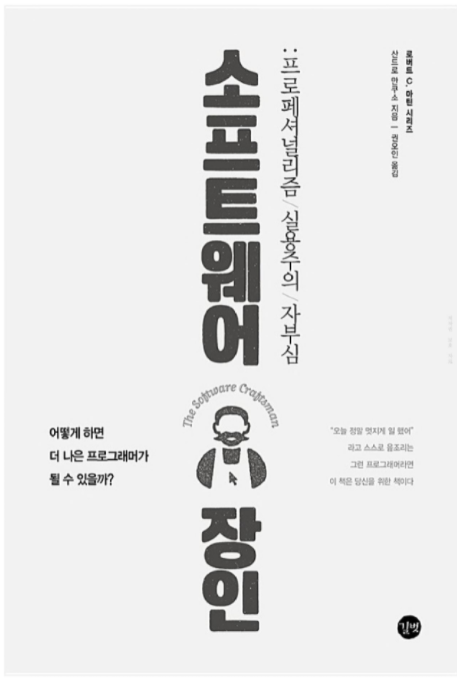

{:class="img-responsive"}

## 1. 최신 기술 공부하기
### 1.1 테스트 
최신 기술에 대해 공부하고 블로그 글로 게시하자.
{: .notice}

## 2. 최신 뉴스 게시하기
### 2.1 테스트
관심있는 뉴스가 나오면 사람들과 공유하고 의견을 나눠보자.

## 3. 토이 프로젝트 소개하기
### 3.1 테스트
개인적으로 진행하는 토이 프로젝트를 진행해보고 결과를 소개해보자.
