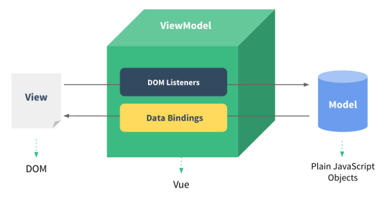
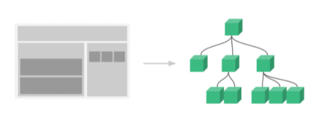
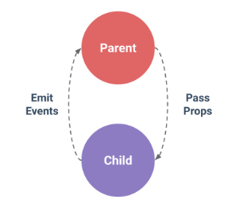
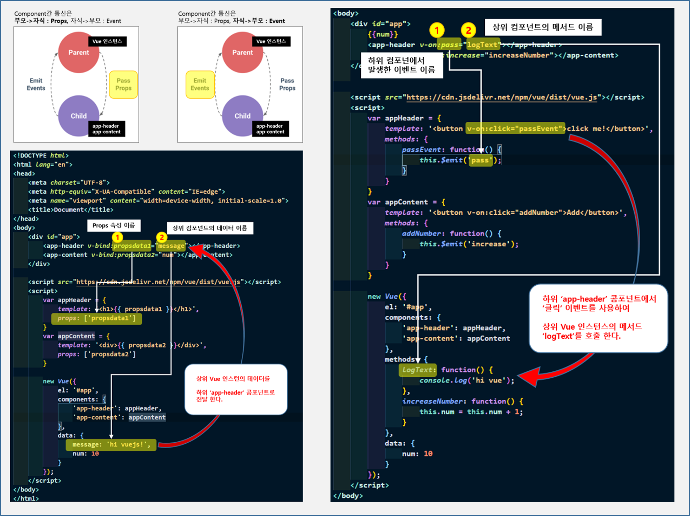
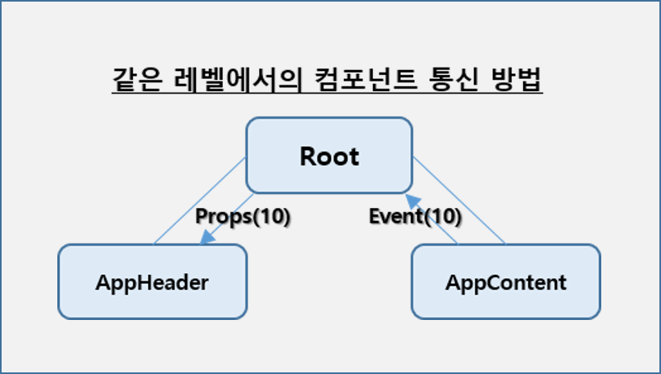
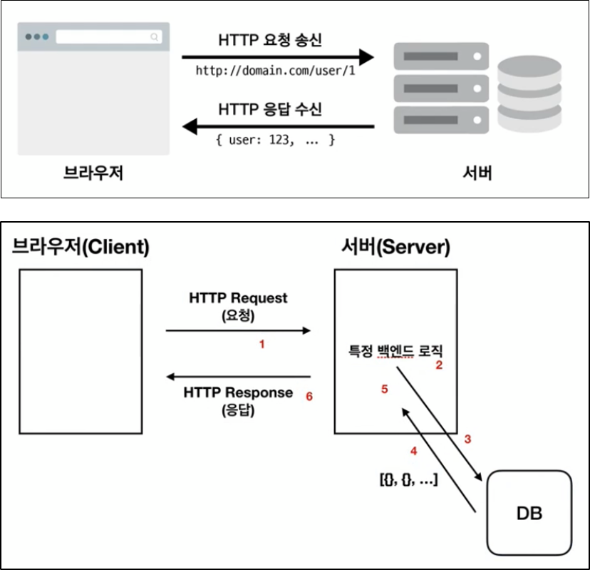
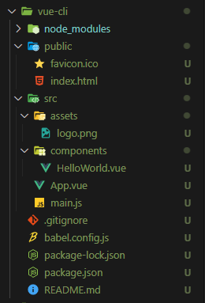
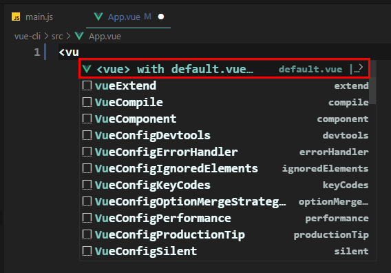
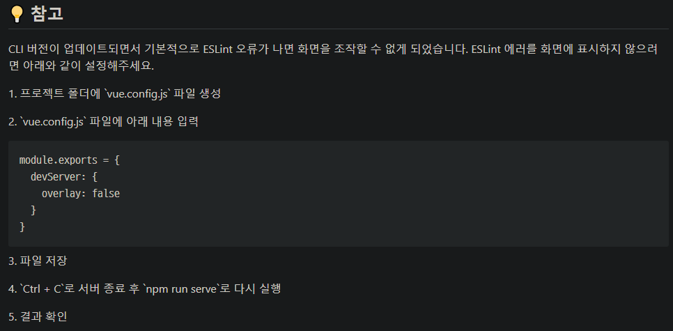

## 1. What is 'Vue'

### 1.1 Vue ??
  * Vue(/vjuː/ 로 발음, view 와 발음이 같습니다.)는 사용자 인터페이스를 만들기 위한 프로그레시브 프레임워크이다.<br/>다른 단일형 프레임워크와 달리 Vue는 점진적으로 채택할 수 있도록 설계 가능하다.<br/>핵심 라이브러리는 뷰 레이어만 초점을 맞추어 다른 라이브러리나 기존 프로젝트와의 통합이 매우 쉽고고 Vue는 현대적 도구 및 지원하는 라이브러리와 함께 사용한다면 정교한 단일 페이지 응용프로그램을 완벽하게 지원할 수 있다.(출저 : [Vue](https://kr.vuejs.org/v2/guide/index.html)) 

### 1.2 Vue & React & Angular & Blazor & Node<br/>
<a href="https://www.ifourtechnolab.com/blog/comparative-analysis-of-blazor-angular-react-vue-and-node-for-web-development"></a>


## 2. 개발 환경 설정

### 2.1 필수 설치
  * [Chrome Brower](https://www.google.com/intl/ko/chrome/), [Visual Studio Code](https://code.visualstudio.com/), [Node.Js/npm 포함](https://nodejs.org/en/), [devtools for google Chrome](https://chrome.google.com/webstore/detail/vuejs-devtools/nhdogjmejiglipccpnnnanhbledajbpd), [git](https://git-scm.com/downloads), [github](https://github.com/), [TortoiseGit](https://tortoisegit.org/)
  * Visual Studio Code Extension : Vetur, Material Icon Theme, Night Owl, Live Server
 
### 2.2 강의 소스
  * [소스](https://github.com/LabofDev/Vue.git)

### 2.3 디버깅
Chrome > F12 > Vue 개발자 도구 활용
{: .notice}


## 3. Vue 주요 문법 및 핵심 키워드

### 3.1 Vue
  * MVVM 패턴의 뷰모델(VieModel) 레이어에 해당하는 화면(View)단 라이브러리<br/>
  

### 3.2 Reactivity
  * Reactivity ([Object.defineProperty() API 문서 링크](https://developer.mozilla.org/en-US/docs/Web/JavaScript/Reference/Global_Objects/Object/defineProperty)) 객체의 동장을 재정의하는 API
  
### 3.3 인스턴스
  * Vue 인스턴스(오브젝트)
  * 속성 AP
    * el, template, data, methods, created, watch 등

### 3.4 콤포넌트
  * 화면의 영역을 구분하여 개발 가능, 재사용성 올라가고 빠르게 화면을 제작 가능<br/>
  
  * 전역 콤포넌트, 지역 콤포넌트<br/>
  
  * Component 통신(Props, Event)
  * Component 통신은 하기와 같이 부모->자식(Props), 자식->부모(Emit Event)로 처리 된다.(Vue : One-way Data Flow)
    * 부모->자식(Props)
      * Props 옵션을 통하여 데이터 전달
    * 자식->부모(Emit Events)
      * Evnet 구현을 통하여 데이터 전달<br/>
    
  * 'this' 키워드 관련
    * 오브젝트가 속해있는 Scope에서의 참조.
    * [The JavaScript this Keyword](https://www.w3schools.com/js/js_this.asp), [Understanding the “this” Keyword in JavaScript](https://betterprogramming.pub/understanding-the-this-keyword-in-javascript-cb76d4c7c5e8)
  * 동일 레벨의 Component간의 통신 방법<br/>
  
  * 동일 레벨의 ‘콤포넌트간 통신’은 부모<->자식간 통신의 규칙을 준수

### 3.5 뷰 라우터
  * 뷰 라우터는 뷰 라이브러리를 이용하여 싱글 페이지 애플리케이션을 구현할 때 사용하는 라이브러리
  * 뷰 라우터를 위한 CDN([Contents Delivery Network](https://ko.wikipedia.org/wiki/%EC%BD%98%ED%85%90%EC%B8%A0_%EC%A0%84%EC%86%A1_%EB%84%A4%ED%8A%B8%EC%9B%8C%ED%81%AC)) 방법이든 NPM([Node Package Manager](https://ko.wikipedia.org/wiki/Npm_(%EC%86%8C%ED%94%84%ED%8A%B8%EC%9B%A8%EC%96%B4))) 방법이든 링크 또는 설치 필요
  * 참고 소스의 'router.html' 참고

### 3.6 Axios
  * 뷰에서 권고하는 HTTP 통신 라이브러리는 엑시오스(Axios)이며, Promise 기반의 HTTP 통신 라이브러리이며, 상대적으로 다른 HTTP 통신 라이브러리들에 비해 문서화가 잘되어 있고 API가 다양
  * javascript 비동기 처리 패턴
    * callback > promise > promise + generator > async & await
  * [Ajaxd위키백과 링크](https://ko.wikipedia.org/wiki/Ajax), [Vue Resource 깃헙 주소](https://github.com/pagekit/vue-resourc), [Axios 깃헙 주소](https://github.com/axios/axios), [자바스크립트 비동기 처리와 콜백 함수](https://joshua1988.github.io/web-development/javascript/javascript-asynchronous-operation/), [자바스크립트 Promise 이해하기](https://joshua1988.github.io/web-development/javascript/promise-for-beginners/), [자바스크립트 async와 await](https://joshua1988.github.io/web-development/javascript/js-async-await/), [jsonplaceholder 사이트 링크](https://jsonplaceholder.typicode.com/), [자바스크립트 동작 원리](https://joshua1988.github.io/web-development/translation/javascript/how-js-works-inside-engine/)<br/>
  
  * 크롬 개발자 도구 네트워크 패널 보는 방법
    * [프런트엔드 개발자가 알아야 하는 HTTP 프로토콜](https://joshua1988.github.io/web-development/http-part1/)
    * [구글 크롬 개발자 도구 공식 문서](https://developer.chrome.com/docs/devtools/)

### 3.7 템플릿
  * 뷰의 템플릿 문법이란 뷰로 화면을 조작하는 방법을 의미한다. 크게 ‘데이터 바인딩’, 디렉티브'로 나눈다
  * 데이터 바인딩
    * 데이터 바인딩은 뷰 인스턴스에서 정의한 속성들을 화면에 표시하는 방법이며, 가장 기본적인 데이터 바인딩 방식은 콧수염 괄호(Mustache Tag)이다.
  * 디렉티브
    * 디렉티브는 뷰로 화면의 요소를 더 쉽게 조작하기 위한 문법이며, 화면 조작에서 자주 사용되는 방식들을 모아 디렉티브 형태로 제공하고 있다.
    
```html
<!--바인딩 샘플-->
<p v-bind:id="uuid" v-bind:class="className">{{ num }}</p>
<script>
    new Vue({
        el: '#app',
        data: {
            num: 10,
            uuid: 'uuid-1234',
            className: 'text-blue'
        },
        computed: {
            doubleNum: function() {
                return this.num * 2;
            }
        }
    });
</script>
```
    
```html
<!--디렉티브 샘플-->
<p v-bind:id="uuid" v-bind:class="className">{{ num }}</p>
<div v-if="loading">
    Loading...
</div>
<div v-else>
    test user has been logged in.
</div>

<div v-show="loading">
    Loading...
</div>
```
  * 특정 속성 값에 따라 화면 영역을 표시하거나 표시하지 않을 수 있다.(ex, v-if, v-on …)
  
```html
<!--Method 샘플-->
<div id="app">
    <button v-on:click="logText">click me</button>
    <input type="text" v-on:keyup.enter="logText">
</div>
<script>
    new Vue({
        el: '#app',
        methods: {
            logText: function() {
                console.log('clicked');
            }
        }
    });
</script>
```

```html
<!--watch 샘플-->
<div id="app">
    {{ num }}
    <button v-on:click="addNum">increase</button>
</div>

<script src="https://cdn.jsdelivr.net/npm/vue/dist/vue.js"></script>
<script>
    new Vue({
        el: '#app',
        data: {
            num: 10
        },
        watch: {
            num: function(val, oldVal) {
                this.logText(val, oldVal);
            }
        },
        methods: {
            addNum: function() {
                this.num = this.num + 1;
            },
            logText: function(val, oldVal) {
                console.log('new: %s, old: %s', val, oldVal);
            }
        }
    });
</script>
```

  * [watch 속성과 computed 속성 차이점에 관한 공식 문서 링크](https://vuejs.org/v2/guide/computed.html#ad)
  * ‘watch’ 속성은 좀더 로지컬한(매번 실행하기 부담스러운) 메서드나 함수에 많이 사용한다.
  * **<u>‘computed’ 속성을 더 많이 사용하며, validation 또는 텍스트 연산 등의 로직에 사용한다. (내부적으로 튜닝이나 최적화가 많이 되어 있음, 사용 추천)</u>**


### 3.8 CLI(Command Line Interface) 

  * 설치 및 확인 사항
    * Visual Studio Code > 터미널
      * node -v : node 버전 확인 및 필요시 설치
      * npm -v : Node Package Manager 버전 확인 및 필요시 설치
      * npm install -g @vue/cli : cli library 설치 (권한 오류 발생시 앞에 ‘sudo’ 추가 후 실행)
  * [Vue CLI 공식 사이트 링크](https://cli.vuejs.org/)
  * [Where does npm install packages? 스택 오버 플로우 글](https://stackoverflow.com/questions/5926672/where-does-npm-install-packages)
  * node, npm, vue 버전 확인
    * node -v, npm -v, vue --version
  * CLI 명령어를 사용한 기본 템플릿 프로젝트 생성
  
```
D:\SOURCE\PILOT\Vue\vuejslearn1>vue create vue-cli
Vue CLI v4.5.13
? Please pick a preset: Default ([Vue 2] babel, eslint)
D:\SOURCE\PILOT\Vue\vuejslearn1>cd vue-cli    
D:\SOURCE\PILOT\Vue\vuejslearn1\vue-cli>npm run serve
```

  * 템플릿 구조 간략 설명(index.html → mail.js → App.vue)<br/>
  
  * *.vue 파일의 ‘기본 템플릿’ 포맷으로 코드를 생성하기 위해서는 ‘<vue>’ 입력<br/>
  

### 3.9 싱글 파일 컴포넌트

  * [LabofDev/Vue](https://github.com/LabofDev/Vue.git)

### 3.10 최종 프로젝트 - 사용자 입력 폼 만들기

  * npm(node package manager) : 명령어로 자바스크립트 라이브러리를 설치하고 관리할 수 있는 패키지 매니저
  * [NPM 소개 강좌](https://www.inflearn.com/course/%ED%94%84%EB%9F%B0%ED%8A%B8%EC%97%94%EB%93%9C-%EC%9B%B9%ED%8C%A9/lecture/37370?tab=curriculum)
  * [NPM 소개 문서](https://joshua1988.github.io/webpack-guide/build/node-npm.html)
  * [이벤트 버블링과 캡쳐링 블로그 글](https://joshua1988.github.io/web-development/javascript/event-propagation-delegation/)<br/>
  

### 3.11 마무리

  * Reactivity : 바인딩과 같이 Vue의 최고 사상
  * 인스턴스 : 뷰 객체
  * 컴포넌트 : 모듈화
  * 컴포넌트 통신 : props, event emit
  * HTTP 통신 라이브러리 : axios
  * 템플릿 문법 : 데이터 바인딩, 뷰 디렉티브(v-???)
  * Vue CLI : Vue Command Line Interface
  * 싱글 파일 컴포넌트
  * 참고 싸이트
    * [Vue.js 공식 문서](https://vuejs.org/v2/guide/)
    * [Vue.js 스타일 가이드](https://vuejs.org/v2/style-guide/)
    * [Vue.js Cookbook](https://vuejs.org/v2/cookbook/)
    * [Vuex 공식 문서](https://vuex.vuejs.org/)
    * [VueRouter 공식 문서](https://router.vuejs.org/)
    * [Vue CLI 공식 문서](https://cli.vuejs.org/)

## 4. 참고 사항

### 4.1 Troubleshooting

  * GitHub 싱크후 ‘npm run serve’시 명령어 인식 불가할 경우 하기와 같이 명령서 실행
  
```
npm i @vue/cli-service
```

### 4.2 출처

  * [인프런](https://www.inflearn.com/course/Age-of-Vuejs)
