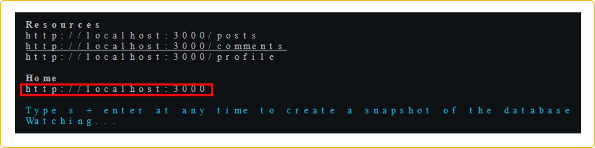
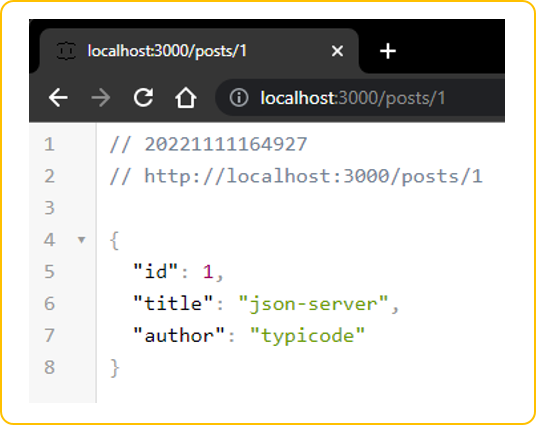
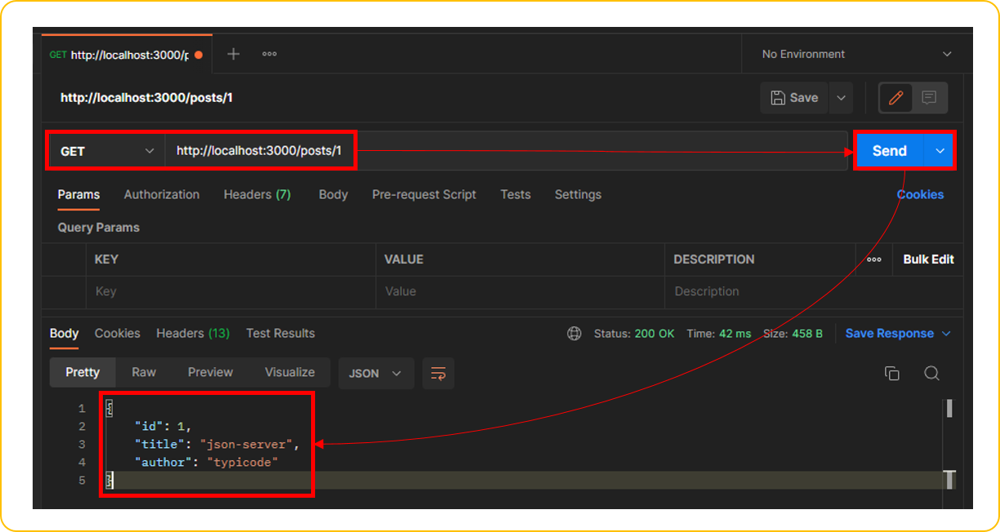

# What is **JSON Server** ?

## 0. Index

- [What is **JSON Server** ?](#what-is-json-server-)
  - [0. Index](#0-index)
  - [1. Introduction](#1-introduction)
    - [1.1 JSON Server 란 ?](#11-json-server-란-)
    - [1.2 JSON Server가 왜 필요할까 ?](#12-json-server가-왜-필요할까-)
  - [2. Body](#2-body)
    - [2.1 설치](#21-설치)
    - [2.2 테스트](#22-테스트)
    - [2.3 코드 적용](#23-코드-적용)
  - [3. Conclusion](#3-conclusion)
  - [4. Reference](#4-reference)

## 1. Introduction 

- 블로그에서 다루는 내용
  - 프론트앤드 개발자의 입장에서 바라본 JSON Server가 무엇인지? 왜 필요한지?
  - 어떻게 설치하는지? 설치하고나서 잘 설치되었는지 확인(테스트)
  - 마지막으로 실제 프론트앤드 코드를 통하여 설치된 JSON Server와 통신 테스트

### 1.1 JSON Server 란 ?

- lowdb를 사용하여 엄청 가볍고 단순한 REST API를 지원하는 환경을 만들어주는 라이브러리 입니다.
- lowdb는 JSON(JavaScript Object Notation)의 형식으로 데이터를 저장하는 매우 간단한 데이터베이스 입니다. lowdb의 형식은 다음의 `db.json`과 같습니다.
  
  - ```json
    // db.json
    {
      "posts": [
        { "id": 1, "title": "json-server", "author": "typicode" }
      ],
      "comments": [
        { "id": 1, "body": "some comment", "postId": 1 }
      ],
      "profile": { "name": "typicode" }
    }
    ```

### 1.2 JSON Server가 왜 필요할까 ?

- 프론트앤드 `학습자` 입장에서
  - 프론트앤드를 위해서 프론트앤드 프레임워크(Vuejs, React, Angular)의 학습에 앞서 CSS, HTML, JavaScript와 같은 기본 언어에 대한 학습이 필요 합니다. 기본 학습에만 많은 시간과 노력이 필요하지만, 웹개발에 학습의 효과를 높이기 위해서는 백앤드와 연동된 학습이 중요하다고 생각 합니다.
  - 이렇게 프론트앤드 학습 중 백앤드와 연동된 학습이 필요하다면 받드시 백앤드가 구성되어 있어야 하지만, JSON Server를 이용하면 쉽게 백앤드를 구성하여 연동 학습에 큰 도움이 됩니다.
- `프론트앤드 개발자`의 입장에서
  - 백앤드 개발자들과 협업을 해야하며, 프로젝트가 막 시작된 경우라고 가정해 봅시다.
  - 표준 디자인 스팩이나 개발 스팩이 세팅될까지 많은 시간이 소요되며, 설령 되었다고 하더라도 백앤드 개발자와 협업을 해야하는 상황이면 커뮤니케이션에 많은 시간이 소요 됩니다.
  - 프론트앤드 개발자 입장에서는 개발 일정에 맞추어 UI를 뽑아내야 하지만, 디자인만이 목적이 아닙니다. 예상하셨겠지만, 백앤드와 연동되어 살아있는 데이터까지 연동되도록 해야 합니다. 
  - 여기에서 이슈가 발생합니다 ! 바로 프론트앤드 개발자가 원하는 시간에 백앤드 스팩이 100% 완성되는냐? 이것이 문제 입니다.
  - 이러한 문제(결국 시간이죠)를 임시방편 해결하기 좋은 방법이 JSON Server를 구성하여 백앤드 스팩이 완료될때까지 개발에 매진할 수 있습니다.
- `백앤드 개발자`의 입장에서
  - 바로 위의 경우와 같이 프로젝트가 시작된지 얼마되지 않았다면, 백앤드 설계 및 개발에 한창 일 것입니다.
  - 여기서 프론트앤드 개발 파트에서는 매일같이 백앤드 개발 일정에 대해서 독촉 할 것입니다. 
  - 이럴때 좋은 대안이 백앤드 개발 파트에서는 프론트 개발 파트에게 JSON Server를 빨리 구성할 수 있도록 가이드(지원)하여, 각 개발 파트에서 불필요한 공수가 발생하지 않게 할 수 있습니다.
- `주의 사항 !!`
  - JSON Server는 db.json 파일에 직접 데이터를 저장하기 때문에 재 배포할 경우 `데이터가 없어 질 수 있습니다.`(백업을 생활화 합시다 !)
  - 가장 기본적인 기능을 가볍에 구성한 라이브러리로 `출시하는 제품용으로 사용함에는 심각한 고민`을 해 보셔야 합니다.

## 2. Body

### 2.1 설치

- 다음의 링크를 타고가면 Step 1 ~ Step 4까지 동일하게 잘 설명이 되어 있습니다.
- [npm json server](https://www.npmjs.com/package/json-server)
  - Step 1
    - JSON Server 설치
  
    - ```command
      npm install -g json-server // for windows
      sudo npm install -g json-server // for mac
      ```

  - Step 2
    - `db.json` 이름으로 데이터를 위한 파일 생성, 데이터 추가

    - ```json
      {
        "posts": [
          { "id": 1, "title": "json-server", "author": "typicode" }
        ],
        "comments": [
          { "id": 1, "body": "some comment", "postId": 1 }
        ],
        "profile": { "name": "typicode" }
      }
      ```

  - Step 3
    - JSON Server 시작

    - ```command
      json-server --watch db.json
      ```

    - 

  - Step 4
    - 테스트 Now if you go to `http://localhost:3000/posts/1`, you'll get

    - ```json
      { "id": 1, "title": "json-server", "author": "typicode" }
      ```

### 2.2 테스트

- 무사히 설치가 완료되었다면, 이제 API를 호출하여 정상적인지 테스트가 필요 합니다.
- 테스트 방법에는 2가지가 있습니다.
  - 웹 브라우져를 이용하여 확인
    - URL에 `http://localhost:3000/posts/1` 입력 후 데이터 조회 확인
    - 
  - Postman을 이용하여 확인
    - [Postman Download](https://www.postman.com/downloads/)하여 설치
    - 
- 어떤 방법으로든 posts의 1번 ID에 대해서 잘 조회 되었다면 성공 입니다.

### 2.3 코드 적용

- JSON Server가 잘 설치되었고, 호출 테스트까지 완료 했다면 마지막으로 실제 코드상에서 호출해 보겠습니다.
- JSON Server에 대한 블로그로 호출 코드에 대한 자세한 설명은 생량하며, 보다 자세한 설명은 다음의 링크를 통해 확인 바랍니다.
  - [XMLHttpRequest(XHR)](https://hong-jung.github.io/bootcamp/bootcamp-javascript-es6/#12-xmlhttprequestxhr--json-server), [fetch API](https://hong-jung.github.io/bootcamp/bootcamp-javascript-es6/#13-fetch-api), [async & await](https://hong-jung.github.io/bootcamp/bootcamp-javascript-es6/#13-fetch-api)

- ```javascript
  function getPostData() {
      const xhr = new XMLHttpRequest();
      xhr.open("GET", "http://localhost:3000/posts");
      xhr.setRequestHeader("content-type", "application/json");
      xhr.send();

      // 서버로부터 응답을 받으면 onload 실행
      xhr.onload = () => {
          if (xhr.status === 200) {
              const res = JSON.parse(xhr.response);
              console.log(res);
              console.log(`JSON.parse(xhr.response) the posts : ${res}`);

              // 통신을 통해 수신한 데이터를 처리하는 로직 구현
              // return res
          } else {
              console.log(xhr.status, xhr.statusText);
          }
      };
  }
  getPostData();
  ```

## 3. Conclusion

- 이것으로 JSON Server의 설치와 실행 후 확인 방법까지 확인해 봤습니다.
- 서두에서 언급했지만, 파일럿 프로젝트나 학습목적에 활용하기 적합하다고 생각합니다.
  
## 4. Reference

- [npm json server](https://www.npmjs.com/package/json-server)
- [MDN XMLHttpRequest](https://developer.mozilla.org/ko/docs/Web/API/XMLHttpRequest)
- [MDN Fetch API](https://developer.mozilla.org/ko/docs/Web/API/Fetch_API)
- [MDN async](https://developer.mozilla.org/ko/docs/Web/JavaScript/Reference/Statements/async_function)