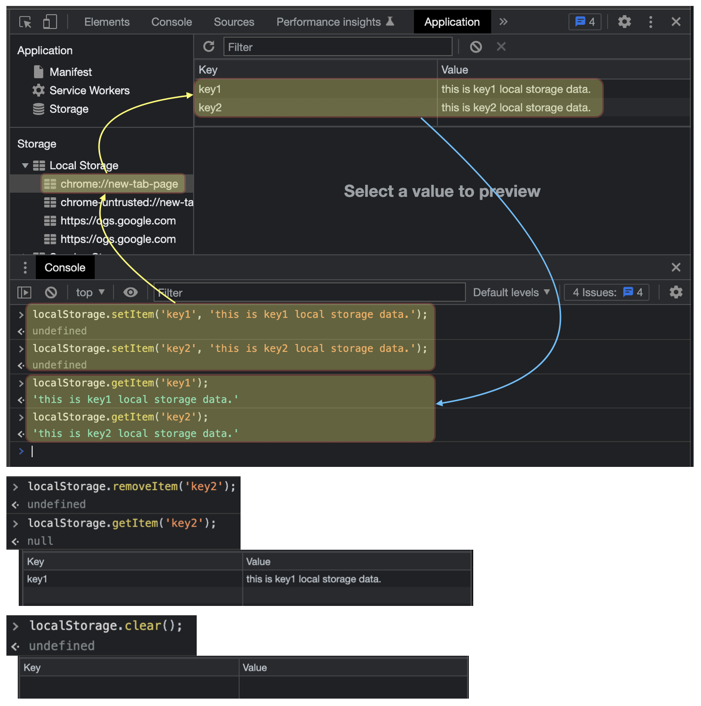
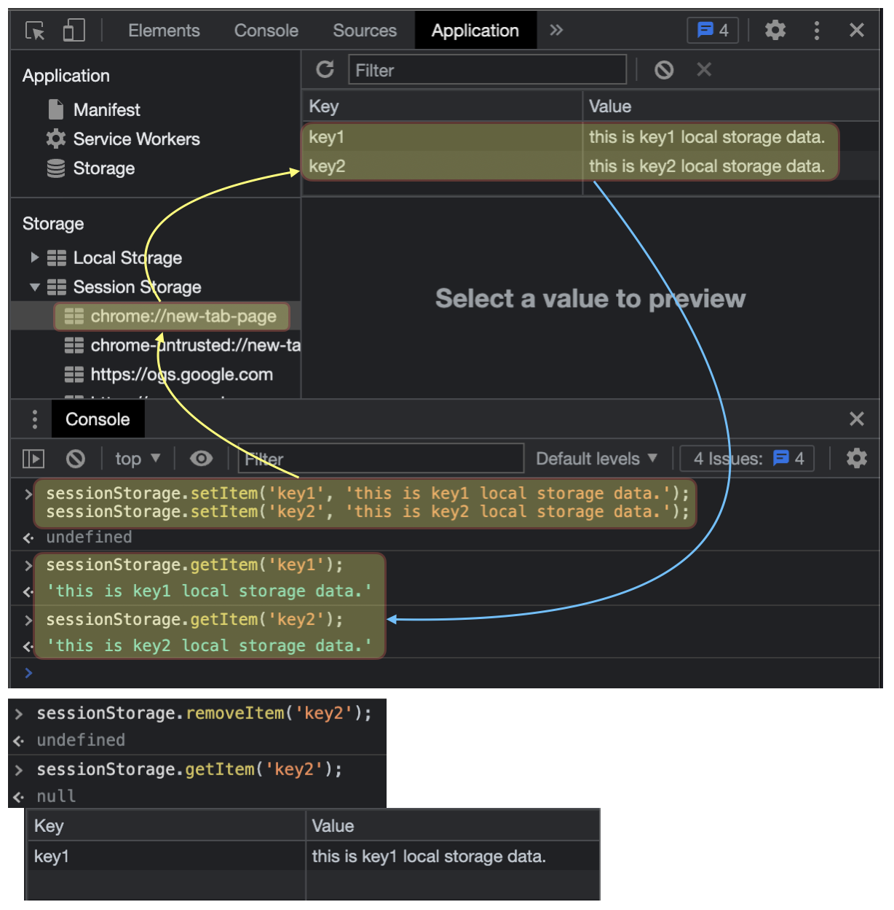
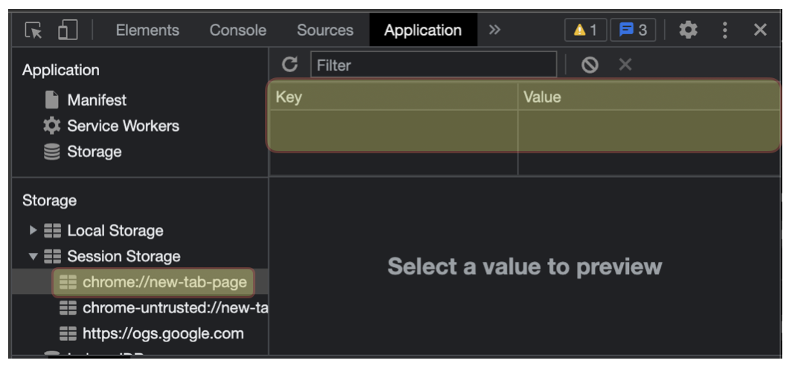

# **Local Storage** & **Session Storage** in JavaScript

## Index

- [**Local Storage** & **Session Storage** in JavaScript](#local-storage--session-storage-in-javascript)
  - [Index](#index)
  - [Introduction](#introduction)
    - [JavaScript에서의 Storage ?](#javascript에서의-storage-)
    - [왜 필요하며 어디에서 사용될까 ?](#왜-필요하며-어디에서-사용될까-)
  - [Body](#body)
    - [Local Storage](#local-storage)
    - [Session Storage](#session-storage)
  - [Conclusion](#conclusion)
  - [Reference](#reference)

## Introduction 

- 블로그에서 다루는 내용
  - Javascript에서의 Storage
  - Storage가 왜 필요하며, 어디에 사용하게 될까?
  - Local Storage와 Session Storage 각각의 특징 및 사용 방법

### JavaScript에서의 Storage ?

- Storage의 Wikipedia 정의
  - `기억 장치` : 컴퓨터에서 데이터를 일시적으로, 또는 영구히 보존하는 장치
- 데이터의 저장을 위한 방법으로 `웹 스토리지(Web Storage)`라고 지칭하며 `Local Storage`와 `Session Storage`로 구분된다.
- HTML5부터 제공되는 기능으로 도메인과 관련된 데이터를 클라이언트 웹브라우저에 저장할 수 있다.

### 왜 필요하며 어디에서 사용될까 ?

- Storage가 왜 필요 할까 ?
  - 개발에서 아주 작은 어플리케이션도 데이터를 저장하고 저장된 데이터를 불러와 재사용하며 관리되는 형태가 대부분 이다.
  - 이러한 데이터의 관리(추가, 불러와 사용, 변경, 삭제)를 위하여 일반적으로 데이터베이스(DataBase)를 사용한다.(최근은 데이터베이스(DataBase)를 위하여 클라우드(Cloud) 플랫폼을 많이 사용 중이다.)
  - 이렇게 데이터를 관리(추가, 사용, 변경, 삭제)하게 됨으로 어플케이션이 보다 거대해지고 복잡해 진다.
  - 이번 블로그는 데이터베이스(DataBase) 스토리지(Storage)는 제외하고, *웹 스토리(Web Storage)중 Local & Session Storage에 대해서 알아본다*.
- 어디에서 사용될까 ?
  - 로컬 스토리지(Local Storage)와 세션 스토리지(Session Storage)는 **저장의 범위, 기간**에서 큰 차이점이 있다고 할 수 있다. (둘다 데이터를 저장한다는 기능은 동일)
  - 데이터중 클라이언트 리소스에 직접 접근하여 사용 될 수 있는 데이터의 경우 유용하다.
  - 웹 싸이트의 *테마, 언어 설정, 비밀번호 임시 저장* 등과 같이 *클라이언트에서만 저장*될 수 있는 모든 데이터는 가능 하다.
  - 속도적인 측면도 중요하지만, *기능적인 측면으로 접근해 보자*.
    - 예를들어, 주요 문서의 내용을 기입하고 관리하는 웹 시스템이 있다고 가정하자.
      - 주요 문서의 내용을 완벽하게 작성했다면, 작성 후 `저장`이라는 기능을 통하여 데이터베이스로 작성된 문서의 내용을 저장한다.
      - 저장된 데이터는 데이터베이스로부터 불러와 `열람`하거나 `수정` 또는 `삭제`가 가능하다.
      - 하지만, 데이터베이스에 저장하기전 즉, *작성이 완료되 경우가 아니라 본인만 열람하며 계속해서 수정해야 한다면 어떻게 될까? 맞다, 기능적으로 해소할 수 있다*.
      - 이럴때, Local Storage 또는 Session Storage의 기능을 활용한다면, 데이터베이스에 저장하기 전 임시로 작성되는 내용에 대해서 충분하게 관리(생성, 열람, 수정, 삭제) 가능 하다.

## Body

### Local Storage

- 웹 스토리지(Web Storage) 중 Local Storage
  
> [!IMPORTANT]
> 
>> - 삭제하기 전까지 클라이언트의 브라우저에 계속해서 남아 있음<br>
>> - 도메인별로 따로 저장이됨<br>
>> - Storage Object를 상속 받음<br>
>> - 키(key)-값(value) 형태로 저장<br>
>> - 브라우저의 탭이나 창 간에 데이터가 공유되며, 탭이나 창을 닫아도 남아 있음<br>
>> - 용량의 제한이 있음(보통 모바일은 2.5MB, 데스크탑은 5~10MB)<br>
>> - 문자형(string) 데이터 타입만 지원 (숫자형 데이터 타입을 위하여 JSON 형태로 변환 필요)

```javascript
// key-value 저장
localStorage.setItem('key1', 'this is key1 local storage data.');
localStorage.setItem('key2', 'this is key2 local storage data.');

// key 값의 데이터 불러오기
localStorage.getItem('key1');
localStorage.getItem('key2');

// key 값의 데이터를 제거
localStorage.removeItem('key2');
localStorage.getItem('key2');

// 전체 데이터 제거
localStorage.clear();
```

- 문자형(string) 데이터 타입만 지원 (숫자형 데이터 타입을 위하여 JSON 형태로 변환 필요)

```javascript
if (typeof (Storage) !== "undefined") {
    let arr = [1, 2];
    localStorage.setItem("key3_num", JSON.stringify(arr));
}
console.log(JSON.parse((localStorage.getItem("key3_num")))[0] + JSON.parse((localStorage.getItem("key3_num")))[1]); 
//output: 3
```



### Session Storage

- 웹 스토리지(Web Storage) 중 Session Storage

```javascript
// key-value 저장
sessionStorage.setItem('key1', 'this is key1 local storage data.');
sessionStorage.setItem('key2', 'this is key2 local storage data.');

// key 값의 데이터 불러오기
sessionStorage.getItem('key1');
sessionStorage.getItem('key2');

// key 값의 데이터를 제거
sessionStorage.removeItem('key2');
sessionStorage.getItem('key2');
```

> [!IMPORTANT]
> 
>> - 브라우저 창을 닫으면(세션이 종료되면) 삭제 됨<br>
>> - Storage Object를 상속 받음<br>
>> - 여러 탭(창)을 뛰우면 여러개 세션 스토리지가 서로 격리되어 저장됨(탭(창)이 닫히면 사라짐)<br>
>> - 용량의 제한이 있음(보통 모바일은 2.5MB, 데스크탑은 5~10MB)




## Conclusion

- 이상으로 Local Storage와 Session Storage에 대해서 알아보았다.
- 데이터베이스(DataBase)와 사용상의 차이점을 분명하게 한다면, 웹 어플리케이션을 보다 효과적으로 개발할 수 있을 것이다.
- 다음에 기회가 된다면 [IndexedDB](https://developer.mozilla.org/ko/docs/Web/API/IndexedDB_API/Using_IndexedDB)에 대해서 알아보도록 하자.
  
## Reference

- [Using the Web Storage API](https://developer.mozilla.org/en-US/docs/Web/API/Web_Storage_API/Using_the_Web_Storage_API)
- [Local Storage](https://developer.mozilla.org/en-US/docs/Web/API/Window/localStorage)
- [Session Storage](https://developer.mozilla.org/en-US/docs/Web/API/Window/sessionStorage)