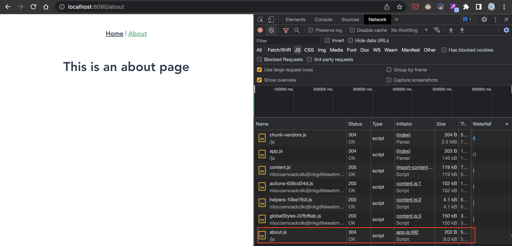

# **라우터(Router) 3가지 방식** in Vuejs

## Introduction 

- 블로그에서 다루는 내용
  - 라우터(Router)가 무엇인가요?
  - 기본 라우터(Router)
  - 3가지 라우터(Router) 방식

### Vuejs에서 라우터(Router)가 뭔가요?

- 정의
  - [위키백과에서의 라우터(Router)란?](https://ko.wikipedia.org/wiki/%EB%9D%BC%EC%9A%B0%ED%84%B0)
    - 라우터(router[a] 혹은 라우팅 기능을 갖는 공유기)는 컴퓨터 네트워크 간에 데이터 패킷을 전송하는 네트워크 장치다. 패킷의 위치를 추출하여, 그 위치에 대한 `최적의 경로`를 지정하며, 이 경로를 따라 `데이터 패킷을 다음 장치로 전달`한다. 이때 최적의 경로는 일반적으로는 `가장 빠르게 통신이 가능한 경로`이므로, 일반적으로는 `최단 거리`일 수 있지만, 돌아가는 경우라도 고속의 전송로를 통하여 전달이 될 수도 있다. 간단히 말해, 서로 `다른 네트워크 간에 중계 역할`을 해주는 장치다.
  - 위는 위키백과사전의 `라우터`에 대한 설명 부분입니다. 본래 네트워크 장치에서 시작된 용어이지만, 중간중간 중요표시한바와 같이 소프트웨어서에서도 유사한 개념의 용어로 사용중 입니다. 가장 눈여겨 볼 부분은 `다른 네트워크 간에 중계 역할`, `최단거리`라고 할 수 있어요.
- **<u>소프트웨어 개발 관점에서 포인트(페이지, 시스템 등등)에서 다른 포인트로 이동하기 위한 중계 역할이라고 정리하면 어떨가 싶네요.</u>**
- Vuejs에서 라우터(Router)는 이러한 `SPA(Single Page Applicaiton)에서 사용할 수 있는 라우팅 기능을 제공하는 공식 라이브러리(Library)` 입니다.

### 그럼 어디에서 사용하면 될까요?

- 라우터(Router)는 어디에 사용될까?
  - 웹 어플리케이션 프로젝트를 가정하면, 첫번째 고려 대상이 페이지간 이동 입니다.
  - 가장 대표적인 페이지 이동에 대한 예제는 메뉴 입니다. 메뉴의 구성은 어플리케이션에서 빠질 수 없으며, 메뉴 구성과 이동을 어떻게 설계하느냐가 UX를 향상시키는 주요한 요인이 될 수 있어요.
  - 일반적인 웹 어플리케이션의 경우 페이지간 이동은 다음과 같은 방법으로 가능 합니다.
    - html element 사용 `<a href="이동 URL"></a>` 
    - javascript 사용 `location.href = '이동 URL'`
  - 이동 경로에 대해서 데이터베이스(Database)에서 관리하여 동적으로 페이지 이동 요소나 코드를 생성할 수 있어요.
  - 이처럼 다양한 페이지 이동에 대한 방법이 존재하지만, 우리는 Vuejs에서 페이지 이동을 위해서 사용할 수 있는 공식 라이브러리인 라우터(Router)에 대해서 알아 보겠습니다.

## Index

- [**라우터(Router) 3가지 방식** in Vuejs](#라우터router-3가지-방식-in-vuejs)
  - [Introduction](#introduction)
    - [Vuejs에서 라우터(Router)가 뭔가요?](#vuejs에서-라우터router가-뭔가요)
    - [그럼 어디에서 사용하면 될까요?](#그럼-어디에서-사용하면-될까요)
  - [Index](#index)
  - [Body](#body)
    - [Vuejs 기본 라우터 이해](#vuejs-기본-라우터-이해)
    - [첫번째, 기본 라우터 방식](#첫번째-기본-라우터-방식)
    - [두번째, 별도의 파일로 분리되는 방식](#두번째-별도의-파일로-분리되는-방식)
    - [세번째, 별도의 파일로 분리되면서 다운로드 특성이 반영된 방식](#세번째-별도의-파일로-분리되면서-다운로드-특성이-반영된-방식)
  - [Conclusion](#conclusion)
  - [Reference](#reference)
  
## Body

### Vuejs 기본 라우터 이해

- vue-cli로 프로젝트를 생성할 때 "Router"를 사용함으로 선택하면 다음의 이미지와 같이 기본 router 폴더와 index.js파일이 생성 됩니다.<br/>
  

<br/>

<br/>

- A 영역
  - router 폴더 하위로 index.js 라는 이름으로 기본 라우터 파일이 생성 됩니다.
- B 영역
  - path : 경로
  - name : 유일한 이름
  - component : 라우터가 연결되는 콤포넌트(Component), 연결할 콤포넌트(Component)를 미리 Import 정의
  
  - ```javascript
    import HomeView from '../views/HomeView.vue'
    ```

- C 영역
  - 기본 라우터 방식이 아닌 webpackChunkName을 사용하는 방식과 webpackPrefetch를 사용하는 방식이 존재하며, 아래에서 확인해 볼께요.

- `루트` 경로와 `about` 경로에 대한 접근 결과
<br/>

<br/>
  
> **기본 라우터(Router)**
> 
>> - vue-cli 프로젝트 생성시 `router` 선택하여 기본 라우터 라이브러리 사용으로 프로젝트 생성
>> - 라우터로 사용할 라우터 배열에 오브젝트 타입으로 `path`, `name`, `component` 설정
>> - path(`접근 경로`), name(`유일한 이름`), component(`연결되는 콤포넌트`)이며, 자동으로 `<a/>` 요소로 변환

----

### 첫번째, 기본 라우터 방식

- 기본 라우터 방식으로 연결할 콤포넌트(Component)에 대해서 미리 Import 하여 정의하고 path, name, component의 오브젝트 값을 정의 합니다. 상단 이미지에서 `B영역` 입니다.
- 컴파일 후 javascript 코드로 자동 변환되는데 이때 app.js 파일에 자동으로 포함되어 클라이언트로 다운로드 됩니다.
  
> **기본 라우터 방식**
> 
>> - 라우터에 사용될 컴포넌트(Component)를 `미리 import 정의`
>> - `path, name, component`를 정의
>> - 특징 : 해당 페이지(컴포넌트)에 `접속하면 즉시` 컴파일된 javascript 파일인 `app.js`이 무조건 클라이언트로 `다운로드`


----

### 두번째, 별도의 파일로 분리되는 방식

- path, name 정의는 기본 라우터 방식과 동일
- 하지만, 사용할 컴포넌트(Component)를 사전에 미리 정의하지 않고, B영역과 같이 함수 선언 형식으로 사용할 컴포넌트를 정의
- webpackChunkName: "about" 옵션을 사용
- 기본 라우터 방식에서 app.js 파일로 다운로드 되지 않고 위에서 정의한 webpackChunkName 이름으로 컴파일되어 클라이언트로 다운로드 됩니다. (물론 해당 페이지(컴포넌트)에 접속할때 다운로드 됩니다.)
  
> **파일 분리 방식**
> 
>> - path, name 정의
>> - 사용할 컴포넌트(Component)를 `함수 선언 방식`으로 정의
>> - `webpackChunkName: "사용할 이름"`으로 컴파일되는 javascript 파일명 정의
>> - 특징 : 해당 페이지(컴포넌트)에 `접속하면 즉시` `webpackChunkName에서 설정한 파일 명`으로 컴파일된 javascript 파일이 클라이언트로 `다운로드`



----

### 세번째, 별도의 파일로 분리되면서 다운로드 특성이 반영된 방식

- 두번째 방식과 동일하지만, webpackPrefetch:true 옵션이 추가되었습니다.

```javascript
{
  path: '/about',
  name: 'about',
  // route level code-splitting
  // this generates a separate chunk (about.[hash].js) for this route
  // which is lazy-loaded when the route is visited.
  component: () =>
    import(/* webpackChunkName: "about", webpackPrefetch:true */ '../views/AboutView.vue')
}
```
  
> **webpackPrefetch 방식**
> 
>> - path, name 정의
>> - 사용할 컴포넌트(Component)를 `함수 선언 방식`으로 정의
>> - `webpackChunkName: "사용할 이름"`으로 컴파일되는 javascript 파일명 정의
>> - `webpackPrefetch:true` 옵션 정의
>> - 특징 : 해당 페이지(컴포넌트)에 `접속하기 전` `webpackChunkName에서 설정한 파일 명`으로 컴파일된 javascript 파일이 `클라이언트 브라우저 캐쉬`에 먼저 `다운로드` 되었다가, `페이지를 클릭하는 순간` 서버가 아니라 브라우저 `캐쉬 영역`에서 `다운로드`


----

## Conclusion

- Vuejs에서는 3가지 라우터(Router) 방식이 존재 합니다. 각 방식의 특징에 대해서 요약하면 다음과 같습니다. 
- `기본 라우터` 방식
  - 하나의 app.js(무조건 동일한 파일) 파일로 클라이어트로 다운로드
  - *<u>무조건 접근하는 페이지의 경우</u>*
- `webpackChunkName: "사용할 이름"` 방식
  - lazy-loaded 즉 라우트로 컴포넌트 호출시 스태틱 파일을 클라이언트로 내려 받음
  - *<u>접속할 확률이 낮거나 사이즈가 작아서 클릭할 때마다 다운로드 받아도 상관 없는 경우</u>*
- `webpackPrefetch:true` 방식
  - 브라우저 캐쉬에 먼저 저장. prefetch cache된 파일을 클릭하는 순간 서버로부터가 아니가 브라우저의 캐쉬 영역에서 다운로드
  - *<u>접속할 확률이 높거나 사이즈가 커서 미리 다운로드 받아야 하는 경우</u>*
- 어플리케이션의 규모에 따라서 다르겠지만, 라우터(Router) 방식을 이해하고 설계한다면 페이지간 이동과 로딩을 최적화 할 수 있을 겁니다.
  
## Reference

- [Official Router - v4.x](https://router.vuejs.kr/guide/index.html)