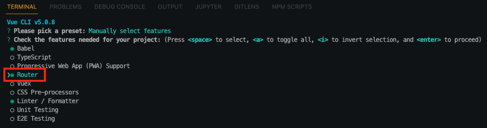

# **Log 관리** in Node.js

## Introduction 

- 블로그에서 다루는 내용
  - Node.js에서 로그 관리가 필요한 이유가 무엇일까?
  - 로그 관리 기본 방법

### Node.js에서 로그 관리가 필요한 이유가 무엇일까 ?

- 정의
  - IT분야에서 로그란, `시스템을 운영하는 과정에서 발생하는 모든 활동(시스템이나 사용자)에 대해서 기록되는 자료`를 의미 합니다.
  - 항공기나 자동차의 `블랙박스` 역할이라고 생각하면 가장 쉬울것 같네요.
    - 블랙박스의 자료를 기반으로 활동(자동차, 사람)에 대해 분석이 가능 합니다.
  - 네트워크의 경우 로그 자료를 바탕으로는 해킹의 단서를 찾는 가장 중요하고 기본적인 요소라고 할 수 있죠.
  - 로그를 통하여 `보안`이나 `장애`에 대해서 분석할 수 있습니다.
  - 통합 로그 관리가 가능한 상용 제품도 다양합니다. 
  - 이정도로 로그가 왜 필요한지에 대해서 살펴 봤어요. 이제부터 Node.js에서 로그 기록을 위한 여러가지 방법과 패턴에 대해서 알아 보겠습니다.

### 로그 관리 기본과 방법은 ?

- 로그 관리의 기본
  - 시나리오
    - Node.js 기반의 백앤드 서비스가 존재하며, 다음과 같은 몇가기 로그(기록)를 남기고 싶습니다.
      - 서버가 시작 또는 중지되는 활동에 대해서 기록
      - 서버에 예상하지 못한 활동(장애)에 대한 기록
      - 클라이언트가 서비스(백앤드 API)를 요청할때마다의 기록
      - 개발자, 운영자 또는 고객의 요구사항(원하는 시점, 지점 등등)에 따른 기록
  - 위와 같은 시나리오가 가장 일반적이고 기본적인 로그(기록) 활동이라고 할 수 있습니다.
- 로그 관리의 방법
  - Node.js에서 많이 사용되고 있는 로그기록 패키지는 다음과 같습니다.
    - `morgan`, `winston`
    - 각각의 패키지의 용도나 사용 방법에 대해서는 다음 본문에서 좀더 상세하게 다루겠습니다.

## Index

- [**Log 관리** in Node.js](#log-관리-in-nodejs)
  - [Introduction](#introduction)
    - [Node.js에서 로그 관리가 필요한 이유가 무엇일까 ?](#nodejs에서-로그-관리가-필요한-이유가-무엇일까-)
    - [로그 관리 기본과 방법은 ?](#로그-관리-기본과-방법은-)
  - [Index](#index)
  - [Body](#body)
    - [Morgan을 사용하여 로그 처리 방법](#morgan을-사용하여-로그-처리-방법)
    - [Winston을 사용하여 로그 처리 방법](#winston을-사용하여-로그-처리-방법)
  - [Conclusion](#conclusion)
  - [Reference](#reference)
  
## Body

### Morgan을 사용하여 로그 처리 방법

- 로깅(logging)을 위한 미들웨어입니다.
- [미들웨어](https://ko.wikipedia.org/wiki/%EB%AF%B8%EB%93%A4%EC%9B%A8%EC%96%B4)는 `컴퓨터 제작 회사가 사용자의 특정한 요구대로 만들어 제공하는 프로그램으로, 운영 체제와 응용 소프트웨어의 중간에서 조정과 중개의 역할을 수행하는 소프트웨어이다`

> **Morgan Middleware**
> 
>> - `HTTP request logger middleware for node.js`
>> - [morgan NPM](https://www.npmjs.com/package/morgan)
>>
>>> - HTTP 요청에대한 로깅처리용으로 사용 가능
>>> - [morgan homepage](https://github.com/expressjs/morgan#readme)
>>
>> - [rotating-file-stream NPM](https://www.npmjs.com/package/rotating-file-stream)
>>
>>> - 

  


- A 영역
  - router 폴더 하위로 index.js 라는 이름으로 기본 라우터 파일이 생성 됩니다.
- B 영역
  - path : 경로
  - name : 유일한 이름
  - component : 라우터가 연결되는 콤포넌트(Component), 연결할 콤포넌트(Component)를 미리 Import 정의
  
```javascript
import HomeView from '../views/HomeView.vue'
```

----

### Winston을 사용하여 로그 처리 방법

- vue-cli로 프로젝트를 생성할 때 "Router"를 사용함으로 선택하면 다음의 이미지와 같이 기본 router 폴더와 index.js파일이 생성 됩니다.<br/>

> **기본 라우터(Router)**
> 
>> - vue-cli 프로젝트 생성시 `router` 선택하여 기본 라우터 라이브러리 사용으로 프로젝트 생성
>> - 라우터로 사용할 라우터 배열에 오브젝트 타입으로 `path`, `name`, `component` 설정
>> - path(`접근 경로`), name(`유일한 이름`), component(`연결되는 콤포넌트`)이며, 자동으로 `<a/>` 요소로 변환
  


- A 영역
  - router 폴더 하위로 index.js 라는 이름으로 기본 라우터 파일이 생성 됩니다.
- B 영역
  - path : 경로
  - name : 유일한 이름
  - component : 라우터가 연결되는 콤포넌트(Component), 연결할 콤포넌트(Component)를 미리 Import 정의
  
```javascript
import HomeView from '../views/HomeView.vue'
```

## Conclusion

- Vuejs에서는 3가지 라우터(Router) 방식이 존재 합니다. 각 방식의 특징에 대해서 요약하면 다음과 같습니다. 
- `기본 라우터` 방식
  - 하나의 app.js(무조건 동일한 파일) 파일로 클라이어트로 다운로드
  - *<u>무조건 접근하는 페이지의 경우</u>*
- `webpackChunkName: "사용할 이름"` 방식
  - lazy-loaded 즉 라우트로 컴포넌트 호출시 스태틱 파일을 클라이언트로 내려 받음
  - *<u>접속할 확률이 낮거나 사이즈가 작아서 클릭할 때마다 다운로드 받아도 상관 없는 경우</u>*
- `webpackPrefetch:true` 방식
  - 브라우저 캐쉬에 먼저 저장. prefetch cache된 파일을 클릭하는 순간 서버로부터가 아니가 브라우저의 캐쉬 영역에서 다운로드
  - *<u>접속할 확률이 높거나 사이즈가 커서 미리 다운로드 받아야 하는 경우</u>*
- 어플리케이션의 규모에 따라서 다르겠지만, 라우터(Router) 방식을 이해하고 설계한다면 페이지간 이동과 로딩을 최적화 할 수 있을 겁니다.
  
## Reference

- [Official Router - v4.x](https://router.vuejs.kr/guide/index.html)