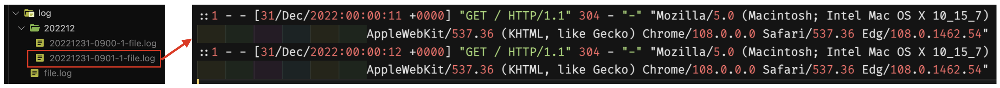
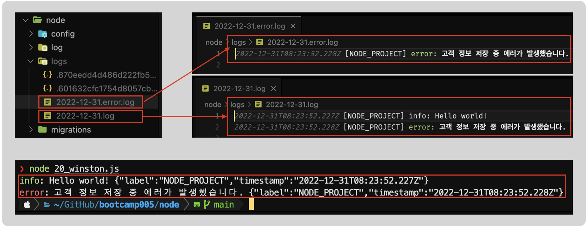

# **Log 관리** in Node.js

## Introduction 

- 블로그에서 다루는 내용
  - Node.js에서 로그 관리가 필요한 이유가 무엇일까?
  - 로그 관리 기본 방법

### ❕Node.js에서 로그 관리가 필요한 이유가 무엇일까 ?

- 정의
  - IT분야에서 로그란, `시스템을 운영하는 과정에서 발생하는 모든 활동(시스템이나 사용자)에 대해서 기록되는 자료`를 의미 합니다.
  - 항공기나 자동차의 `블랙박스` 역할이라고 생각하면 가장 쉬울것 같네요.
    - 블랙박스의 자료를 기반으로 활동(자동차, 사람)에 대해 분석이 가능 합니다.
  - 네트워크의 경우 로그 자료를 바탕으로는 해킹의 단서를 찾는 가장 중요하고 기본적인 요소라고 할 수 있죠.
  - 로그를 통하여 `보안`이나 `장애`에 대해서 분석할 수 있습니다.
  - 통합 로그 관리가 가능한 상용 제품도 다양합니다. 
  - 이정도로 로그가 왜 필요한지에 대해서 살펴 봤어요. 이제부터 Node.js에서 로그 기록을 위한 여러가지 방법과 패턴에 대해서 알아 보겠습니다.

### ❕로그 관리 기본과 방법은 ?

- 로그 관리의 기본
  - 시나리오
    - Node.js 기반의 백앤드 서비스가 존재하며, 다음과 같은 몇가기 로그(기록)를 남기고 싶습니다.
      - 서버가 시작 또는 중지되는 활동에 대해서 기록
      - 서버에 예상하지 못한 활동(장애)에 대한 기록
      - 클라이언트가 서비스(백앤드 API)를 요청할때마다의 기록
      - 개발자, 운영자 또는 고객의 요구사항(원하는 시점, 지점 등등)에 따른 기록
  - 위와 같은 시나리오가 가장 일반적이고 기본적인 로그(기록) 활동이라고 할 수 있습니다.
- 로그 관리의 방법
  - Node.js에서 많이 사용되고 있는 로그기록 패키지는 다음과 같습니다.
    - `morgan`, `winston`
    - 각각의 패키지의 용도나 사용 방법에 대해서는 다음 본문에서 좀더 상세하게 다루겠습니다.

---

## Index

- [**Log 관리** in Node.js](#log-관리-in-nodejs)
  - [Introduction](#introduction)
    - [❕Node.js에서 로그 관리가 필요한 이유가 무엇일까 ?](#nodejs에서-로그-관리가-필요한-이유가-무엇일까-)
    - [❕로그 관리 기본과 방법은 ?](#로그-관리-기본과-방법은-)
  - [Index](#index)
  - [Body](#body)
    - [1️⃣ Morgan을 사용하여 로그 처리 방법](#1️⃣-morgan을-사용하여-로그-처리-방법)
    - [2️⃣ Winston을 사용하여 로그 처리 방법](#2️⃣-winston을-사용하여-로그-처리-방법)
  - [Conclusion](#conclusion)
  - [Reference](#reference)

---

## Body

### 1️⃣ Morgan을 사용하여 로그 처리 방법

- http 요청에 대한 로깅(logging)을 위한 미들웨어입니다.
- [미들웨어](https://ko.wikipedia.org/wiki/%EB%AF%B8%EB%93%A4%EC%9B%A8%EC%96%B4)는 `컴퓨터 제작 회사가 사용자의 특정한 요구대로 만들어 제공하는 프로그램으로, 운영 체제와 응용 소프트웨어의 중간에서 조정과 중개의 역할을 수행하는 소프트웨어이다`
- 즉, 시스템을 운영하면서 http 요청에 대해서 상세한 자동 로깅(logging)을 위해서 유용하게 사용 가능 합니다.
  - 로깅(logging)을 물리 파일에 남길 경우, 생성되는 파일의 크기, 주기 및 경로 등 사용자 정의 옵션을 통하여 파일을 생성 시킬수 있습니다. 이럴때 `rotating-file-stream` 패키지를 사용 합니다.

> **Morgan Middleware**
> 
>> - `HTTP request logger middleware for node.js`
>> - [morgan NPM](https://www.npmjs.com/package/morgan)
>>
>>> - HTTP 요청에대한 로깅처리용으로 사용 가능
>>> - [morgan homepage](https://github.com/expressjs/morgan#readme)
>>
>> - [rotating-file-stream NPM](https://www.npmjs.com/package/rotating-file-stream)
>>
>>> - 특정 패턴을 정의하여 파일을 생성할 수 있는 패키지로 세부 옵션에 대해서 사용자 정의가 가능
>>> - [rotating-file-stream homepage](https://github.com/iccicci/rotating-file-stream#readme)
  
- 다음의 코드와 같이 `morgan` 패키지의 사용에 대해서 설정 합니다.
  
```javascript
const morgan = require("morgan"); // morgan npm require 
const rfs = require("rotating-file-stream"); // rotating-file-stream npm require

// '파일이 생성되는 패턴'값과 생성 옵션 정의
const accessLogStream = rfs.createStream('파일이 생성되는 패턴', {
  interval: "1d", // 1d
  size: "10M", // 10MB 단위
  path: path.join(__dirname, "log"), // 경로
});

// express > app에 정의한 morgan 패키지 사용으로 설정
app.use(morgan("combined", { stream: accessLogStream }));
```

- 설정한 morgan 패키지의 로깅(logging)을 확인하기 위하여 다음과 같이 express 간단한 라우터(Get API)를 정의하고 서버를 실행 합니다.

```javascript
app.get("/", (req, res) => { res.send("Hello World"); });
app.listen(3000, () => { console.log("서버가 포트 3000번으로 시작 되었습니다.");});
```

- postman에서 정의된 GET API를 호출하면 `morgan`에서는 아래의 이미지와 같이 정의된 파일생성 패턴에 준하여 로깅(logging) 됩니다.



----

### 2️⃣ Winston을 사용하여 로그 처리 방법

- `winston is designed to be a simple and universal logging library with support for multiple transports. A transport is essentially a storage device for your logs.`
- Node.js에서 Http Request에 대한 로깅(logging)용 Morgan과 유사하게 Log를 효율적으로 관리할 수 있는 `Winston`이라는 패키지가 있습니다. 좀더 쉽게 이야기하면, `원할때 로그처리가 가능합니다.(console.log, console.error와 동일)`
- 물론 console.log와 console.error보다 `다양한 정보를 기록`할 수 있고 `외부 파일(파일 생성 패턴을 사용)로 기록`도 가능 합니다.
- 외부 파일로 저장할때 파일의 생성 주기, 크기 등 다양한 옵션을 제공하는 `winston-daily-rotate-file`를 함께 사용할 수 있습니다.

> **Winston(winston-daily-rotate-file)**
>
>> - `winston is designed to be a simple and universal logging library with support for multiple transports.` 
>> - [winston NPM](https://www.npmjs.com/package/winston)
>>
>>> - 다양[한 레벨로 심플하게 로그를 관리할 수 있는 패키지
>>> - [winstron homepage](https://github.com/winstonjs/winston#readme)
>>
>> - [winston-daily-rotate-file NPM](https://www.npmjs.com/package/winston-daily-rotate-file)
>>
>>> - 로기 기록을 위한 파일의 생성 패턴(크기, 개수 등등)을 설정할 수 있는 패키지
>>> - [winston-daily-rotate-file homepage](https://github.com/winstonjs/winston-daily-rotate-file#readme)

- winston, winstron-daily-rotate-file require
  
```javascript
const winston = require("winston");
const winstonDaily = require("winston-daily-rotate-file");
const { createLogger } = require("winston");
```

- winston.createLogger 함수를 통해 info, error 2개의 레벨로 logFormat의 형태로 파일을 생성되도록 설정
  
```javascript
const logFormat = printf(({ level, message, label, timestamp }) => {
  return `${timestamp} [${label}] ${level}: ${message}`; // 로그 출력 포맷 정의
});

const logger = createLogger({
  format: combine(label({ label: "NODE_PROJECT" }), timestamp(), logFormat),
  transports: [
    new winstonDaily({
      level: "info",
      datePattern: "YYYY-MM-DD",
      dirname: logDir,
      filename: "%DATE%.log",
      maxSize: "20m", // 로그파일 크기
      maxFiles: "30d", // 최근 30일치 로그 파일만 보관
    }),
    new winstonDaily({
      level: "error",
      datePattern: "YYYY-MM-DD",
      dirname: logDir,
      filename: "%DATE%.error.log",
      maxSize: "20m", // 로그파일 크기
      maxFiles: "30d", // 최근 30일치 로그 파일만 보관
    }),
  ],
});
```

- 정의된 winston log 레벨에 따른 로깅(logging) 처리
  
```javascript
const logger = require("./winston/logger");

logger.info("Hello world!");
logger.error("고객 정보 저장 중 에러가 발생했습니다.");
```

- 위에서 정의된 2개의 로그 레벨(info, error)를 필요한 코드라인에 추가하여 실행하면 다음과 같이 로그 파일이 생성되며, 로깅(logging) 처리 됩니다.



---

## Conclusion

- 이번 블로그에서 node.js에서의 로깅(logging) 처리에 대해서 알아 보았습니다.
- 로깅(logging) 처리의 중요성은 위에서 언급해듯이 특정 상황이 발생 했을경우 존재 유무에 따라서 대처 방법과 의사결정 시간까지의 소요 시간이 결정 된다고 할 수 있습니다. 로그 데이터를 데이터베이스(Database)에 저장하는 경우도 많으며 이번 블로그에서는 파일로 생성되는 로그에 대해서 알아 보았습니다.
- Http Request에 대한 로깅(logging) 패키지인 Morgan, 유연한 개발자(사용자) 설정에 의한 로깅(logging) 패키지인 Winston에 대해서 알아 보았습니다.
- 로그 분석 플랫폼
  - 오픈소스 메트릭 데이터 시각화 도구로 메트릭 분석 플랫폼을 지향하는 [`Grafana`](https://grafana.com/)
  - 실시간 로그 취합 및 분석 도구이자 모니터링 플랫폼을 지향하는 [`Sentry`](https://sentry.io/)
  
## Reference

- [morgan homepage](https://github.com/expressjs/morgan#readme)
- [rotating-file-stream homepage](https://github.com/iccicci/rotating-file-stream#readme)
- [winstron homepage](https://github.com/winstonjs/winston#readme)
- [winston-daily-rotate-file homepage](https://github.com/winstonjs/winston-daily-rotate-file#readme)