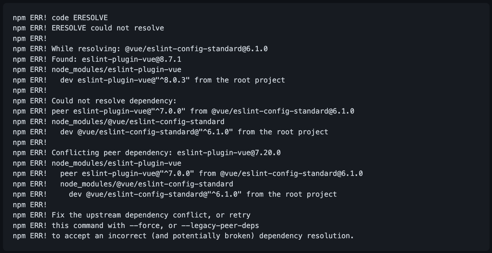
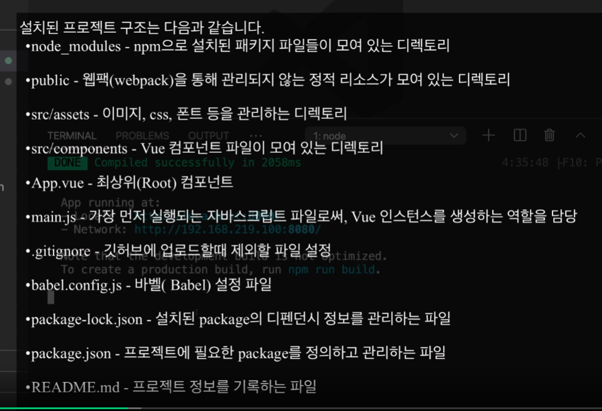

- [Key Remember Things](#key-remember-things)
- [Vuejs](#vuejs)
- [Nodejs](#nodejs)
- [SQL](#sql)
- [10. 엑셀 업로드 및 파싱](#10-엑셀-업로드-및-파싱)

# Key Remember Things

- Research 관련 중요한 사항들을 정리하는 목적

# Vuejs

> **IMPORTANT**
>> Vue 초기 설치를 위한 순서 및 참고 사항
>>
>> - vue 버전을 확인
>>
>>> - `vue --version`
>>>
>> - vue 최신 버전을 설치
>>
>>> - `npm install -g @vue/cli`
>>>
>> - vue 프로젝트를 생성
>>
>>> - `vue create vuetify-admin-template`
>>>
>> - VS CODE로 생성된 프로젝트를 오픈하고 실행
>>
>>> - `npm run serve`
>>>
>> - vue-router_ 설치
>>
>>> - `npm i -S vue-router`

- 코드 포맷터와 충돌나는 부분을 해소하기 위해서
  
```json
//* .prettierrc
{
    "semi": false,
    "bracketSpacing": true,
    "singleQuote": true,
    "useTabs": false,
    "trailingComma": "none",
    "printWidth": 80
}

//* package.json
"rules": {
  "space-before-function-paren": "off"
}

//* jsconfig.json
"jsx": "preserve",

// webpackPrefetch:true
```

- vscode, nodejs, npm, 
  - vscode.modules : vetur, prettier, vue 3 snippets

- vue cli 설치, vue 프로젝트 생성 3가지 방법
  - npm install -g @vue/cli
  - sudo npm install -g @vue/cli
  - vue create [프로젝트이름]
    - default, manually, vue 프로젝트 매니저(vue ui)

- 추가 라이브러리 설치
  - vue router 설치
    - vue add router
    - Lazy Load -> 라우팅시 페이지 접속시마다 로딩
    - Prefetch -> 사전에 모든 페이지 로딩
    - vue.config.js -> prefetch 전역 설정

- vue component 기본
  - 기본구조
  - User Snippet 설정
    - vue.json에 코드 스니펫 템플릿 추가(인터넷 검색하면 많이 나옴)
  - 데이터 바인딩 기본
    - {{문자열}}, v-html, v-model(two-way, value에 할당), textarea는 반드시 v-model로 바인딩 필요
    - select(v-model:value와 연결), checkbox(v-model:checked와 연결), radio(v-model:checked와 연결), html의 속성앞에 'v-bind:'를 넣으면 연결 가능

- 코드 포맷터와 충돌나는 부분을 해소하기 위해서 아래와 같이 prettierrc, package.json, jsconfig.json 등을 수정 한다.

- npm install error 관련
  - eslint-plugin 관련 resolve dependency 문제 발생시 아래의 코드 실행
  

- npm run serve error 관련
  - `./node_modules/bootstrap/dist/js/bootstrap.esm.js` error
    - `npm install --save @popperjs/core` 명령어 실행

  - ```command
    npm config set legacy-peer-deps=true --location=project
    ```
  
- Vue Project Folder Structure & Describe


- [`개발생산성과 품질향상을 위한 Vuejs 개발 방안` 문서](./../../assets/images/posts/bootcamp005/개발생산성과_품질향상을_위한_Vue_js_개발_방안.pdf)

# Nodejs

- WebServer Configuration

# SQL

- SQL 관련된 주요 사항 기록

> **IMPORTANT**
>> 페이징 처리
>>
>> - SELECT * FROM table_name LIMIT 건수
>> - SELECT * FROM table_name WHERE 조건 LIMIT 시작인덱스, 가져올 건수
>> - SELECT * FROM table_name LIMIT 5 OFFSET 5; // postgresql 구문
>> - 한 페이지에 보여주는 행의 갯수 = 10 라면 ???
>>
>>> - (첫번째 페이지 번호 - 1) x 보여줄 행 갯수 = (1 - 1) x 10 = 0 = LIMIT 0, 10
>>> - (두번째 페이지 번호 - 1) x 보여줄 행 갯수 = (2 - 1) x 10 = 10 = LIMIT 10, 10
>>> - (세번째 페이지 번호 - 1) x 보여줄 행 갯수 = (3 - 1) x 10 = 30 = LIMIT 30, 10
>>> - (네번째 페이지 번호 - 1) x 보여줄 행 갯수 = (4 - 1) x 10 = 40 = LIMIT 40, 10

# 10. 엑셀 업로드 및 파싱

- 내용

> **IMPORTANT**
>> 타이틀
>>
>> - 컨텐츠

```html
```