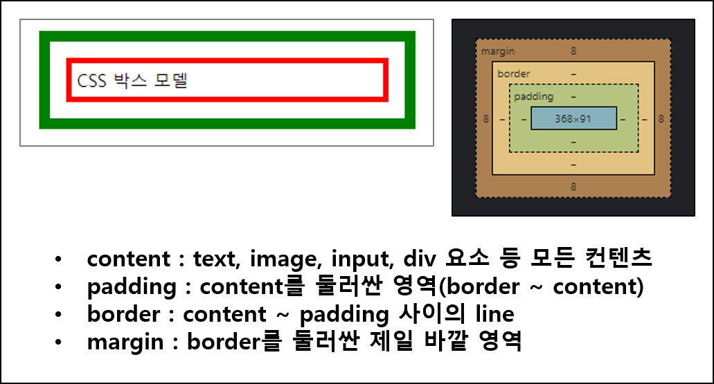

<!--  -->

## 1. CSS

- [CSS(Cascading Style Sheets)](https://ko.wikipedia.org/wiki/CSS)
- CSS는 웹 페이지에 스타일(디자인, 레이아웃등)을 적용할 수 있는 기술이다.
  - HTML은 웹 페이지의 뼈대를 구성하는 기술이다.
- W3C의 표준화 제정
  - [can i use ?](https://caniuse.com)
  - W3C(World Wide Web)에서 추가되는 신규 기술 사양에 대해서 표준화 제정 단계 4단계로 사용자에게 기술 사양의 상태를 알려줌
    - WD(Working Draft), CR(Candidate Recommendation), PR(Proposed Recommendation), REC(W3C Recommendation)
    - `caniuse.com`에서 CSS의 기술 사양에 대해서 상태를 상세하게 확인 가능
    - 초록색은 지원, 붉은색은 미지원

### 1.1 선택자(Selector)

- 특정 요소 및 원하는 요소에 대해서 한번에(쉽게, 편리하게) 디자인(CSS Style)을 적용할 수 있는 방법을 제공해 준다
- 
- `h1` : 선택자
- `{color:blue; font-size:12px;}` : 선언 블럭(declaration block)
- `color:blue;` : 선언(declaration)
- `color` : 속성(property)
- `blue` : 속성값(property-value)
- 선택자의 종류
  - 클래스 선택자(class selector)
    - element의 class 속성값을 활용

    - ```html
      <style>
        .bg-red { background-color: red; }
      </style>
      <div class="bg-red h-100">클래스 선택자</div>
      ```

  - 태그 선택자(tag selector)
    - element 명을 활용 

    - ```html
      <style>
        a { text-decoration: none; } 
      </style>
      ```

  - ID 선택자(ID selector)
    - html 요소의 id(유일한 값)를 활용

    - ```html

      <style>
        #container { width: 1200px; margin: 20px auto; }
      </style>
      <div id="container">아이디사용</div>
      ```

  - 복합 선택자(combination selector)
    - 2개 이상의 요소에 대해서 활용 

    - ```html
      <style>
        <!-- section 요소하위 모든 ul 요소 -->
        section ul { border: 1px dotted black; } 

        <!-- section 하위 ul 요소 -->
        section>ul { border: 1px; }

        <!-- 인접한 형제 선택자 -->
        h1+ul { background: blue; }

        <!-- 일반 형제 선택자 -->
        h1~ul { background: green; }
      </style>
      ```

  - 속성 선택자(attribute selector)
    - 요소의 속성별로 활용

    - ```html
      <style>
        <!-- E[attr] -->
        a[href] { color: black; text-decoration: none; }

        <!-- E[attr="value"] -->
        input[type="text"] { width: 200px; border: 1px solid #ddd; }

        <!-- name 속성 선택자 -->
        [name='email'] { border: 2px solid blue; }
      </style>
      <input type='email' name='email' id=''/>
      ```

  - 가상 클래스 선택자(pseudo selector)
    - 특정 요소에 사용자의 이벤트(마우스 포커스, 마우스 호버등)에 대해서 스타일을 지정
    - a 요소의 text-decoration: none이후 마우스 호버시 링크 표시

    - ```html
      <style>
        <!-- :link, :visited, :hover, :active, :focus` ... -->
        a:hover { text-decoratin: underline; }

        <!-- 2n or even : 짝수, 2n+1 or odd : 홀수 -->
        tbody > tr:nth-child(2n) { background-color: yellow; }
      </style>
      ```

### 1.2 CSS 적용 방법

- [MDN Site 참고](https://developer.mozilla.org/ko/docs/Learn/CSS/First_steps/How_CSS_is_structured#html_%EC%97%90_css_%EC%A0%81%EC%9A%A9%ED%95%98%EA%B8%B0)
- inline style
  - html 요소의 시작 태그에 style 속성을 사용하여 직접 지정
- internal style
  - head 태그내에 `<style></style>` 태그를 사용하여 지정
- external style
  - internal style의 내용을 별도의 css 확장자의 파일로 분리하고 head 태그내에서 참고하여 사용

  - ```html
    <link rel="stylesheet" href="./css/style.css" />
    ```

  - 실무에서 가장 많이 사용

### 1.3 색상 적용 방법

- [MDN Site 참고](https://developer.mozilla.org/ko/docs/Web/CSS/CSS_Colors/Applying_color)
- 색상명
  - 색상명에 해당하는 키워드 사용

  - ```html
    <h1 style="background-color: blue">파란색 배경색 적용</h1>
    ```

- RGB
  - R-Red, G-Green, B-Blue에 대당하는 숫자값(0~255) 사용

  - ```html
    <h1 style="color: rgb(255, 0, 0)">빨간색</h1>
    ```

- RGBA
  - RGB에 알파값 추가 A-Alpha(투명도)

  - ```html
    <h1 style="color: rgba(255, 0, 0, 0.2)">빨간색</h1>
    ```

- HEX
  - 16진수 표기법, 광원(빛의 3원색)인 Red, Green, Blue의 조합으로 표기
  - 0 -> HEX '00', 255 -> HEX 'FF'

  - ```html
    <h1 style="color: #ff0000">빨간색</h1>
    ```

- HSL
  - 색조(hue), 채도(saturation), 밝기(lightness) 3가지 값
  - 색조 : 0~360, 360은 빨간색, 120은 초록색, 240은 파란색
  - 채도 : 0~100%, 0%은 회색음영
  - 밝기 : 0~100%, 100% 가장 밝은 값

  - ```html
    <h1 style="color: hsl(360, 100%, 50%)">빨간색</h1>
    ```

- HSLA
  - HSL에 알파값 추가 A-Alpha(투명도)

  - ```html
    <h1 style="background-color: hsla(9, 100%, 64%, 0.2)">어떤 배경색</h1>
    ```

### 1.4 텍스트 스타일링

- [MDN Siste 참고](https://developer.mozilla.org/ko/docs/Web/CSS/CSS_Text)
- 몇가지 스타일을 복합해서 사용할 수 있으며, 개별로 사용도 가능하다.

  - ```html
    <style>
      .underover {
          text-decoration: dashed underline overline red 4px;
        }
      .decoration_style {text-decoration-style: dashed;}
      .decoration_line {text-decoration-line: underline;}
      .decoration_color {text-decoration-color: red;}
      .decoration_thinkness {text-decoration-thinkness: 4px;}
    </style>
    ```

- 대소문자를 위한 스타일의 경우

  - ```html
    <style>
      .uppercase {text-transform: uppercase;}
      .lowercase {text-transform: lowercase;}
      .capitalize {text-transform: capitalize;}
    </style>
    ```

  - 사용자는 페이지에서 문자 입력시 스타일을 사용하여 대소문자로 변경할 수 있으나, CSS는 눈에 보이는 값만 적용된다. 
  - 즉, 입력은 소문자로 하지만 표시는 대문자로 된다. 하지만 값(value)은 입력한 소문자 그대로 이다.
  - 서버로 전송할 경우 javascript.toUpperCase() 함수를 사용하여 다시 변경 후 서버로 전송 한다.

### 1.5 글꼴 스타일링

- [MDN Site 참고](https://developer.mozilla.org/ko/docs/Web/CSS/CSS_Fonts)
- [5개의 기본 폰트를 브라우저가 제공함](https://www.w3schools.com/cssref/css_websafe_fonts.asp)
- 다중의 폰트를 정의할 수 있다.

  - ```html
    <style>
      .font1 {
        font-family: "Courier New", Courier, monospace;
      }

      .font2 {
        font-family: Arial, Helvetica, sans-serif;
      }
    </style>
    ```

  - 1번째부터 순차적으로 적용하고 없다면 하순위로 이동한다.
- italic & oblique 구분
  - `italic` 이탤릭체 폰트 사용, `oblique` 글자 자체만 기울임
- [글꼴](https://developer.mozilla.org/ko/docs/Web/CSS/font-family)
  - font-family: 굴림, 맑은고딕 등

  - ```html
    <h1 style="font-family: verdana">verdana 폰트</h1>
    ```

- [글꼴 스타일](https://developer.mozilla.org/ko/docs/Learn/CSS/Styling_text/Fundamentals)
  - font-style: 이택릭 등

  - ```html
    .italic { font-style: italic; }
    ```

- 글꼴 굵기
  - font-weight: normal(보통, 숫자로 400), bold(숫자로 700)

  - ```html
    <p style="font-weight: 100">font-weight:100</p>
    ```

  - 100 ~ 900, bold, bolder, normal 값이 존재
  - border : 상대적인 값
    - 부모 100~300 > 자식 400, 부모 400~500 > 자식 700, 부모 600이상 > 자식 900 고정
  - lighter : 상대적인 값
    - 부모 100~500 > 자식 100, 부모 600~700 > 자식 400, 부모 800~900 > 자식 700
- 폰트 크기
  - font-size : ???

  - ```html
    <p style="font-size: 10px">font-size:10px</p>
    ```

  - 절대 값
    - xx-small, x-small, small, medium, large, x-large, xx-large
  - 상대 값
    - larger, smaller
  - 길이 값
    - em : 부모 요소의 폰트 크기 기준 (상대값)
    - rem : 루트 요소의 폰트 크기 기준 (상대값)
    - px : 픽셀
    - pt : 포인트, 1pt = 0.72인치
  - 퍼센트 값
  - 대부분의 브라우저의 폰트 크기의 ***기본값은 12px = 16px = 1em = 100%***
  - `em, rem`의 ***장점은 상대값으로 반영됨으로 다양한 크기의 디바이스 적용에 적당***
  - 모바일 디바이스 일때는 ***기본값이 20px이다라는 식으로 정의***할 수 있다.

### 1.6 목록 스타일링

- [MDN Site 참고](https://developer.mozilla.org/en-US/docs/Web/CSS/list-style-type)
- 순서 없는 목록(ul), 순서 있는 목록(ol), 목록의 하위 목록(li)
- `ul > list-style-type`
  - disc, circle, square, "custom"

  - ```html
    <style>
      ul {
        list-style-type: disc;
        list-style-type: circle;
        list-style-type: square;
        list-style-type: "-";
      }
    </style>
    ```

- `ol > list-style-type`
  - decimal, lower-roman, lower-greek, lower-latin, armenian, lower-alpha

  - ```html
    <style>
      ol {
        list-style-type: decimal;
        list-style-type: lower-roman;
        list-style-type: lower-greek;
        list-style-type: armenian;
      }
    </style>
    ```

### 1.7 링크와 커서 스타일링

- [MDN Site 참고](https://developer.mozilla.org/ko/docs/Web/CSS/cursor)
- 가상 클래스(pseudo-classes)
  - a:hover, a:visited, a:link [가상 클래스 MDN Site 참고](https://developer.mozilla.org/en-US/docs/Web/CSS/Pseudo-classes)
- 페이지이동 역할(버튼과 같음), 커서모양 학습
  - style="curosr= value" [MDN cursor value 참고](https://developer.mozilla.org/ko/docs/Web/CSS/cursor#%EA%B0%92)
    - auto, default, context-menu, help, pointer, progress, wait, cell, crosshair, text, copy, move, not-allowed, col-resize, row-resize, zoom-in, zoom-out

### 1.8 표 스타일링

- [MDN Site 참고](https://developer.mozilla.org/ko/docs/Web/CSS/CSS_Table)

- ```html
    <style>
      .table {
        border: 1px solid black;
        border-collapse: collapse;
        width: 100%;
      }

      .table th,
      .table td {
        border: 1px solid black;
      }

      .table-striped > tbody > tr:nth-child(2n + 1) {
        background-color: aquamarine;
      }

      .table-hover > tbody > tr:hover {
        background-color: yellow;
      }

      .table > tbody {
        cursor: pointer;
      }
    </style>
  ```

### 1.9 CSS 박스 모델과 요소의 크기

- [Box Model - MDN Site 참고](https://developer.mozilla.org/ko/docs/Web/CSS/CSS_Box_Model)
- [Box Size - MDN Site 참고](https://developer.mozilla.org/ko/docs/Web/CSS/box-sizing)
- 박스 모델(Box Model)
  - html 요소는 박스 모양으로 구성(box mobel)
  - 
  - padding과 margin 속성의 값의 할당 의미

    - ```html
      <div style="padding: 10px 5px 10px 5px; 
          margin: 5px 10px 5px 10px;
          border: 10px solid green;">
      <!-- 순서가 top, right, bottom, left 즉, 시계방향으로 진행 -->
      <!-- 2개만 준다면, 1번째는 top, bottom 2번째는 right, left를 의미 -->
      ```

- 박스 사이징(Box Sizing)
  - margin, border, padding, content 중 크기(width, height)의 기준 잡기가 중요
  - box-sizing 속성을 이용하여 기준점 설정
  - px 단위, 페센트 단위(부모 요소를 기준의 상대 값)

  - ```html
    <style>
      .box-size {
        box-sizing: content-box;
        box-sizing: border-box;
      }
    </style>
    <body>
      <div class="box-size">박스 모델</div>

      <div style="width: 100%; height: 200px; background-color: green">
        <div
          style="
            width: 50%;
            max-width: 900px;
            min-width: 200px;
            height: 50%;
            background-color: red;">
        </div>
      </div>
    </body>
    ```

### 1.10 background 스타일링

- [MDN Site 참고](https://developer.mozilla.org/ko/docs/Web/CSS/background)
- [단축 속성](https://developer.mozilla.org/ko/docs/Web/CSS/Shorthand_properties)으로 색상, 이미지, 원점, 크기 반복등 여러 배경 스타일을 한 번에 지정할 수 있음.(속성별로 사용 가능)

- ```html
  <style>
      /* 배경색 */
      div {
        background-color: aqua;
      }

      /* 배경 이미지 */
      /* background: color, image, repeat, position */
      body {
        /* background-image: url("./img/img_tree.png"); */
        /* background-repeat: repeat-x; */
        /* background-position: center top; */
        /* background-position: right 20px top 50px; */
        /* background-attachment: scroll; */

        background: yellowgreen url("./img/img_tree.png") no-repeat right 20px top 50px;
        background-attachment: fixed;
      }
    </style>
  ```

### 1.11 border 스타일링

- [MDN Site 참고](https://developer.mozilla.org/ko/docs/Web/CSS/border)
- [단축 속성](https://developer.mozilla.org/ko/docs/Web/CSS/Shorthand_properties)으로 요소의 테두리를 설정(border-width, border-style, border-color)

- ```html
  <style>
      /* border  */
      /* 시계방향 : border-top, border-right, border-bottom, border-left */
      /* border: 5px -> 4면 모두 5px */
      /* border: 5px 10px -> top, bottom은 5px, right, left는 10px */
      /* border: 5px 10px 7px -> top은 5px, right, left는 10px, bottom 7px */
      /* border: 5px 10px 7px 8px */
      div {
        border: 3px solid red;
        /*border-width: 3px;
        border-style: solid;
        border-color: red;*/

        width: 50px;
        height: 50px;
        margin: 10px;
      }
  </style>
  ```

### 1.12 Position

- [요소의 위치 정의 MDN site 참고](https://developer.mozilla.org/ko/docs/Web/CSS/position)
- position: static
  - 기본값
  - 일반적인 문서의 흐름에 따라서 요소의 위치가 정해짐
- position: relative
  - top, right, bottom, left 속성 같이 사용해서 오프셋 적용
- position: fixed
  - 지정된 위치에 html 요소를 고정 (웇그 하단 to top 과 같은 기능)
  - top, right, bottom, left 속성 같이 사용해서 오프셋 적용
- position: absolute
  - `position:relative;`가 설정된 가장 가까운 부모 요소에 대한 상대적 위치
- position: sticky
  - nav 요소의 최상단 부착 기능
  - 스크롤이 되기 전에는 원래 요소가 있어야 할 위치에 있다가 스크롤이 되면 지정된 위치에 고정

### 1.13 Overflow

- [요소의 컨텐츠가 부모 요소의 크기보다 클때 MDN site 참고](https://developer.mozilla.org/ko/docs/Web/CSS/overflow)

- ```html
  <style>
  overflow: visible;
  overflow: hidden;
  overflow: clip;
  overflow: scroll;
  overflow: auto;
  overflow: hidden visible;
  </style>
  ```

### 1.14 Layout for CSS

- [MDN site 참고](https://developer.mozilla.org/ko/docs/Web/CSS/display)
- 페이지 레이아웃을 위하여 부모/자식 관계로 설정
- display 설정값을 사용하여
  - block : 한 라인 전체
  - inline : 요소의 크기 만큼만
- display 유형을 설정하는 값
  - table : table 태그 처럼 자식 요소 배치 (반응형에 어려움)
  - flex : flexbox 모델에 따라 자식요소 배치 (실무에서 많이 사용)
  - grid : 그리드 레이아웃을 사용해서 자식요소 배치
  
- ```html
  <style>
    .container {
      <!-- table, flex, grid -->
      display: <display-keyword>;
    }
  </style>
  ```

- display : table
  - `display: table;` = `<table>`
  - `display: table-header-group;` = `<thead>`
  - `display: table-row-group;` = `<tbody>`
  - `display: table-row;` = `<tr>`
  - `display: table-cell;` = `<td>, <th>`
- display : flex
  - flexbox, main axis(x축 or y축 가능), cross axis(주축과 교차)
  - 부모 요소의 display: flex로 주면 자식도 동일 속성 적용
  - 주축을 기준으로 레이아웃
  - flex-direction (주축 설정)
    - row : 왼쪽 -> 오른쪽
    - row-reverse : 오른쪽 -> 왼쪽
    - column : 상단 -> 하단
    - column-reverse : 하단 -> 상단
  - flex-wrap (사이즈가 넓이보다 클때)
    - wrap : 부모의 크기가 자식의 크기를 고려해서 조정
  - justify-content (컨테이너 크기 > 자식의 크기 일때 정렬)
    - flex-start, flex-end, center, space-between, space-ground, space-evenly
- display : grid
  - grid layout은 웹 페이지 레이아웃을 위한 2차원 지원
    - 행,열을 동시에 지정해서 배치 가능
  - flexbox -> 1차원(가로? 세로?)

### 1.15 반응형 웹

- 반응형 웹
  - 해상도도 별로 웹 페이지의 레이아웃을 변경 가능한 기술
- [뷰포트(Viewport)](https://www.w3schools.com/css/css_rwd_viewport.asp)
  - 모바일 디바이스에서 웹 페이지가 사용자에게 보여지는 영역을 의미

  - ```html
    <meta name="viewport" content="width=device-width, initial-scale=1.0">
    ```

- [미디어 쿼리](https://www.w3schools.com/css/css_rwd_mediaqueries.asp)
  - 스크린의 크기별로 CSS에서 최적활 할 수 있는 기술
  - `@media` 규칙을 사용하여 특정 조건이 true인 경우에만 CSS 속성 블록을 포함합니다.

  - ```html
    <style>
    @media screen and (max-width: 768px) {
    .row,
    .navbar {
        flex-direction: column;
      }
    }
    
    /* 스마트폰 같은 작은 기기 (576px 이상) */
    @media (min-width: 576px) { /* CSS 정의 */ }

    /* 태블릿 같은 중간 크기 기기 (768px 이상) */
    @media (min-width: 768px) { /* CSS 정의 */ }

    /* 데스크톱 작은 해상도 (992px 이상) */
    @media (min-width: 992px) { /* CSS 정의 */ }

    /* 데스크톱 중간 해상도 (1200px 이상) */
    @media (min-width: 1200px) { /* CSS 정의 */ }

    /* 데스크톱 고 해상도 (1400px 이상) */
    @media (min-width: 1400px) { /* CSS 정의 */ }
    </style>
    ```

### 1.16 오픈 그래프 프로토콜

- [ogp.me 참고](https://ogp.me/)
- [오픈 그래프 프로토콜이란?](https://namu.wiki/w/%EC%98%A4%ED%94%88%20%EA%B7%B8%EB%9E%98%ED%94%84%20%ED%94%84%EB%A1%9C%ED%86%A0%EC%BD%9C)
  - 오픈 그래프 프로토콜은 어떠한 인터넷 웹사이트의 HTML 문서에서 `head -> meta` 태그 중 `og:XXX`가 있는 태그들을 찾아내어 보여주는 프로토콜이다.

- ```html
  /* meta tag에 아래와 같은 코드 추가 */
  <meta property="og:title" content="제목">
  <meta property="og:image" content="https://xxx.xx.io/aasdf/xxx.png">
  <meta property="og:image:width" content="1200">
  <meta property="og:image:height" content="630">
  <meta property="og:type" content="website">
  <meta property="og:url" content="최종 목적지">
  <meta property="og:description" content="설명">
  ```

- 카카오 개발자 > 도구 > 디버거 도구 > 공유 디버거
  - url을 입력해서 캐쉬를 초기화 해야 한다. (카카오톡 서비스에서 캐쉬 사용중이라 클리어 필요)

## 2. 웹 디자인시 반드시 고려할 사용

### 2.1 패턴 및 기획시 고려 사항

- 최소한의 semantic tag를 적극 사용하라
- 간략한 반응형을 구현하라
- box-sizing으로 기준을 잡아라
- display: flex; flex-direction: row; flex-wrap: warp; 설정 잡아라
- content에서 flex: 30% 같이 비율로 잡아라
- navbar의 경우 position: sticky; top: 0;와 같이 고정 시켜라
- 컬러값은 "HEX"를 사용해라
- 크기는 em, rem(루트요소)비율을 사용하라. (px 사용 금지, 상단 크기를 기준으로 비율로)
- semantic tag가 있다.
  - 기존에는 `<div>`만 이용했다.
  - semantic tag는 `<div>`와 완전 동일하지만 별명을 준다.
  - layout semantic tag
    - `<header></header>` 머릿 영역
    - `<nav></nav>` 메뉴 영역
    - `<aside></aside>` 좌우의 측면 영역
    - `<main></main>` 메인 영역
    - `<footer></footer>` 하단 푸터

### 2.2 꼭 검토 필요한 CSS 및 참고 코드

- box-sizing 속성으로 기준점을 설정 한다.

  - ```html
    <style>
      * {
       box-sizing: border-box;
      }
    </style>
    ```

- scroll-behavior: smooth;
- fixed-button;
- flexbox model을 활용
- css > external style을 준수

- ```html
  <style>
    /* flexbox model 사용 */
    .row {
      display: flex;
      flex-direction: row;
      flex-wrap: wrap;
    }
    
    html{
      /* 자연스러운 스크롤 */
      scroll-behavior: smooth;
    }

    .navbar {
      /* 위치에 고정 시킨다 */
      position: sticky;
      top: 0;
    }
  
    .fixed-button {
      position: fixed;
      bottom: 20px;
      right: 20px;
      width: 40px;
      height: 40px;
      border-radius: 20px;
      border: 3px solid green;
      font-size: 25px;
      color: green;
      text-align: center;
      display: none;
    }
  </style>
  ```

## 3. Reference

- [개발자의 품격 youtube](https://www.youtube.com/c/%EA%B0%9C%EB%B0%9C%EC%9E%90%EC%9D%98%ED%92%88%EA%B2%A9)
- [MDN Site](https://developer.mozilla.org/ko/)
- [W3C Site](https://www.w3.org/)
- [Can I use ? Site](https://caniuse.com/)