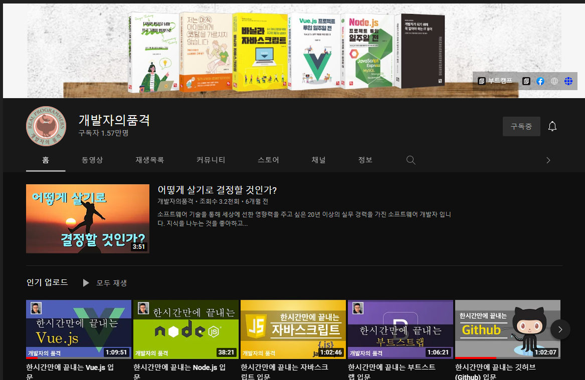

<!--  -->

## 0. Index

- [0. Index](#0-index)
- [1. JavaScript 란?](#1-javascript-란)
  - [1.1 역사](#11-역사)
  - [1.2 표준재정](#12-표준재정)
  - [1.3 바닐라스크립트](#13-바닐라스크립트)
- [2. JavaScript 작성 위치](#2-javascript-작성-위치)
  - [2.1 작성 위치](#21-작성-위치)
  - [2.2 추천 위치](#22-추천-위치)
- [4. 변수 선언자(var, let, const)](#4-변수-선언자var-let-const)
  - [4.1 변수명명 규칙](#41-변수명명-규칙)
  - [4.2 변수 선언자(var, let, const)](#42-변수-선언자var-let-const)
- [5. 기본 데이터 타입](#5-기본-데이터-타입)
  - [5.1 Object 타입](#51-object-타입)
  - [5.2 Array 타입](#52-array-타입)
  - [5.3 비트 부동소수점](#53-비트-부동소수점)
- [6. 연산자(할당, 비교, 산술, 논리, 문자열, 조건삼항)](#6-연산자할당-비교-산술-논리-문자열-조건삼항)
- [7. 조건문](#7-조건문)
- [8. 반복문](#8-반복문)
- [9. 함수](#9-함수)
- [10. 주요 객체와 내장 함수](#10-주요-객체와-내장-함수)
  - [10.1 String](#101-string)
  - [10.2 Number](#102-number)
  - [10.3 Array](#103-array)
  - [10.4 Date](#104-date)
  - [10.5 Set](#105-set)
  - [10.6 Map](#106-map)
  - [10.7 Math](#107-math)
  - [10.8 JSON](#108-json)
  - [10.9 window](#109-window)
- [Reference](#reference)

## 1. JavaScript 란?

### 1.1 역사

- [JavaScript의 역사](https://ko.wikipedia.org/wiki/%EC%9E%90%EB%B0%94%EC%8A%A4%ED%81%AC%EB%A6%BD%ED%8A%B8)
  - 1990년대 넷스케이프 회사의 Brendan Eich가 처음 Mocha이름으로 개발 후 LiveScript를 거처 JavaScirpt로 되었음
  - Microsoft도 인터넷 익스플로러 전용 JScript를 개발, 이때부터 표준화가 이슈화 됨

### 1.2 표준재정

- [ECMA Script(ES)](https://ko.wikipedia.org/wiki/ECMA%EC%8A%A4%ED%81%AC%EB%A6%BD%ED%8A%B8)
  - 스크립트 표준 규격인 [ECMA-262](https://www.ecma-international.org/technical-committees/tc39/?tab=general) 채택됨
  - JavaScirpt는 언어이며, ECMA Script는 스크립트 표준
  - ECMA Script = ES

### 1.3 바닐라스크립트

- [Valilla JavaScript](http://vanilla-js.com/)
  - 순수 자바스크립트로 어떠한 라이브러리도 사용하지 않음
  - 슬로건
    - Vanilla JS is a fast, lightweight, cross-platform framework
for building incredible, powerful JavaScript applications.

## 2. JavaScript 작성 위치

### 2.1 작성 위치

- 헤더영역에 인라인으로 작성

  - ```html
    <head>
      <script>
        document.write("hello.!!");
      </script>
    </head>
    <body></body>
    ```

- 바디 어디든 작성

  - ```html
    <body>
      <script>
        document.write("hello.1");
      </script>
      <h1>머리말1</h1>
      <script>
        document.write("hello.2");
      </script>
    </body>
    ```

- 외부 파일 작성

  - ```javascript
    <!-- ./js/js_location.js -->
    document.write("별도의 js 파일에서 document.write 실행");
    ```

  - ```html
    <head>
      <script src="./js/js_location.js"></script>
    </head>
    ```

- 순차적으로 코드를 분석(인터프리터 방식) 및 로딩으로 바디 태그 아래에 두는 것이 퍼포먼스측면에서 가장 좋다.

  - `defer` 속성을 사용하여 `<head></head>`에 정의된 script도 `<body></body>` 태그 하단에서 로딩

  - ```html
    <head>
      <script src="./js/js_location.js" defer></script>
    </head>
    ```

### 2.2 추천 위치

- 하단의 외부참조부터 넣고, 해당 파일만의 스크립트 태그 작성

- ```html
  <body>
    <h1>본문 내용</h1>
    <script src="./js/js_location.js"></script>
    <script>
      <!-- 해당 html 파일에서만 사용되는 JavaSciprt 코드 정의 -->
    </script>
  </body>
  ```

## 3. Console 객체의 log 함수

- `console.log` 함수를 사용해 원하는 값을 콘솔에 출력 가능

- ```html
  <body>
    <script>
      <!-- window.console 객체의 log 함수의 문자열 파라메터를 사용하여 로그 출력 -->
      console.log('hello !');
    </script>
  </body>
  ```

## 4. 변수 선언자(var, let, const)

- 변수란?
  - 데이터를 넣기 위한 단위 그릇
- 자바나 C#과 같은 강력한 형식이 존재하는 언어는 어떤 데이터를 담을지에 따라서 그릇의 형태를 다르게 해야 한다.
- 자바스크립트의 경우는 어떠한 형식(문자, 숙자, 날짜, 소숫점등)이든 데이터를 담는 그릇이 동일하다.
- 편함에 있어서는 장점이 될 수 도 있지만, 사전에(개발시) 다양한 데이터 형식으로 인한 오류를 잡지 못하는 상황이 생김
- 타입스크립트 : 기존의 이러한 자바스크립트의 단점을 보완, 형식을 지정

- 데이터를 담기 위하여 변수를 선언
  - 변수라고 알려주기 위해서는 "변수 선언자"가 필요
  - ES6 이전에는 변수 선언자는 "var" 뿐임
  - ES6 이후에는 변수 선언자는 "var, let, const"와 같이 다양해짐

### 4.1 변수명명 규칙

- **변수 선언자(var, let, const)**를 이용하여 변수를 선언할때 이름을 지어주어야 한다. 이럴때 다음과 같이 많이 사용하는 명명규칙이 있다.
  - [카멜표기법(camelCase)](https://ko.wikipedia.org/wiki/%EC%B9%B4%EB%A9%9C_%ED%91%9C%EA%B8%B0%EB%B2%95)
    - ```javasscript var userName = "walter";```
  - [스네이크 표기법(snake_case)](https://ko.wikipedia.org/wiki/%EC%8A%A4%EB%84%A4%EC%9D%B4%ED%81%AC_%ED%91%9C%EA%B8%B0%EB%B2%95)
    - ```javasscript var user_name = "walter";```
  - 파스칼 표기법(PascalCase)
    - ```javasscript var UserName = "walter";```
  - [헝가리언 표기법(데이터타입의 약어사용)](https://ko.wikipedia.org/wiki/%ED%97%9D%EA%B0%80%EB%A6%AC%EC%95%88_%ED%91%9C%EA%B8%B0%EB%B2%95)
    - ```javasscript var strUserName = "walter";```
  - ES6에서도 카멜표기법을 따라서 사용하며, 일반적으로 가장 많이 사용

### 4.2 변수 선언자(var, let, const)

- var, let, const의 차이점
  - var
    - 선언한 변수명에 데이터를 다시 할당할 수 있음

      - ```javascript
        var x = 5;
        var y = 7;
        var z = x + y; // 12
        console.log("z 출력값:", z);

        x = 9;
        y = 10;
        z = x + y;
        console.log("z 출력값2:", z);
        ```

    - 동일한 변수명으로 재 선언 할 수 있음

      - ```javascript
        var x = 12;
        var y = 15;
        var z = x + y;
        console.log("z 출력값3:", z);
        ```

  - 문제점 ?
    - 이미 선언한 변수에 값도 다시 할 당 할 수 있고(여긴 그나마 문제가 덜됨), 하지만 동일한 변수명을 다시 재 선언함으로 코드의 오류가 발생(공동 작업이나, 원 변수의 의미를 알지 못한다면). 그래서 ES6에서 let, const라는 변수 선언자가 생겼음
  - let
    - 선언한 변수명에 데이터를 다시 할달할 수 있음

      - ```javascript
        let x1 = 5;
        let y1 = 7;
        let z1 = x1 + y1;
        console.log("z1 출력값:", z1);

        x1 = 9;
        y1 = 10;
        z1 = x1 + y1;
        console.log("z1 출력값2:", z1);
        ```

    - 동일한 변수명으로 재 선언 할 수 없음

      - ```javascript
        let x1 = 7; // 동일한 변수명으로 재선언시 에러 발생
        ```

  - const
    - 변수를 선언하는 시점에 값을 반드시 할당해야 함

      - ```javascript
        const PI; // 선언시 값을 할당하지 않아 에러 발생
        const PI = 3.14;
        ```

    - 동일한 변수명을 재 선언 할 수 없으며, 값을 재 할당 할 수도 없음

      - ```javascript
        let PI = 3; // 에러발생
        PI = 3.16; // 에러발생
        ```

## 5. 기본 데이터 타입

### 5.1 Object 타입

### 5.2 Array 타입

### 5.3 비트 부동소수점

## 6. 연산자(할당, 비교, 산술, 논리, 문자열, 조건삼항)

## 7. 조건문

## 8. 반복문

## 9. 함수

## 10. 주요 객체와 내장 함수

### 10.1 String

### 10.2 Number

### 10.3 Array

### 10.4 Date

### 10.5 Set

### 10.6 Map

### 10.7 Math

### 10.8 JSON

### 10.9 window

## Reference

- [개발자의 품격 youtube](https://www.youtube.com/c/%EA%B0%9C%EB%B0%9C%EC%9E%90%EC%9D%98%ED%92%88%EA%B2%A9)
- [MDN Site](https://developer.mozilla.org/ko/)
- [W3C Site](https://www.w3.org/)
- [Can I use ? Site](https://caniuse.com/)