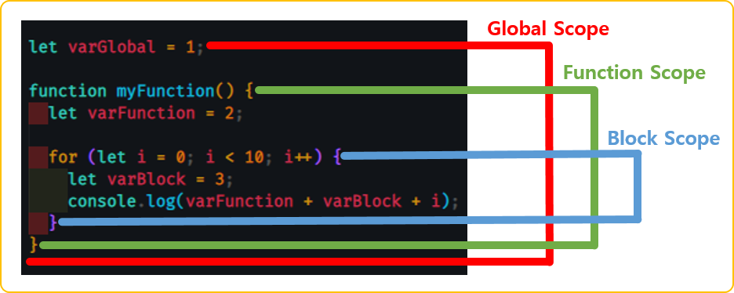

# JavaScript

- [JavaScript](#javascript)
  - [1. JavaScript ES6?](#1-javascript-es6)
    - [1.1. 역사](#11-역사)
    - [1.2. ES6](#12-es6)
  - [2. [ES6] this 키워드](#2-es6-this-키워드)
    - [2.1 Code Sample](#21-code-sample)
  - [3. [ES6] Scope](#3-es6-scope)
    - [3.1 Code Sample](#31-code-sample)
  - [4. [ES6] Default Function Parameter](#4-es6-default-function-parameter)
    - [4.1 Code Sample](#41-code-sample)
  - [5. [ES6] Rest Parameter](#5-es6-rest-parameter)
    - [5.1 Code Sample](#51-code-sample)
  - [6. [ES6] Arrow Function](#6-es6-arrow-function)
    - [6.1 Code Sample](#61-code-sample)
  - [7. [ES6] Template Literal Syntax Extension](#7-es6-template-literal-syntax-extension)
    - [7.1 Code Sample](#71-code-sample)
  - [8. [ES6] Object Literal Syntax Extension](#8-es6-object-literal-syntax-extension)
    - [8.1 Code Sample](#81-code-sample)
  - [9. [ES6] Spread Operator](#9-es6-spread-operator)
    - [9.1 Code Sample](#91-code-sample)
  - [10. [ES6] Object Destructuring](#10-es6-object-destructuring)
    - [10.1 Code Sample](#101-code-sample)
  - [11. [ES6] Array Destructuring](#11-es6-array-destructuring)
    - [11.1 Code Sample](#111-code-sample)
  - [12. XMLHttpRequest & json-server](#12-xmlhttprequest--json-server)
  - [13. fetch API](#13-fetch-api)
  - [14. async & await](#14-async--await)
  - [15. module](#15-module)
  - [16. class](#16-class)
  - [17. error](#17-error)
  - [18. strict mode](#18-strict-mode)
  - [19. 정규 표현식](#19-정규-표현식)
  - [20. 참고](#20-참고)

## 1. JavaScript ES6?

### 1.1. 역사

- [JavaScript의 역사](https://ko.wikipedia.org/wiki/%EC%9E%90%EB%B0%94%EC%8A%A4%ED%81%AC%EB%A6%BD%ED%8A%B8)
  - 1990년대 넷스케이프 회사의 Brendan Eich가 처음 Mocha이름으로 개발 후 LiveScript를 거처 JavaScirpt로 되었음
  - Microsoft도 인터넷 익스플로러 전용 JScript를 개발, 이때부터 표준화가 이슈화 됨

### 1.2. ES6

- [ECMA Script(ES)](https://ko.wikipedia.org/wiki/ECMA%EC%8A%A4%ED%81%AC%EB%A6%BD%ED%8A%B8)
- 스크립트 표준 규격인 [ECMA-262](https://www.ecma-international.org/technical-committees/tc39/?tab=general) 채택됨
- JavaScirpt는 언어이며, ECMA Script는 스크립트 표준
- ECMA Script = ES

## 2. [ES6] this 키워드

- [MDN this](https://developer.mozilla.org/ko/docs/Web/JavaScript/Reference/Operators/this)
- `this` 키워드의 특징
  - 자신이 속한 객체를 가리키는 참조 변수
  - 코드 어디에서든 참조 가능
  - 함수를 호출하면 파라메터와 함께 this가 암시적으로 함수 내부로 전달되고 함수내에서 사용가능
  - 전역에서 사용할때, 함수내부에서 사용할때 구분이 필요하다(Scope 정의 확인 필요)
  
### 2.1 Code Sample

```html
<!-- click -->
<button onclick="myFunction2(this);">클릭</button>

<!-- change -->
<select name="" id="" onchange="myFunction2(this);">
  <option value="A">A</option>
  <option value="B">B</option>
  <option value="C">C</option>
</select>
```

```javascript
// 0.1 사용되는 위치에 따라서 this에 바인딩되는 객체가 달라진다.
console.log(this); //window object

function myFunction() {
  console.log(this);
}

myFunction(); //window object

// 0.2 DOM(Document Object Model) 요소가 binding 된 경우
function myFunction2(obj) {
  console.log(obj);
}
// 버튼을 클릭한 경우 
// output: <button onclick="myFunction2(this);">클릭</button>

let person = {
  firstName: "John",
  lastName: "Doe",
  getFullName: function() {
    return this.firstName + " " + this.lastName;
  }
  const fullName = person.getFullName();
  console.log(fullName);//Output: John Doe
}
```
  
## 3. [ES6] Scope

- [MDN Scope](https://developer.mozilla.org/ko/docs/Glossary/Scope)<br/>

- `Scope`
  - 범위를 의미
  - 변수에 접근할 수 있는 범위 또는 식별자(변수)를 찾기위한 규칙
  - JavaScript 언어는 *함수 레벨 스콥*을 따름
  - 전역 Scope
    - 코드 어디에서든 참조 가능
    - `전역 변수`
      - 전역에서 선언된 변수로 어디서든 참조 할 수 있음
  - 지역 Scope
    - 함수 코드 블럭내 또는 함수 자신(하위)에서만 참고 가능
    - `지역 변수`
      - 지역(함수) 내에 선언된 변수로 해당 지역(함수)와 하위 지역(함수)에서만 참조 가능

### 3.1 Code Sample

```javascript
// 0.1 함수내에서 선언된 변수는 함수내 또는 해당 함수의 하위 함수에서만 참조 가능
function myFunction() {
  let carName = "기아차";
  console.log(carName);
}
myFunction(); //output: "기아차"
//console.log(carName); // 함수 밖에서 함수 안에 있는 변수 참조할수 없음

// 0.2 함수 밖에서 선언된 변수는 함수 밖 & 내부에서 참조 가능
let carName2 = "현대";
function myFunction2() {
  console.log(carName2);
}
myFunction2(); //output: "현대"

// 0.3 함수 내/외부는 Scope이 다름, 같은 변수명으로 let, const 선언자로 사용할 수 있음
let carName3 = "쌍용";
function myFunction3() {
  let carName3 = "볼보";
  console.log(carName3);
}
myFunction3(); //output: 볼보
```

## 4. [ES6] Default Function Parameter

- [MDN default parameters](https://developer.mozilla.org/ko/docs/Web/JavaScript/Reference/Functions/Default_parameters)
- `default parameters`
  - 함수에 파라메터가 있을수도 있고, 없을수도 있을때 사용
  - 기본 parameter의 값은 *undefined임*, 하지만 기본 값을 설정할 수 있음

### 4.1 Code Sample

```javascript
// 0.1 default parameter를 사용하지 않고 파라메터가 존재하나 파라메터를 넘기지 않을때 처리 방법
function myFunction(name) {
  if(name !== undefined) { // 반드시 validation 처리 필요
    console.log('hello, ' + name);
  }
}

myFunction("test");//output: hello, test
myFunction();//output: undefined

// 0.2 default parameter를 사용해서 처리 방법
function myFunction2(name = 'John Doe') {
  console.log('hello, ' + name);
}

myFunction2("test");//output: hello, test
myFunction2();//output: hello, John Doe
```

## 5. [ES6] Rest Parameter

- [MDN Rest Parameter](https://developer.mozilla.org/en-US/docs/Web/JavaScript/Reference/Functions/rest_parameters)
- `Rest Parameter`
  - 전달되는 파라메터앞에 `...`를 붙여 정의
  - 전달된 Rest 파라메터의 목록은 배열로 전달받는다.
  - *Rest 파라메터는 반드시 마지막 파라미터여야 함*

### 5.1 Code Sample

```javascript
function Add(...nums) {
  console.log(Array.isArray(nums));//true
  let total = 0;
  for(const n of nums) {
    total += n;
  }
  return total;
}

console.log(Add(1,2));//output: 3
console.log(Add(1,2,3));//output: 6
console.log(Add(1,2,3,4));//output: 10
```

## 6. [ES6] Arrow Function

- [MDN Arrow Function](https://developer.mozilla.org/ko/docs/Web/JavaScript/Reference/Functions/Arrow_functions)
- `Arrow Function`
  - 일반적인 함수 표현법을 축약하여 간단하게 사용할 수 있는 표현법
  - 제약 사항이 존재하니 MDN이나 관련 문서 참고가 필요

### 6.1 Code Sample

```javascript
// 0.1 함수 선언식 : 일반적인 함수 표현식
function myFunction1(name) {
  return "hello, " + name;
}

// 0.2 함수 표현식 : 변수에 할당하는 표현식
const myFunction2 = function(name) {
  return "hello, " + name;
}

// 0.3 화상표 함수 : 축약형
const myFunction3 = (name) => {
  return "hello, " + name;
}
```

## 7. [ES6] Template Literal Syntax Extension

- [MDN Template Literals](https://developer.mozilla.org/ko/docs/Web/JavaScript/Reference/Template_literals)
- [Wiki Literal-KR](https://ko.wikipedia.org/wiki/%EB%A6%AC%ED%84%B0%EB%9F%B4)
- `Template Literals`
  - 내장된 표현식을 허용하는 문자열 리터럴
  - 문자열 결함시 `+`를 사용했으나 특정 표현식(`${}`)의 사용으로 변수처럼 사용

### 7.1 Code Sample

```javascript
// 0.1 일반적은 결합(문자열)
function myFunction1(firstName, lastName) {
  console.log("hello, " + firstName + " " + lastName + ".");
}
myFunction1("John", "Doe");//output: hello, John Doe.

function myFunction2(firstName, lastName) {
  console.log("hello, ${firstname} ${lastName}.");
}
myFunction2("John", "Doe");//output: hello, John Doe.
```

## 8. [ES6] Object Literal Syntax Extension

- [MDN Object Literal](https://developer.mozilla.org/ko/docs/Web/JavaScript/Reference/Operators/Object_initializer#%EA%B0%9D%EC%B2%B4_%EB%A6%AC%ED%84%B0%EB%9F%B4_%ED%91%9C%EA%B8%B0%EB%B2%95_vs_json)
- [Wiki Literal-KR](https://ko.wikipedia.org/wiki/%EB%A6%AC%ED%84%B0%EB%9F%B4)
- `Object Literal`
  - ES6에서 추가된 표현법 언급
  - Shorthand property name(프로퍼티 축약)
    - key-value에서 key 이름과 value에 변수 이름이 같을 경우 한번만 사용 가능
  - Shorthand method names(메서드 축약)
    - 콜론(;) 또는 function 키워드를 제거할 수 있음
  - Computed property names(계산된 프로퍼티 이름)
    - 객체의 key값을 표현식의 연산 값(변수)을 사용

### 8.1 Code Sample

```javascript
// 0.1 Shorthand property name(프로퍼티 축약)
let name = "John Doe";
let personName = {
  name: name //key-value에서 key 이름과 value에 변수 이름이 같을 경우 한번만 사용 가능
};

let personNameShorthandProperty = {
  name
};

// 0.2 Shorthand method names(메서드 축약)
let person = {
  firstName: "John",
  lastName: "Doe",
  age: 23,
  fullName: function() {
    return firstName + " " + lastName;
  }
};

let personShorthandMethod = {
  firstName: "John",
  lastName: "Doe",
  age: 23,
  fullName: { //콜론(;) 또는 function 키워드를 제거할 수 있음
    return firstName + " " + lastName;
  }
};

// 0.3 Computed property names(계산된 프로퍼티 이름)
let property = "property";
let person = {
  firstName: "John",
  lastName: "Doe",
  age: 23,
  [property]: "010-111-1111",
  [property+'1']: "부산광역시...",
  [`${property}3`]: "소속회사"
};
console.log(person);
//output: {firstName: 'John', lastName: 'Doe', age: 23, property: '010-111-1111', property1: '부산광역시...',property3: '소속회사' ...}
```

## 9. [ES6] Spread Operator

- [MDN Spread Operator](https://developer.mozilla.org/ko/docs/Web/JavaScript/Reference/Operators/Spread_syntax)
- `Spread Operator`
  - 배열을 분해하여 각각의 요소를 따로 분리

### 9.1 Code Sample

```javascript
// 0.1 spread operator 없이 배열의 결합 방법
let num1 = [1, 2, 3];
let num2 = [4, 5, 6];
let num3 = num1.concat(num2);
console.log(num3);//[1, 2, 3, 4, 5, 6]

// 0.2 spread operator 사용하여 배열 결합
let num4 = [...num1, ...num2];
console.log(num4);//[1, 2, 3, 4, 5, 6]

// 0.3 샘플 예제
function sum(x, y, z) {
  return x + y + z;
}

const numbers = [1, 2, 3];
console.log(sum(...numbers));//output: 6
```

## 10. [ES6] Object Destructuring

- [MDN Object Destructuring](https://developer.mozilla.org/ko/docs/Web/JavaScript/Reference/Operators/Destructuring_assignment)
- `Object Destructuring`
  - 객체에서 값(value)이나 프로퍼티(property)를 분해하여 손쉽게 별도의 변수에 할당
  - 분해하여 할당할 객체의 타입은 일치화 시켜야 함(object -> object)

### 10.1 Code Sample

```javascript
function myFunction() {
  return {
    firstName: "John",
    lastName: "Doe",
    age: 32,
    email: "john.doe@email.com"
  }
}
let person = myFunction();
console.log(person.firstName);//output: John
console.log(person.age);//output: 32

// Object Destructuring
// 수없이 많은 속성을 가지고 있는 객체가 있을때 그중 내가 필요해서 사용할 속성은 몇개 뿐일때 사용하기 좋음
let { lastName, email } = myFunction();
console.log(lastName);//output: Doe
console.log(email);//output: john.doe@email.com
```

## 11. [ES6] Array Destructuring

- [MDN Array Destructuring](https://developer.mozilla.org/ko/docs/Web/JavaScript/Reference/Operators/Destructuring_assignment#%EB%B0%B0%EC%97%B4_%EA%B5%AC%EC%A1%B0_%EB%B6%84%ED%95%B4)
- 배열에서 값(value)이나 프로퍼티(property)를 분해하여 손쉽게 별도의 변수에 할당
  - 분해하여 할당할 객체의 타입은 일치화 시켜야 함(array -> array)

### 11.1 Code Sample

```javascript
let [a, b] = [10, 20];
console.log(a);//output: 10
console.log(b);//output: 20

let array = [1, 2, 3, 4, 5];
let [a, b, ...rest] = array;
console.log(rest); // [3, 4, 5];

function getGeoLocation(addr) {
  return [112.1234, 65.2334];
}
let geoLocation = getGeoLocation();
console.log(geoLocation[0]); // 위도
console.log(geoLocation[1]); // 경도

let [latitude, longitude] = getGeoLocation();
console.log(latitude); // 위도
console.log(longitude); // 경도
```

## 12. XMLHttpRequest & json-server

- 컨텐츠

## 13. fetch API

- 컨텐츠

## 14. async & await

- 컨텐츠

## 15. module

- 컨텐츠

## 16. class

- 컨텐츠

## 17. error

- 컨텐츠

## 18. strict mode

- 컨텐츠

## 19. 정규 표현식

- 컨텐츠

## 20. 참고

- [개발자의 품격 youtube](https://www.youtube.com/c/%EA%B0%9C%EB%B0%9C%EC%9E%90%EC%9D%98%ED%92%88%EA%B2%A9)
- [MDN Site](https://developer.mozilla.org/ko/)
- [W3C Site](https://www.w3.org/)
- [Can I use ? Site](https://caniuse.com/)