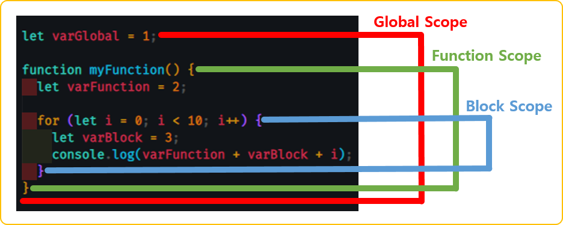

# JavaScript

- [JavaScript](#javascript)
  - [1. JavaScript ES6?](#1-javascript-es6)
    - [1.1. 역사](#11-역사)
    - [1.2. ES6](#12-es6)
  - [2. [ES6] this 키워드](#2-es6-this-키워드)
    - [2.1 Code Sample](#21-code-sample)
  - [3. [ES6] Scope](#3-es6-scope)
    - [3.1 Code Sample](#31-code-sample)
  - [4. [ES6] Default Function Parameter](#4-es6-default-function-parameter)
    - [4.1 Code Sample](#41-code-sample)
  - [5. [ES6] Rest Parameter](#5-es6-rest-parameter)
    - [5.1 Code Sample](#51-code-sample)
  - [6. [ES6] Arrow Function](#6-es6-arrow-function)
    - [6.1 Code Sample](#61-code-sample)
  - [7. [ES6] Template Literal Syntax Extension](#7-es6-template-literal-syntax-extension)
    - [7.1 Code Sample](#71-code-sample)
  - [8. [ES6] Object Literal Syntax Extension](#8-es6-object-literal-syntax-extension)
    - [8.1 Code Sample](#81-code-sample)
  - [9. [ES6] Spread Operator](#9-es6-spread-operator)
    - [9.1 Code Sample](#91-code-sample)
  - [10. [ES6] Object Destructuring](#10-es6-object-destructuring)
    - [10.1 Code Sample](#101-code-sample)
  - [11. [ES6] Array Destructuring](#11-es6-array-destructuring)
    - [11.1 Code Sample](#111-code-sample)
  - [12. XMLHttpRequest(XHR) & json-server](#12-xmlhttprequestxhr--json-server)
    - [12.1 Virtual Web Server Configure (JSON Server)](#121-virtual-web-server-configure-json-server)
    - [12.1 Code Sample](#121-code-sample)
  - [13. fetch API](#13-fetch-api)
  - [14. async & await](#14-async--await)
    - [14.1 Code Sample](#141-code-sample)
  - [15. module](#15-module)
    - [15.1 Code Sample](#151-code-sample)
  - [16. class](#16-class)
    - [16.1 Code Sample](#161-code-sample)
  - [17. error](#17-error)
    - [17.1 Code Sample](#171-code-sample)
  - [18. strict mode](#18-strict-mode)
    - [18.1 Code Sample](#181-code-sample)
  - [19. 정규 표현식](#19-정규-표현식)
    - [19.1 사용법(형식)](#191-사용법형식)
    - [19.2 매칭 패턴](#192-매칭-패턴)
    - [19.3 검색 패턴](#193-검색-패턴)
    - [19.4 수량 패턴](#194-수량-패턴)
    - [19.5 플래그(옵션)](#195-플래그옵션)
    - [19.6 주요 함수](#196-주요-함수)
    - [19.2 Code Sample](#192-code-sample)
  - [20. Memory](#20-memory)
    - [20.1 스택 메모리, 힙 메모리](#201-스택-메모리-힙-메모리)
  - [21. 참고](#21-참고)

## 1. JavaScript ES6?

### 1.1. 역사

- [JavaScript의 역사](https://ko.wikipedia.org/wiki/%EC%9E%90%EB%B0%94%EC%8A%A4%ED%81%AC%EB%A6%BD%ED%8A%B8)
  - 1990년대 넷스케이프 회사의 Brendan Eich가 처음 Mocha이름으로 개발 후 LiveScript를 거처 JavaScirpt로 되었음
  - Microsoft도 인터넷 익스플로러 전용 JScript를 개발, 이때부터 표준화가 이슈화 됨

### 1.2. ES6

- [ECMA Script(ES)](https://ko.wikipedia.org/wiki/ECMA%EC%8A%A4%ED%81%AC%EB%A6%BD%ED%8A%B8)
- 스크립트 표준 규격인 [ECMA-262](https://www.ecma-international.org/technical-committees/tc39/?tab=general) 채택됨
- JavaScirpt는 언어이며, ECMA Script는 스크립트 표준
- ECMA Script = ES

## 2. [ES6] this 키워드

- [MDN this](https://developer.mozilla.org/ko/docs/Web/JavaScript/Reference/Operators/this)
- `this` 키워드의 특징
  - 자신이 속한 객체를 가리키는 참조 변수
  - 코드 어디에서든 참조 가능
  - 함수를 호출하면 파라메터와 함께 this가 암시적으로 함수 내부로 전달되고 함수내에서 사용가능
  - 전역에서 사용할때, 함수내부에서 사용할때 구분이 필요하다(Scope 정의 확인 필요)
  
### 2.1 Code Sample

```html
<!-- click -->
<button onclick="myFunction2(this);">클릭</button>

<!-- change -->
<select name="" id="" onchange="myFunction2(this);">
  <option value="A">A</option>
  <option value="B">B</option>
  <option value="C">C</option>
</select>
```

```javascript
// 0.1 사용되는 위치에 따라서 this에 바인딩되는 객체가 달라진다.
console.log(this); //window object

function myFunction() {
  console.log(this);
}

myFunction(); //window object

// 0.2 DOM(Document Object Model) 요소가 binding 된 경우
function myFunction2(obj) {
  console.log(obj);
}
// 버튼을 클릭한 경우 
// output: <button onclick="myFunction2(this);">클릭</button>

let person = {
  firstName: "John",
  lastName: "Doe",
  getFullName: function() {
    return this.firstName + " " + this.lastName;
  }
  const fullName = person.getFullName();
  console.log(fullName);//Output: John Doe
}
```
  
## 3. [ES6] Scope

- [MDN Scope](https://developer.mozilla.org/ko/docs/Glossary/Scope)<br/>

- `Scope`
  - 범위를 의미
  - 변수에 접근할 수 있는 범위 또는 식별자(변수)를 찾기위한 규칙
  - JavaScript 언어는 *함수 레벨 스콥*을 따름
  - 전역 Scope
    - 코드 어디에서든 참조 가능
    - `전역 변수`
      - 전역에서 선언된 변수로 어디서든 참조 할 수 있음
  - 지역 Scope
    - 함수 코드 블럭내 또는 함수 자신(하위)에서만 참고 가능
    - `지역 변수`
      - 지역(함수) 내에 선언된 변수로 해당 지역(함수)와 하위 지역(함수)에서만 참조 가능

### 3.1 Code Sample

```javascript
// 0.1 함수내에서 선언된 변수는 함수내 또는 해당 함수의 하위 함수에서만 참조 가능
function myFunction() {
  let carName = "기아차";
  console.log(carName);
}
myFunction(); //output: "기아차"
//console.log(carName); // 함수 밖에서 함수 안에 있는 변수 참조할수 없음

// 0.2 함수 밖에서 선언된 변수는 함수 밖 & 내부에서 참조 가능
let carName2 = "현대";
function myFunction2() {
  console.log(carName2);
}
myFunction2(); //output: "현대"

// 0.3 함수 내/외부는 Scope이 다름, 같은 변수명으로 let, const 선언자로 사용할 수 있음
let carName3 = "쌍용";
function myFunction3() {
  let carName3 = "볼보";
  console.log(carName3);
}
myFunction3(); //output: 볼보
```

## 4. [ES6] Default Function Parameter

- [MDN default parameters](https://developer.mozilla.org/ko/docs/Web/JavaScript/Reference/Functions/Default_parameters)
- `default parameters`
  - 함수에 파라메터가 있을수도 있고, 없을수도 있을때 사용
  - 기본 parameter의 값은 *undefined임*, 하지만 기본 값을 설정할 수 있음

### 4.1 Code Sample

```javascript
// 0.1 default parameter를 사용하지 않고 파라메터가 존재하나 파라메터를 넘기지 않을때 처리 방법
function myFunction(name) {
  if(name !== undefined) { // 반드시 validation 처리 필요
    console.log('hello, ' + name);
  }
}

myFunction("test");//output: hello, test
myFunction();//output: undefined

// 0.2 default parameter를 사용해서 처리 방법
function myFunction2(name = 'John Doe') {
  console.log('hello, ' + name);
}

myFunction2("test");//output: hello, test
myFunction2();//output: hello, John Doe
```

## 5. [ES6] Rest Parameter

- [MDN Rest Parameter](https://developer.mozilla.org/en-US/docs/Web/JavaScript/Reference/Functions/rest_parameters)
- `Rest Parameter`
  - 전달되는 파라메터앞에 `...`를 붙여 정의
  - 전달된 Rest 파라메터의 목록은 배열로 전달받는다.
  - *Rest 파라메터는 반드시 마지막 파라미터여야 함*

### 5.1 Code Sample

```javascript
function Add(...nums) {
  console.log(Array.isArray(nums));//true
  let total = 0;
  for(const n of nums) {
    total += n;
  }
  return total;
}

console.log(Add(1,2));//output: 3
console.log(Add(1,2,3));//output: 6
console.log(Add(1,2,3,4));//output: 10
```

## 6. [ES6] Arrow Function

- [MDN Arrow Function](https://developer.mozilla.org/ko/docs/Web/JavaScript/Reference/Functions/Arrow_functions)
- `Arrow Function`
  - 일반적인 함수 표현법을 축약하여 간단하게 사용할 수 있는 표현법
  - 제약 사항이 존재하니 MDN이나 관련 문서 참고가 필요

### 6.1 Code Sample

```javascript
// 0.1 함수 선언식 : 일반적인 함수 표현식
function myFunction1(name) {
  return "hello, " + name;
}

// 0.2 함수 표현식 : 변수에 할당하는 표현식
const myFunction2 = function(name) {
  return "hello, " + name;
}

// 0.3 화상표 함수 : 축약형
const myFunction3 = (name) => {
  return "hello, " + name;
}
```

## 7. [ES6] Template Literal Syntax Extension

- [MDN Template Literals](https://developer.mozilla.org/ko/docs/Web/JavaScript/Reference/Template_literals)
- [Wiki Literal-KR](https://ko.wikipedia.org/wiki/%EB%A6%AC%ED%84%B0%EB%9F%B4)
- `Template Literals`
  - 내장된 표현식을 허용하는 문자열 리터럴
  - 문자열 결함시 `+`를 사용했으나 특정 표현식(`${}`)의 사용으로 변수처럼 사용

### 7.1 Code Sample

```javascript
// 0.1 일반적은 결합(문자열)
function myFunction1(firstName, lastName) {
  console.log("hello, " + firstName + " " + lastName + ".");
}
myFunction1("John", "Doe");//output: hello, John Doe.

function myFunction2(firstName, lastName) {
  console.log("hello, ${firstname} ${lastName}.");
}
myFunction2("John", "Doe");//output: hello, John Doe.
```

## 8. [ES6] Object Literal Syntax Extension

- [MDN Object Literal](https://developer.mozilla.org/ko/docs/Web/JavaScript/Reference/Operators/Object_initializer#%EA%B0%9D%EC%B2%B4_%EB%A6%AC%ED%84%B0%EB%9F%B4_%ED%91%9C%EA%B8%B0%EB%B2%95_vs_json)
- [Wiki Literal-KR](https://ko.wikipedia.org/wiki/%EB%A6%AC%ED%84%B0%EB%9F%B4)
- `Object Literal`
  - ES6에서 추가된 표현법 언급
  - Shorthand property name(프로퍼티 축약)
    - key-value에서 key 이름과 value에 변수 이름이 같을 경우 한번만 사용 가능
  - Shorthand method names(메서드 축약)
    - 콜론(;) 또는 function 키워드를 제거할 수 있음
  - Computed property names(계산된 프로퍼티 이름)
    - 객체의 key값을 표현식의 연산 값(변수)을 사용

### 8.1 Code Sample

```javascript
// 0.1 Shorthand property name(프로퍼티 축약)
let name = "John Doe";
let personName = {
  name: name //key-value에서 key 이름과 value에 변수 이름이 같을 경우 한번만 사용 가능
};

let personNameShorthandProperty = {
  name
};

// 0.2 Shorthand method names(메서드 축약)
let person = {
  firstName: "John",
  lastName: "Doe",
  age: 23,
  fullName: function() {
    return firstName + " " + lastName;
  }
};

let personShorthandMethod = {
  firstName: "John",
  lastName: "Doe",
  age: 23,
  fullName: { //콜론(;) 또는 function 키워드를 제거할 수 있음
    return firstName + " " + lastName;
  }
};

// 0.3 Computed property names(계산된 프로퍼티 이름)
let property = "property";
let person = {
  firstName: "John",
  lastName: "Doe",
  age: 23,
  [property]: "010-111-1111",
  [property+'1']: "부산광역시...",
  [`${property}3`]: "소속회사"
};
console.log(person);
//output: {firstName: 'John', lastName: 'Doe', age: 23, property: '010-111-1111', property1: '부산광역시...',property3: '소속회사' ...}
```

## 9. [ES6] Spread Operator

- [MDN Spread Operator](https://developer.mozilla.org/ko/docs/Web/JavaScript/Reference/Operators/Spread_syntax)
- `Spread Operator`
  - 배열을 분해하여 각각의 요소를 따로 분리

### 9.1 Code Sample

```javascript
// 0.1 spread operator 없이 배열의 결합 방법
let num1 = [1, 2, 3];
let num2 = [4, 5, 6];
let num3 = num1.concat(num2);
console.log(num3);//[1, 2, 3, 4, 5, 6]

// 0.2 spread operator 사용하여 배열 결합
let num4 = [...num1, ...num2];
console.log(num4);//[1, 2, 3, 4, 5, 6]

// 0.3 샘플 예제
function sum(x, y, z) {
  return x + y + z;
}

const numbers = [1, 2, 3];
console.log(sum(...numbers));//output: 6
```

## 10. [ES6] Object Destructuring

- [MDN Object Destructuring](https://developer.mozilla.org/ko/docs/Web/JavaScript/Reference/Operators/Destructuring_assignment)
- `Object Destructuring`
  - 객체에서 값(value)이나 프로퍼티(property)를 분해하여 손쉽게 별도의 변수에 할당
  - 분해하여 할당할 객체의 타입은 일치화 시켜야 함(object -> object)

### 10.1 Code Sample

```javascript
function myFunction() {
  return {
    firstName: "John",
    lastName: "Doe",
    age: 32,
    email: "john.doe@email.com"
  }
}
let person = myFunction();
console.log(person.firstName);//output: John
console.log(person.age);//output: 32

// Object Destructuring
// 수없이 많은 속성을 가지고 있는 객체가 있을때 그중 내가 필요해서 사용할 속성은 몇개 뿐일때 사용하기 좋음
let { lastName, email } = myFunction();
console.log(lastName);//output: Doe
console.log(email);//output: john.doe@email.com
```

## 11. [ES6] Array Destructuring

- [MDN Array Destructuring](https://developer.mozilla.org/ko/docs/Web/JavaScript/Reference/Operators/Destructuring_assignment#%EB%B0%B0%EC%97%B4_%EA%B5%AC%EC%A1%B0_%EB%B6%84%ED%95%B4)
- 배열에서 값(value)이나 프로퍼티(property)를 분해하여 손쉽게 별도의 변수에 할당
  - 분해하여 할당할 객체의 타입은 일치화 시켜야 함(array -> array)

### 11.1 Code Sample

```javascript
let [a, b] = [10, 20];
console.log(a);//output: 10
console.log(b);//output: 20

let array = [1, 2, 3, 4, 5];
let [a, b, ...rest] = array;
console.log(rest); // [3, 4, 5];

function getGeoLocation(addr) {
  return [112.1234, 65.2334];
}
let geoLocation = getGeoLocation();
console.log(geoLocation[0]); // 위도
console.log(geoLocation[1]); // 경도

let [latitude, longitude] = getGeoLocation();
console.log(latitude); // 위도
console.log(longitude); // 경도
```

## 12. XMLHttpRequest(XHR) & json-server

- [MDN XMLHttpRequest](https://developer.mozilla.org/ko/docs/Web/API/XMLHttpRequest)
- 서버와 상호작용(통신)에서 사용되며, 페이지 새로고침 없이도 URL에서 데이터를 가져옴
- [HTTP](https://developer.mozilla.org/ko/docs/Web/HTTP/Overview)
  - 
  - 동기화 방식
  - 클라이언트가 서버로 요청(request)을 보내면, 서버가 요청에 대한 응답(response)
  - 응답이 오기 전까지는 다른 코드 블럭으로 이동이 불가
- [Ajax(Asynchronous JavaScript And XML)](https://developer.mozilla.org/ko/docs/Web/Guide/AJAX/Getting_Started)
  - `*Asynchronous JavaScript + XML(AJAX)*은 그 자체가 특정 기술은 아닙니다. 2005년 Jesse James Garrett이 처음 만들어낸 말로, HTML 또는 XHTML, CSS, JavaScript, DOM, XML, XSLT, 그리고 제일 중요한 XMLHttpRequest 객체를 비롯해 기존의 여러 기술을 사용하는 "새로운" 접근법을 설명하는 용어입니다. 이렇게 다양한 기술을 AJAX 모델로서 결합했을 때, 웹 어플리케이션은 전체 페이지를 새로 고칠 필요 없이 사용자 인터페이스에 빠르고 점진적인 업데이트를 적용할 수 있습니다. 덕분에 어플리케이션은 보다 빨라지고, 사용자 행동에 대한 반응성도 좋아집니다.` (in [MDN](https://developer.mozilla.org/ko/docs/Web/Guide/AJAX))
  - 비동기 통신(코드 블럭이 기다리지 않고 실행됨)
  - 페이지를 새로고침 하지 않아도 URL을 통해서 데이터를 전송하거나 받아올 수 있음.
  - `XMLHttpRequest` 객체 사용

### 12.1 Virtual Web Server Configure (JSON Server)

- 통신 코드를 실행하기 위해서 서버가 있어야하나, 개발단계 또는 코드레벨에서는 부담이다. 그래서 가상의 웹서버를 제공하는 패키지들이 있다. 다음의 순서대로 진행해 *간단한 가상서버*를 설치 한다.
- [npm json server](https://www.npmjs.com/package/json-server)
  - Step 1
    - Install JSON Server
  
    - ```command
      npm install -g json-server
      ```

  - Step 2
    - Create a `db.json` file with some data

    - ```json
      {
        "posts": [
          { "id": 1, "title": "json-server", "author": "typicode" }
        ],
        "comments": [
          { "id": 1, "body": "some comment", "postId": 1 }
        ],
        "profile": { "name": "typicode" }
      }
      ```

  - Step 3
    - Start JSON Server

    - ```command
      json-server --watch db.json
      ```

  - Step 4
    - Now if you go to `http://localhost:3000/posts/1`, you'll get

    - ```json
      { "id": 1, "title": "json-server", "author": "typicode" }
      ```

### 12.1 Code Sample

```javascript
// HTTP Method
// GET - 리소스 요청, POST - 리소스 생성, PUT - 리소스 수정, DELETE - 리소스 삭제

// 0.1 일반적으로 XMLHttpRequest 사용
function getPostData() {
    const xhr = new XMLHttpRequest();
    xhr.open("GET", "http://localhost:3000/posts");
    xhr.setRequestHeader("content-type", "application/json");
    xhr.send();

    // 서버로부터 응답을 받으면 onload 실행
    xhr.onload = () => {
        if (xhr.status === 200) {
            const res = JSON.parse(xhr.response);
            console.log(res);
            console.log(`JSON.parse(xhr.response) the posts : ${res}`);

            // 통신을 통해 수신한 데이터를 처리하는 로직 구현
            // return res
        } else {
            console.log(xhr.status, xhr.statusText);
        }
    };
}
getPostData();
console.log("AAAA");

function getCommentData() {
    const xhr = new XMLHttpRequest();
    xhr.open("GET", "http://localhost:3000/comments");
    xhr.setRequestHeader("content-type", "application/json");
    xhr.send();

    // 서버로부터 응답을 받으면 onload 실행
    xhr.onload = () => {
        if (xhr.status === 200) {
            const res = JSON.parse(xhr.response);
            console.log(res);
            console.log(`JSON.parse(xhr.response) the comments : ${res}`);

            // 통신을 통해 수신한 데이터를 처리하는 로직 구현
            // return res
        } else {
            console.log(xhr.status, xhr.statusText);
        }
    }
}
getCommentData();
console.log("BBBB");

/*output : 
AAAA
BBBB
[{…}] <<- posts json data
JSON.parse(xhr.response) the posts : [object Object]
[{…}] <<- comments json data
JSON.parse(xhr.response) the comments : [object Object]
*/
```

```javascript
// 0.2 Promise 사용
// 비동기 통신을 하는데 서버로 응답이 왔을 때 호출한 함수에서 알 수 있게 약속 한다.
function getData(url) {
    return new Promise((resolve, reject) => {
        const xhr = new XMLHttpRequest();
        xhr.open("GET", url);
        xhr.setRequestHeader("content-type", "application/json");
        xhr.send();

        // 서버로부터 응답을 받으면 onload 실행
        xhr.onload = () => {
            if (xhr.status === 200) {
                const res = JSON.parse(xhr.response);
                resolve(res);
            } else {
                console.log(xhr.status, xhr.statusText);
                reject(xhr.status);
            }
        };
    });
}
getData("http://localhost:3000/posts").then((res) => {
    console.log("http://localhost:3000/posts : " + res);
    console.log(res);
});
getData("http://localhost:3000/comments").then((res) => {
    console.log("http://localhost:3000/comments : " + res);
    console.log(res);
});
console.log("CCCC");

/*output : 
CCCC
http://localhost:3000/posts : [object Object]
[{…}] <<- posts json data
http://localhost:3000/comments : [object Object]
[{…}] <<- comment json data
*/
```

```javascript
// 나머지 post, put, delete 구현
//<button onclick="postData();">생성</button>
function postData() {
    const xhr = new XMLHttpRequest();
    xhr.open("POST", "http://localhost:3000/posts");
    xhr.setRequestHeader("content-type", "application/json;charset=UTF-8");
    const data = { title: "JavaScript", author: "Jeremy" };
    xhr.send(JSON.stringify(data));

    xhr.onload = () => {
        if (xhr.status === 200) {
            const res = JSON.parse(xhr.response);
            console.log(res);
        } else {
            console.log(xhr.status, xhr.statusText);
        }
    };
}
/*
output: 
201 'Created'

->> db.json file
{
  "posts": [
    {
      "id": 1,
      "title": "json-server",
      "author": "typicode"
    },
    {
      "title": "JavaScript",
      "author": "Jeremy",
      "id": 2
    }
  ]
}
*/

//<button onclick="putData();">수정</button>
function putData() {
    const xhr = new XMLHttpRequest();
    xhr.open("PUT", "http://localhost:3000/posts/2");
    xhr.setRequestHeader("content-type", "application/json;charset=UTF-8");
    xhr.send(JSON.stringify({ title: "HTML", author: "John Doe" }));

    xhr.onload = () => {
        if (xhr.status === 200) {
            const res = JSON.parse(xhr.response);
            console.log(res);
        } else {
            console.log(xhr.status, xhr.statusText);
        }
    };
}
/*
output:
{title: 'HTML', author: 'John Doe', id: 2}

->> db.json file
{
  "posts": [
    {
      "id": 1,
      "title": "json-server",
      "author": "typicode"
    },
    {
      "title": "HTML",
      "author": "John Doe",
      "id": 2
    }
  ]
}
*/

//<button onclick="deleteData();">삭제</button>
function deleteData() {
    const xhr = new XMLHttpRequest();
    xhr.open("DELETE", "http://localhost:3000/posts/2");
    xhr.setRequestHeader("content-type", "application/json;charset=UTF-8");
    xhr.send();

    xhr.onload = () => {
        if (xhr.status === 200) {
            const res = JSON.parse(xhr.response);
            console.log(res);
        } else {
            console.log(xhr.status, xhr.statusText);
        }
    };
}
/*
output:
{}

->> db.json file
{
  "posts": [
    {
      "id": 1,
      "title": "json-server",
      "author": "typicode"
    }
  ]
}
*/
```

## 13. fetch API

- [MDN Fetch API](https://developer.mozilla.org/ko/docs/Web/API/Fetch_API)
- [XMLHttpRequest](https://developer.mozilla.org/ko/docs/Web/API/XMLHttpRequest)와 비슷한 API이지만, 보다 강력하고 유연한 기능을 제공
  
- ```javascript
  // syntax without ES5
  fetch('api 주소')
  .then(function(res) {
    return res.json();
  })
  .then(function(res) {
    // data를 응답 받은 후의 로직
  });

  // syntax with ES6(arrow function)
  fetch('api 주소')
  .then(res => res.json())
  .then(res => {
    // data를 응답 받은 후의 로직
  });
  ```

### 13.1 Code Sample

```javascript
function getPostData() {
  // fetch("http://localhost:3000/posts")
  //   .then(function (response) {
  //     return response.json();
  //   })
  //   .then(function (json) {
  //     console.log(json);
  //   });

  fetch("http://localhost:3000/posts")
    .then((response) => response.json())
    .then((json) => console.log(json));
}

const headers = { "content-type": "application/json;charset=UTF-8" };

function postData() {
  const data = { title: "JavaScript", author: "Jeremy" };

  fetch("http://localhost:3000/posts", {
    method: "POST",
    body: JSON.stringify(data),
    headers: headers,
  })
  .then((response) => response.json())
  .then((json) => console.log(json));
}

function putData() {
  const data = { title: "Fetch API", author: "Jeremy" };
  fetch("http://localhost:3000/posts/2", {
    method: "PUT",
    body: JSON.stringify(data),
    headers: headers,
  })
  .then((response) => response.json())
  .then((json) => console.log(json));
}

function deleteData() {
  fetch("http://localhost:3000/posts/2", {
    method: "DELETE",
  })
  .then((response) => response.json())
  .then((json) => console.log(json));
}
```

## 14. async & await

- [MDN async](https://developer.mozilla.org/ko/docs/Web/JavaScript/Reference/Statements/async_function)
  - 비동기 함수를 정의
  - 암시적으로 promise를 사용하여 결과를 반환
  
  - ```javascript
    async function foo() {
        await 1
    }

    function foo() {
      return Promise.resolve(1)
    }
    ```

- [MDN await](https://developer.mozilla.org/ko/docs/Web/JavaScript/Reference/Operators/await)
  - `async` 함수의 실행을 일시 중지하고 전달 된 `Promise`의 해결을 기다린 다음 async 함수의 실행을 다시 시작하고 완료후 값을 반환
  - `await` 키워드는 async 함수에서만 유효. async 함수의 본문 외부에서 사용하면 SyntaxError가 발생

### 14.1 Code Sample

```javascript
//<button onclick="getPostData();">조회</button>
function getPostData() {
  fetch("http://localhost:3000/posts")
    .then((response) => response.json())
    .then((json) => console.log(json));

  console.log("ABC");
}
// Promise Type
// 패치부분에서 기다리지 않고 패치를 빠져나옴 즉, 비동기 방식이라 코드가 진행됨
// 순서가 있어야 하는 코드 블럭이면 사용 불가

//<button onclick="getPostNCommentData();">조회2</button>
function getPostNCommentData() {
  fetch("http://localhost:3000/posts")
    .then((response) => response.json())
    .then((json) => {
      fetch("http://localhost:3000/comments")
        .then((response2) => response2.json())
        .then((json2) => {
          console.log(json2);
        });
    });
}
// Promise Type
// 만약 순서있게 API를 호출해야 한다면 위와같이 코드를 중첩해서 작성해야 한다.
// 코드양도 많아지고 가독성도 떨어진다.

//<button onclick="getData();">조회3</button>
async function getData() {
  const response = await fetch("http://localhost:3000/posts");
  const json = await response.json();

  const response2 = await fetch("http://localhost:3000/comments");
  const json2 = await response2.json();

  console.log(json2);

}
// async & await
// promise의 순서있게 실행을 해결하기 위한 방법
// await에서 동기화처럼 응답이 올때까지 기다림으로 순서있는 코드 실행을 구현
// 코드양도 줄고, 가독성도 좋아진다.
```

## 15. module

- [MDN module](https://developer.mozilla.org/ko/docs/Web/JavaScript/Guide/Modules)
- 여러 기능들에 관한 코드가 모여있는 하나의 파일로 다음을 위함
  - 유지보수성, 네임스페이스화, 재사용성
  - CommonJS, AMD, UMD, ES6과 같이 여러가지 방법 존재
  - ES6 방법
    - `import`, `export로` 구분
    - *named export*
      - 모듈내에서 한번만 사용 가능
      - import할때 {}로 묶어서 참조 또는 as(alias), *(와일드카드) 사용 가능
    - *default export*
      - 모듈내에서 여러번 사용 가능
      - import할때 export 이름 그대로 사용해야 함

### 15.1 Code Sample

```javascript
// log.js
export function log(message) {
  console.log(message);
}

export function error(message) {
  console.error(message);
}
```

```javascript
<script type="module">
  // module
  import { log } from "./log.js";
  log("모듈내 함수 호출");
</script>
```

## 16. class

- [MDN class](https://developer.mozilla.org/ko/docs/Web/JavaScript/Reference/Classes)
- class는 객체(object)를 생성하기 위한 템플릿이다.(붕어빵을 찍어내기 위한 붕어빵 틀!)
  - 함수를 *함수표현식*과 *함수선언식*으로 정의하듯 class문법도 *class 표현식*, *class 선언식* 두가지로 가능
  
  - ```javascript
    // class 표현식
    class Rectangle {
      constructor(height, width) {
        this.height = height;
        this.width = width;
      }
    }

    // class 선언식(unnamed, named)
    let Rectangle = class Rectangle2 {
      constructor(height, width) {
        this.height = height;
        this.width = width;
      }
    };
    console.log(Rectangle.name);
    // output: "Rectangle2"
    ```

- JavaScript에서 class의 특징
  - class body는 {} 블럭에 정의하며, [strict mode](https://developer.mozilla.org/ko/docs/Web/JavaScript/Reference/Strict_mode)이라 문법 오류를 표출
  - *constructor()* 메서드를 통하여 객체를 생성하고 초기화하며, 클래스에 한개만 존재 (부모 클래스의 생성자 호출시 *super* 키워드 사용)
  - *static* 키워드는 정적 속성 및 메서드를 정의하며, 클래스의 인스턴스화(new) 없이 호출
  - public 필드(필드를 먼저 선언)와 private 필드(#) 선언
  - *extends* 키워드를 사용하여 상속
  - *super* 키워드를 사용하여 상위 클래스 호출(접근)

### 16.1 Code Sample

```javascript
// 일반적인 클래스 정의
class Car {
  constructor(modelName, modelYear) {
    this.modelName = modelName;
    this.modelYear = modelYear;
  }

  getModelName() {
    return this.modelName;
  }

  getModelYear() {
    return this.modelYear;
  }

  setModelYear(modelYear) {
    this.modelYear = modelYear;
  }
}

const sonata = new Car("소나타", "2022");
console.log(sonata.getModelName());
sonata.setModelYear(2023);
console.log(sonata.getModelYear());

// Car 클래스를 상속받은 ElectricCar 클래스 정의
class ElectricCar extends Car {
  constructor(modelName, modelYear, type) {
    super(modelName, modelYear);
    this.type = type;
  }
  getType() {
    return this.type;
  }
  setType(type) {
    this.type = type;
  }
}

const ionic = new ElectricCar("아이오닉", 2022, "E");
console.log(ionic.getType());
ionic.setType("E2");
console.log(ionic.getType());
```

## 17. error

- [MDN Error](https://developer.mozilla.org/ko/docs/Web/JavaScript/Reference/Global_Objects/Error)
- 런타임(실행시) 오류가 발생하면 던져짐
- 표준 내장 오류 유형
  - EvalError, RangeError, ReferenceError, SyntaxError, TypeError, URIError, AggregateError, IntervalError
- try...catch...finally 코드 블럭을 통하여 오류 처리 가능
  
  - ```javascript
    try {
      throw new Error("이런!");
    } catch (e) {
      alert(e.name + ": " + e.message);
    } finally {
      console.log("종료");
    }
    ```

### 17.1 Code Sample

```javascript
let x = "";

try {
  if (x === "") {
    throw "x is empty";
  }
} catch (error) {
  // 에러 로그 기록
  console.log(error);
  writeLog(error);
} finally {
  console.log("에러가 나든 안나든 실행");
}
console.log("try...catch문 밖의 코드");

function writeLog(message) {
  // 로그파일 혹은 데이터베이스에 저장
}
```

## 18. strict mode

- [MDN strict mode](https://developer.mozilla.org/ko/docs/Web/JavaScript/Reference/Strict_mode)
- 초기 불안한 문법의 변경없이 진화하는 새로운 문법에 대응하기 위하여 ES5부터 나옴
- ES5에서 추가된 엄격모드(strict mode)는 암묵적인 느슨한모드(sloppy mode)를 해제하기 위함
- strict mode 적용 방법
  - `'use strict';` 또는 `"use strict";` 구문을 추가 (스크립트 전체 또는 함수단위 가능)
  - 모듈의 경우 전체 컨텐츠에 대해서 자동으로 엄격 모드

### 18.1 Code Sample

```javascript
<script>
  // strict mode (엄격모드)
  "use strict";
  x = 3; // 불완전한 문법

  function myFunction() {
    "use strict";
    y = 2;
  }

  myFunction();
</script>
```

## 19. 정규 표현식

- [MDN 정규 표현식(Regular Expressions)](https://developer.mozilla.org/en-US/docs/Web/JavaScript/Guide/Regular_Expressions)
- [W3School 정규 표현식(Regular Expressions)](https://www.w3schools.com/java/java_regex.asp)
- *형식 언어(Formal Language)*라고 하며, `특정 패턴의 문자열을 찾기 위한 표현 방식`
- [RegExLib](https://regexlib.com/UserPatterns.aspx?authorId=e52f1f3c-83dd-4dad-a4c8-ed4745dbf278&AspxAutoDetectCookieSupport=1), [Regexper](https://regexper.com/)
  
### 19.1 사용법(형식)

- `/패턴/플래그`  
- `/`와 `/`사이에 `찾을`(매칭시킬) `패턴`(아래의 패턴표나 MDN 참고) 작성
- `/` 다음에 `옵션`을 위한 `패턴`(아래의 패턴이나 MDN 참고) 작성
- 사용 예제 
  - `/a-zA-Z/g`
    - `/`로 시작을 알림
    - `a-z` 찾을 패턴으로 소문자 영문 a에서 z까지
    - `A-Z` 찾을 패턴으로 대문자 영문 A에서 Z까지
    - `/`로 종료를 알림
    - `/` 다음에 전체에서 찾는다라는 옵션 `g`

### 19.2 매칭 패턴

|    패턴    | 설명                                                 |
| :--------: | :--------------------------------------------------- |
|   a-zA-Z   | 영문자, 소문자, 대문자                               |
| ㄱ-ㅎ가-힣 | 국문자                                               |
|    0-9     | 숫자                                                 |
|     .      | 모든 문자(숫자, 한글, 영어, 특수기호, 공백, 공백제외 |
|     \d     | 숫자                                                 |
|     \D     | 숫자가 아님                                          |
|     \w     | 영문, 숫자, 언더라인(_)                              |
|     \W     | \w가 아님                                            |
|     \s     | 공백                                                 |
|     \S     | 공백이 아님                                          |
| \특수기호  | 일반문자로 인식                                      |

### 19.3 검색 패턴

|   패턴   | 설명                      |
| :------: | :------------------------ |
|  &#124;  | 또는                      |
|    []    | 대괄호안의 문자들 중 한개 |
| [^문자]  | 대괄호안의 문자를 제외    |
| ^문자열  | 문자열로 시작             |
| 문자열$  | 문자열로 끝남             |
|    ()    | 그룹, 그룹별로 묶음       |
| (?:패턴) | 그룹 검색                 |
|    \b    | 단어의 처음/끝            |
|    \B    | 단어의 처음/끝 아님       |

### 19.4 수량 패턴

|   패턴    | 설명                             |
| :-------: | :------------------------------- |
|     ?     | 최대한번(없거나, 한개이거나)     |
|     *     | 없거나 있거나(여러개 포함)       |
|     +     | 최소한개(한개 또는 여러개)       |
|    {n}    | n개                              |
|  {Min,}   | 최소 Min개 이상                  |
| {Min,Max] | 최소 Min개 이상, 최대 Max개 이하 |

### 19.5 플래그(옵션)

| 옵션  | 설명                                 |
| :---: | :----------------------------------- |
|   g   | Global 의미(매칭되는 첫번째만 검색)  |
|   i   | Ignore Case 의미(대소문자 구분안함)  |
|   m   | Multi line 의미(여러행의 문자열 검색 |

### 19.6 주요 함수

|                      함수                      | 설명                                                                 |
| :--------------------------------------------: | :------------------------------------------------------------------- |
|      ("문자열").match(/정규표현식/플래그)      | "문자열"에서 match내의 패턴이 매칭되는 항목을 `배열`로 반환          |
| ("문자열").replace(/정규표현식/, "대체문자열") | `/정규표현식/`에 매칭되는 항목을 `"대체문자열"`로 변환               |
|          ("문자열").split(정규표현식)          | `"문자열"`을 `정규표현식`에 매칭되는 항목으로 분리하여 `배열`로 반환 |
|          (정규표현식).test("문자열")           | `"문자열"`이 `정규표현식`과 매칭되면 `ture`, 아니면 `false` 반환     |
|          (정규표현식).exec("문자열")           | match와 동일하나, `첫번째` 매칭 결과만 반환                          |

### 19.2 Code Sample

```javascript
//<input type="email" name="" id="email" value="" />
//<button onclick="doSave();">저장</button>

const regexpEmail = /^([a-z]+\d*)+(\.?[a-z]+\d*)+@([a-z]+\d*)+(\.[a-z]{2,3})+$/;

function doSave() {
  const email = document.getElementById("email").value;
  console.log(email);
  if (!regexpEmail.test(email)) {
    alert("이메일 형식이 맞지 않습니다. 올바른 형식으로 입력하세요.");
  }
}
```

## 20. Memory

### 20.1 스택 메모리, 힙 메모리

- 스택메모리
  - string, number, boolean (사이즈가 고정적인 데이터 타입)
- 힙메모리
  - object, array (사이즈가 유동적인 데이터 타입)
  - const arr = [1,2,3,4];
    - 첫번째 블록
      - 배열 데이터가 저장되어 있는 힙메모리 블록에 대한 주소 값(스택메모리)
    - 두번째 블록
      - 배열 데이터가 저장되는 공간(힙메모리)
  
## 21. 참고

- [개발자의 품격 youtube](https://www.youtube.com/c/%EA%B0%9C%EB%B0%9C%EC%9E%90%EC%9D%98%ED%92%88%EA%B2%A9)
- [MDN Site](https://developer.mozilla.org/ko/)
- [W3C Site](https://www.w3.org/)
- [Can I use ? Site](https://caniuse.com/)