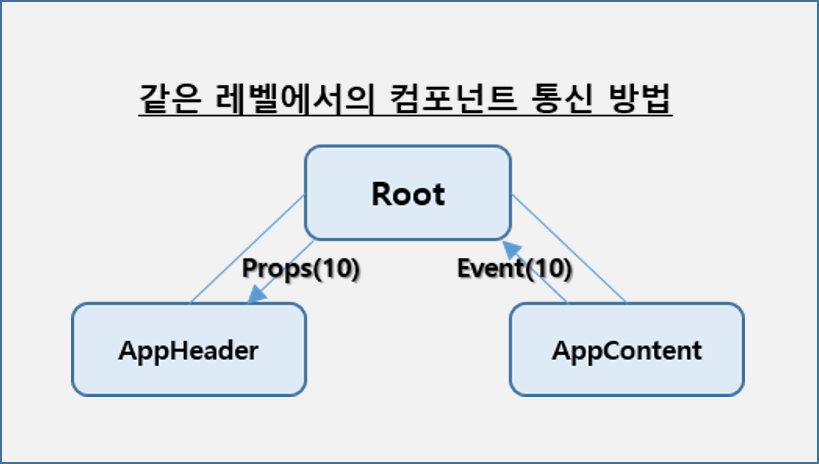
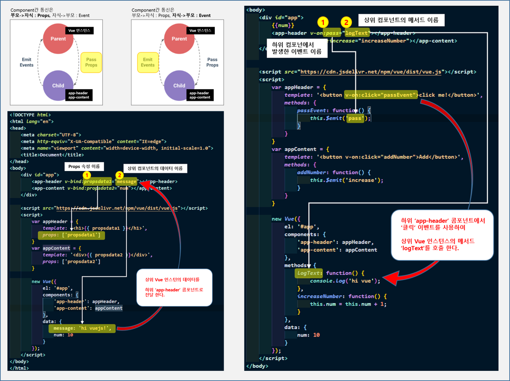

- [1. What is Vuejs](#1-what-is-vuejs)
- [2. 설치, 프로젝트생성, 구조](#2-설치-프로젝트생성-구조)
- [3. 라우터](#3-라우터)
- [4. 데이터바인딩](#4-데이터바인딩)
- [5. 이벤트](#5-이벤트)
- [6. 렌더링](#6-렌더링)
- [7. computed, watch](#7-computed-watch)
- [8. lifecycle hook](#8-lifecycle-hook)
- [9. component](#9-component)
- [10. bootstrap](#10-bootstrap)
- [11. SimpleGrid](#11-simplegrid)
- [12. Slot](#12-slot)
- [13. Layout Component](#13-layout-component)
- [14. provide, inject](#14-provide-inject)
- [15. 참고](#15-참고)

# 1. What is Vuejs


- [Vuejs 공식 사이트](https://vuejs.org/)

> **IMPORTANT**
>> Vue.js ?<br>
>> User Interface 개발을 위한 Progressive Framework이며, Native & Web의 장점을 모두 수용하고 표준 패텬을 사용해 개발
>>> `SPA`(Single Page Application)<br>
>>> `MVVM`(Model-View-ViewModel) Pattern<br>
>>> `Angular 양방향`, `React 가상돔` 장점을 모두 채택

- 장점
  - 러닝커브가 낮다.
  - 재사용 가능한 Component 사용
  - Angular.js의 Two-Way Binding 수용
  - React의 Virtural DOM 수용<
- 기대효과
  - 높은 수준의 웹 애플리케이션 제작 가능
  - 안정적이고 체계적인 운영 지원


# 2. 설치, 프로젝트생성, 구조

> **IMPORTANT**
>>
>> - vuejs 설치
>> - vuejs 프로젝트 생성
>> - 프로젝트 구성

- vuejs 설치
  
```command
//0.1 npm 설치가 선행되어야 함
npm -v

// 0.2 vue 설치
vue --version
npm install -g vue //windows OS
sudo npm install -g vue //Mac OS

// 0.2 vue cli : vue 프로젝트 생성을 위한 command line interface
sudo npm install -g @vue/cli //Mac OS는 sudo 추가

// 0.3 visual studio code > extension 설치
// Vetur : code snippet, highlight ...
```

- vuejs 프로젝트 생성
  - 수동으로 프로젝트 생성 및 Preset 저장
  
  - ```command
    // 프로젝트를 생성할 경로에서 명령어 실행
    vue create [projectname]

    // 'manually select features'
    // - Router, Vuex 선택
    // - 3.x 버전 선택(최신 버전) - 많은 오픈소스 모듈이 아직 3.x 버전으로 업그레이드 되지 않았음
    // - history mode > y 선택
    // - ESLint + Standard config 선택
    // - Lint on save 선택
    // - In package.json 선택
    // - Preset > y 선택
    // - Preset Name > vue basic 입력
    ```

- 프로젝트 구성
  - 
  - node_modules : 설치된 node 모듈이 위치해 있는 폴더. npm install 명령어를 통해 설치한 모듈이 위치
  - public : index.html 파일이 위치하는 곳 (정적 파일이 위치)
  - src : 구현되는 vue 컴포넌트 파일이 위치
  - src > assets : css, image 등 파일
  - src > components : Vue 컴포넌트 중 재사용을 위해서 구현된 컴포넌트 위치
  - src > router : 라우팅을 정의하는 파일이 위치
  - src > store : vuex의 상태저장소인 store 파일이 위치
  - src > views : 웹 애플리케이션에서 각 화면, 즉 메뉴에 대응되는 화면에 해당하는 Vue 컴포넌트가 위치
  - App.vue : 최상위 Vue 컴포넌트
  - package.json : Vue 프로젝트에 대한 정보 및 사용하고 있는 모듈 등에 대한 정보를 관리하고, Vue 프로젝트를 실행할 수 있는 스크립트가 정의된 파일 (하기 파일 설명 참고)

    - ```json
      // 프로젝트 정보, 버전
      // npm에 등록된다면 공개/비공개 여부 명시
      "name": "project01",
      "version": "0.1.0",
      "private": true,
      ```

    - ```json
      // 명령어 단축 모음
      "scripts": {
        "serve": "vue-cli-service serve", // 프로젝트 구동
        "build": "vue-cli-service build", // product를 위한 컴파일
        "lint": "vue-cli-service lint"
      },
      ```

    - ```json
      // build시(운영환경)) 참조해야할 npm 모듈 목록
      "dependencies": {
        "core-js": "^3.8.3",
        "vue": "^3.2.13"
      },
      ```

    - ```json
      // 개발시 참조해야할 npm 모듈 목록 
      // package-lock.json를 다시 참조하고 있음
      "devDependencies": {
        "@babel/core": "^7.12.16",
        "@babel/eslint-parser": "^7.12.16",
        "@vue/cli-plugin-babel": "~5.0.0",
        "@vue/cli-plugin-eslint": "~5.0.0",
        "@vue/cli-service": "~5.0.0",
        "eslint": "^7.32.0",
        "eslint-plugin-vue": "^8.0.3"
      },
      ```

    - ```json
      // 구문 패턴을 위한 설정
      "eslintConfig": {
        "root": true,
        "env": {
          "node": true
        },
        "extends": [
          "plugin:vue/vue3-essential",
          "eslint:recommended"
        ],
        "parserOptions": {
          "parser": "@babel/eslint-parser"
        },
        "rules": {}
      },
      ```

    - ```json
      // 지원 브라우저 정보
      "browserslist": [
        "> 1%", // 사용자수 1% 이상인 것만
        "last 2 versions", // 최근 2개의 버전만 지원
        "not dead",
        "not ie 11" // IE 11 지원하지 않음
      ]
      ```

> **IMPORTANT**
>> 실행 구조<br>
>> Vue 프로젝트 실행 -> main.js 실행 -> App.vue 가져오기 -> public/index.html 에 마운트<br>
>>
>> - Vue 프로젝트가 실행(npm run serve)이 되면 가장 먼저 main.js를 실행합니다.
>> - main.js에서 App.vue 컴포넌트로 Vue 앱을 생성합니다.
>> - main.js 라우터(router), 상태관리(vuex), 믹스인(mixins), 전역 모듈 등을 로드합니다.
>> - App.vue 에서 네비게이션 처리 및 라우터에 해당하는 컴포넌트를 실행하게 됩니다.
>> - App.vue 컴포넌트가 public 폴더의 index.html 의 html 요소 중 id가 "app"인 요소에 마운트됩니다.

- Vue Component의 기본 구조
  
```html
<template>
    <main>
    </main>
</template>
<script>
export default {
    name: 'ComponentName',
    components: {},
    data() {
        return {
            sampleData: '',
        }
    },
    methods: {}
}
</script>
<style scoped>
</style>
```

- User Snippets 등록
  - File > Preference > User Snippets 메뉴 이동
  - 검색창에 vue 입력 -> vue 선택
  - 아래 코드 입력
  
  - ```json
    "Generate Basic Vue Code" : { "prefix": "vue-start", "body": [ "<template>\n\t<div></div>\n</template>\n<script>\nexport default {\n\tcomponents: {},\n\tdata() {\n\t\treturn {\n\t\t\tsampleData: ''\n\t\t}\n\t},\n\tsetup() {},\n\tcreated() {},\n\tmounted() {},\n\tunmounted() {},\n\tmethods: {}\n}\n</script>" ], "description": "Generate Basic Vue Code" }
    ```

- eslint, prettier 설정
  - `.prettierrc` 파일 생성
    - `{ "semi": false, "bracketSpacing": true, "singleQuote": true, "useTabs": false, "trailingComma": "none", "printWidth": 80 }`
  - package.json 파일 열기
    - `"rules": { "space-before-function-paren": "off" }`

# 3. 라우터

<br>

- chunk-vendors.js
  - 참조한 라이브러리들이 컴파일되는 javascript 파일

> **IMPORTANT**
>> <strong>첫번째 방법 (기본 Import)</strong>
>> *<u>무조건 접근하는 페이지의 경우</u>* "`app.js`"
>>
>> - 라우팅할 컴포넌트를 임포트하고
>> - path, name, component 값을 설정
>> - 무조건 동일한 파일

```javascript
import HomeView from '../views/HomeView.vue'

const routes = [
  {
    path: '/',
    name: 'home',
    component: HomeView
  }
]

const router = createRouter({
  history: createWebHistory(process.env.BASE_URL),
  routes
})

export default router
```

> **IMPORTANT**
>> <strong>두번째 방법 (lazy-loaded without webpackPrefetch)</strong>
>> *<u>접속할 확률이 낮거나 사이즈가 작아서 클릭할 때마다 다운로드 받아도 상관 없는 경우</u>* "`about.js`"
>> 
>> - 사용할 컴포넌트를 화살표 함수로 정의
>> - 라우트 별로 파일을 분리(설정, `webpackChunkName: "about"`)할 수 있다.(빌드시 해쉬코드가 추가됨)
>> - lazy-loaded 된다. 즉 라우트로 컴포넌트 호출시 스태틱 파일을 클라이언트로 내려 받는다
>> - status = 304, size = ???B로 클라이언트로 다운로드 됨
>> - `webPackChunkName`이 동일하다면 같은 파일로 간주한다.

```javascript
const routes = [
  {
    path: '/about',
    name: 'about',
    // route level code-splitting
    // this generates a separate chunk (about.[hash].js) for this route
    // which is lazy-loaded when the route is visited.
    component: () => import(/* webpackChunkName: "about" */ '../views/AboutView.vue')
  }
]
```

> **IMPORTANT**
>> <strong>세번째 방법 (lazy-loaded with webpackPrefetch)</strong>
>> *<u>접속할 확률이 높거나 사이즈가 커서 미리 다운로드 받아야 하는 경우</u>* "`webpackPrefetch:true`"
>>
>> - 2번째 방법에서 "`webpackPrefetch:true`" 속성을 추가
>> - status = 200, size = prefetch cache로 당장은 사용할 것이 아니고 앞으로 사용할 것으로 브라우저 캐쉬에 먼저 저장. preload, preconnect의 종료가 더 존재
>> - prefetch cache된 파일을 클릭하는 순간 서버로부터가 아니가 브라우저의 캐쉬 영역에서 다운로드 함으로 속도가 빠름

<br>

```javascript
// router > index.js
const routes = [
  {
    path: '/about',
    name: 'about',
    // route level code-splitting
    // this generates a separate chunk (about.[hash].js) for this route
    // which is lazy-loaded when the route is visited.
    component: () => import(/* webpackChunkName: "about", webpackPrefetch:true*/ '../views/AboutView.vue')
  }
]

// index.html > <head> 엘리먼트에 자동 추가 됨
<link rel="prefetch" as="script" href="/js/about.js">
```

# 4. 데이터바인딩

- 데이터 바인딩
  - Data Binding
    - 기존의 javascript에서는 데이터를 아래와 같이 ID/Name/Class 속성을 먼저 선언하고 사용했다.
  
    - ```javascript
      document.querySelector("#tbBody").innerHTML = h.join("");
      ```

    - 하지만, vuejs에서는 아래와 같이 변수와 vue 키워드로 다양하게 바인딩이 가능 하다.

> **IMPORTANT**
>> <strong>Binding</strong>
>>
>> - 문자열 바인딩은 `data() 영역에 선언된 데이터 영역의 변수`를 html영역에 `{{데이터이름}}` 형태로 바인딩
>> - data() 영역에 `html tag가 데이터 변수`로 사용되었다면, `v-html="html변수명"(v-directive)` 사용(innterHtml로 바인딩 됨)
>> - html 속성으로 `v-model="변수명"`을 사용하면 `two-way binding`으로 값이 동시에 변경된다.
>>   - select, input은 value와 양방향 바인딩
>>   - checkbox는 checked와 양방향 바인딩
>> - `v-model.number="변수명"`과 같이 `.데이터타입`으로 형변환 가능
>> - `<select v-model="selectedCity">`와 같이 select 요소에도 `v-model로 two-way 바인딩`
>> - `checkbox` 요소의 경우 반드시 `arrary 형식과 v-model 연결`을 하고 checked 속성과 바인딩 됨
>> - `radio` 요소의 경우 `문자열 형식과 v-model 연결`을 함
>> - `속성`에 데이터를 바인딩할때는 `v-bind`로 할당 대신에 `:`로 사용 가능 

- <strong>`string`, `input`, `select`, `checkbox`, `radio`, `html` and `attribute` Binding</strong>
  
```html
<template>
  <!-- string binding -->
  <div>
    <h1>hello {{ userName }}</h1>
  </div>

  <!-- input -->
  <br/>
  <input type="text" v-model.number="num3" /> + <input type="text" name="" id="" v-model.number="num4" /> = <span>{{ num3 + num4 }}</span>

  <!-- select -->
  <br/>
  <div>
    <select name="" id="" v-model="selectedCity">
      <option value=""></option>
      <option value="02">서울</option>
      <option value="051">부산</option>
      <option value="064">제주</option>
    </select>
  </div>
  
  <!-- checkbox & radio -->
  <br/>
  <div>
    <div>
      <input type="checkbox" id="html" value="HTML" v-model="checkFavoriteLang" />
      <label for="html">HTML</label>
    </div>
    <div>
      <input type="checkbox" id="js" value="JavaScript" v-model="checkFavoriteLang" />
      <label for="js">JavaScript</label>
    </div>

    <div>선택한 지역은: {{ checkFavoriteLang }}</div>
  </div>
  <div>
    <div>
      <input type="radio" id="html" value="HTML" v-model="radioFavoriteLang" />
      <label for="html">HTML</label>
    </div>
    <div>
      <input type="radio" id="js" value="JavaScript" v-model="radioFavoriteLang" />
      <label for="js">JavaScript</label>
    </div>

    <div>선택한 지역은: {{ radioFavoriteLang }}</div>
  </div>

  <!-- html -->
  <br/>
  <div>
    <div>{{ htmlString }}</div>
    <div v-html="htmlString"></div>
  </div>
  
  <!-- attribute -->
  <br/>
  <input type="text" name="" id="" v-bind:value="userId" readonly />
  <input type="text" name="" id="" :value="userId" readonly />
  <br />
  
  
  <br />
  <input type="search" name="" id="" v-model="txt1" />
  <button :disabled="txt1 === ''">search</button>
</template>

<script>
export default {
  components: {},
  data() {
    return {
      // string
      userName: 'John Doe',
      // input
      num3: 0,
      num4: 0,
      // select
      selectedCity: '02',
      // checkbox
      checkFavoriteLang: ['js'],
      // radio
      radioFavoriteLang: '',
      // html
      htmlString: '<p style="color:red;">Red Color</p>',
      // attribute
      userId: '',
      imgSrc: 'https://www.vectorlogo.zone/logos/vuejs/vuejs-ar21.svg',
      txt1: '',
    }
  }
}
```

- <strong>`List(Array)` Binding</strong>
  
```html
<template>
  <div>
    <div>
      <select name="" id="">
        <option value=""></option>
        <option v-bind:value="city.code" v-bind:key="city.code" v-for="city in cities">{{ city.title }}</option>
      </select>
    </div>

    <div>
      <table>
        <thead>
          <tr>
            <th>제품번호</th>
            <th>제품명</th>
            <th>가격</th>
            <th>주문수량</th>
            <th>함계</th>
          </tr>
        </thead>
        <tbody>
          <!-- <tr v-bind:key="i" v-for="(drink, i) in drinkList"></tr> <== 키 값이 없을 경우 -->
          <tr v-bind:key="drink.drinkId" v-for="drink in drinkList">
            <td>{{ drink.drinkId }}</td>
            <td>{{ drink.drinkName }}</td>
            <td>{{ drink.price }}</td>
            <td><input type="number" name="" id="" v-model="drink.qty" /></td>
            <td>{{ drink.price * drink.qty }}</td>
          </tr>
        </tbody>
      </table>
    </div>
  </div>
</template>
<script>
export default {
  components: {},
  data() {
    return {
      cities: [
        { title: '서울', code: '02' },
        { title: '부산', code: '051' },
        { title: '제주', code: '064' }
      ],
      drinkList: [
        { drinkId: '1', drinkName: '코카콜라', price: 700, qty: 3 },
        { drinkId: '2', drinkName: '오렌지주스', price: 900, qty: 10 },
        { drinkId: '3', drinkName: '사이다', price: 700, qty: 8 },
        { drinkId: '4', drinkName: '옥수수차', price: 1200, qty: 7 },
        { drinkId: '5', drinkName: '환타', price: 500, qty: 4 }
      ]
    }
  }
}
</script>
```

- <strong>`Class(for style)` Binding</strong>

```html
<template>
  <div>
    <!-- class binding : true, false -->
    <div v-bind:class="{ 'text-red': true }">class binding</div>
    <div v-bind:class="{ 'text-red': false }">class binding</div>
    <div v-bind:class="{ 'text-red': hasError, active: isActive }">class binding</div>

    <!-- class binding : array -->
    <div v-bind:class="class2">클래스 바인딩</div>
  </div>
</template>
<script>
export default {
  components: {},
  data() {
    return {
      isActive: false,
      hasError: false,
      class2: ['isActive', 'hasError']
    }
  },
  setup() {},
  created() {},
  mounted() {},
  unmounted() {},
  methods: {}
}
</script>

<style scoped>
.active {
  background-color: greenyellow;
  font-weight: bold;
}
.text-red {
  color: red;
}
</style>
```

- <strong>`Style` Binding</strong>

```html
<template>
  <div style="color: red; font-size: 30px">style binding 글씨 : red; 폰트크기 : 30px</div>
  <!-- 스타일은 키:값 형태임으로 object 형식으로 바인딩 가능 -->
  <div v-bind:style="style1">style binding 글씨 : green; 폰트크기 : 30px</div>

  <button v-on:click="style1.color = 'blue'">색상바꾸기</button>
</template>
<script>
export default {
  components: {},
  data() {
    return {
      style1: {
        color: 'green',
        fontSize: '30px'
      }
    }
  }
}
</script>

```

# 5. 이벤트

- 이벤트
  - Event
    - on+event에서 on대신 @붙여 `@click`="func name" 또는 `v-on:click`="function name" 형식으로 사용
  
    - ```html
      <button onclick="clickFunciton();">click</button>
      <script>
        fuction clickFunction() {
          alert("click");
        }
      </script>

      <button v-on:click="increaseCounter1">click 1</button>
      <button @click="increaseCounter2">click 2</button>
      ```

> **IMPORTANT**
>> <strong>Event</strong>
>>
>> - `@`나 `v-on` prefix를 사용하여 이벤트 리스너를 등록
>> - 함수로 event를 인자를 전달하기 위해서는 functionName(`@event`)로 리스너를 등록해야 한다.
>> - key event로 `@keyup.enter`와 같이 `keyup.`으로 키 값을 즉시 알 수 있음
>>   - .enter, .tab, .delete, .esc, .space, .up, .down, .left, .right, .stop - event.stopPropagation(), .prevent - event.preventDefault();

```html
<template>
  <!-- event -->
  <div>
    <select name="" id="" v-on:change="changeCity($event)" v-model="selectedCity">
      <option value="">==도시선택==</option>
      <option v-bind:value="city.cityCode" v-bind:key="city.cityCode" v-for="city in cityList">{{ city.title }}</option>
    </select>
  </div>
  <div>
    <select name="" id="">
      <option v-bind:value="dong.dongCode" v-bind:key="dong.dongCode" v-for="dong in selectedDongList">{{ dong.dongTitle }}</option>
    </select>
  </div>

  <!-- key event -->
  <div>
    <input type="search" name="" id="" v-on:keyup="checkEnter($event)" v-model="searchText" />
    <input type="search" name="" id="" v-on:keyup.enter="doSearch" v-model="searchText" />
  </div>
  <button @click="doSearch">조회</button>
  <button type="submit" @click.prevent="doSearch">prevent</button>
</template>
<script>
export default {
  components: {},
  data() {
    return {
      selectedCity: '',
      cityList: [
        { cityCode: '02', title: '서울' },
        { cityCode: '051', title: '부산' },
        { cityCode: '064', title: '제주' }
      ],
      dongList: [
        { cityCode: '02', dongCode: '1', dongTitle: '서울 1동' },
        { cityCode: '02', dongCode: '2', dongTitle: '서울 2동' },
        { cityCode: '051', dongCode: '1', dongTitle: '부산 1동' },
        { cityCode: '051', dongCode: '2', dongTitle: '부산 2동' },
        { cityCode: '051', dongCode: '3', dongTitle: '부산 3동' },
        { cityCode: '064', dongCode: '1', dongTitle: '제주 1동' },
        { cityCode: '064', dongCode: '2', dongTitle: '제주 2동' }
      ],
      selectedDongList: [],
      searchText: ''
    }
  },
  methods: {
    changeCity(event) {
      console.log(event.target.tagName)
      console.log(this.selectedCity)
      this.selectedDongList = this.dongList.filter((dong) => dong.cityCode === this.selectedCity)
      console.log(this.selectedDongList)
    },
    doSearch() {
      console.log(this.searchText)
    },
    checkEnter(event) {
      if (event.keyCode === 13) {
        this.doSearch()
      }
    }
  }
}
</script>
```

# 6. 렌더링

- 화면에 나타나기 또는 숨기기 위해서 기존의 javaScript에서는 다음과 같은 코드를 사용 했다.

```html
<button id="btnDelete" onclick="doDelete();" disabled>삭제</button>
<script>
  document.querySelector("#btnDelete").disabled = false;
</script>
```

- vue.js에서는 `v-if, v-else-if, v-else` 또는 `v-show` 키워드로 대처 가능 하다.

> **IMPORTANT**
>> `v-if, v-else-if, v-else`는 vue.js에서 사용하는 조건문으로 아래의 코드와 같이 조건문별 컨트롤 배치 가능<br>
>> `v-show`는 `style="display: none"` 속성을 사용<br>

```html
<template>
  <div>
    <!-- v-if, v-else-if, v-else 키워드 사용 -->
    <div v-if="userRole === 'G'">
      <button>조회</button>
    </div>
    <div v-else-if="userRole === 'M'">
      <button>조회</button>
      <button>생성</button>
    </div>
    <div v-else>
      <button>조회</button>
      <button>생성</button>
      <button>삭제</button>
    </div>
    <div>
      <button v-if="userRole === 'A' || userRole === 'M' || userRole === 'G'">조회</button>
      <button v-if="userRole === 'A' || userRole === 'M'">생성</button>
      <button v-if="userRole === 'A'">생성</button>
    </div>
    <br />
    <!-- v-show 키워드 사용 -->
    <input type="radio" name="" id="ai" value="AI" v-model="favoriteField" />
    <label for="ai">인공지능</label>
    <input type="radio" name="" id="blockchain" value="BC" v-model="favoriteField" />
    <label for="blockchain">블럭체인</label>
    <input type="radio" name="" id="iot" value="IOT" v-model="favoriteField" />
    <label for="iot">사물인터넷</label>
    <input type="radio" name="" id="other" value="OTH" v-model="favoriteField" />
    <label for="other">기타</label>
    <div v-show="favoriteField === 'OTH'">
      <input type="text" name="" id="" />
    </div>
  </div>
</template>
<script>
export default {
  components: {},
  data() {
    return {
      userRole: 'M', // A(admin), M(manager), G(general)
      favoriteField: ''
    }
  }
}
</script>
```

# 7. computed, watch

- vue.js에서는 computed와, watch 속성을 통하여 모듈내 데이터의 변환에 대해서 대처할 수 있다.

> **IMPORTANT**
>> computed
>>
>> - 해당 vue instance내에 정의된 데이터 값과 연관된 또다른 데이터를 정의해서 사용 가능
>> - 함수이자 vue instance내의 또다른 데이터 이다.
>> - *동일한 데이터가 모듈내 여러곳에서 사용될 경우 유용*하다.

> **IMPORTANT**
>> watch
>>
>> - vue instance에 정의된 데이터 값이 변경이 일어나는지 감시하고 변경시 지정된 함수 실행
>> - watch에 정의된 하나의 데이터 값만 감시한다. data의 이름과 동일해야 한다.
>> - *watch하는 하나의 데이터의 값이 변경되기 전에는 실행되지 않는*다.

```html
<template>
  <!-- computed -->
  <div>
    <input type="text" name="" id="" v-model="firstName" />
    <input type="text" name="" id="" v-model="lastName" />
  </div>
  <h1>{{ getfullName }}</h1>
  <br />
  <label>---------------------------------------------------</label>
  <br />
  <div>
    <label for="age">당신의 나이는?</label>
    <input type="number" name="" id="age" v-model="age" />
  </div>
  <p>{{ age >= 20 ? '성인(직접코드)' : '미성년자(직접코드)' }}</p>
  <p>{{ isAdult }}</p>
  <br /><br />

  <!-- watch -->
  <div>
    <select name="" id="" v-model="selected">
      <option value="A">A</option>
      <option value="B">B</option>
      <option value="C">C</option>
    </select>
    <button v-on:click="displayHistory($event)">show history</button>
  </div>
</template>
<script>
export default {
  components: {},
  data() {
    return {
      // for computed
      firstName: 'John',
      lastName: 'Doe',
      title: 'Mr.',
      age: 0,
      // for watch
      fullName: '',
      selected: '',
      changeHistory: []
    }
  },
  computed: {
    getfullName() {
      let returnName = this.title + ' ' + this.firstName + ', ' + this.lastName
      returnName = returnName + '.'
      return returnName
    },
    isAdult() {
      let returnStr = null
      returnStr = this.age >= 20 ? '성인' : '미성년자'
      return returnStr
    }
  },
  watch: {
    firstName(newValue, oldValue) {
      console.log(oldValue)
      console.log(newValue)
      this.fullName = this.title + ' ' + this.firstName + ', ' + this.lastName
    },
    lastName(newValue, oldValue) {
      console.log(oldValue)
      console.log(newValue)
      this.fullName = this.title + ' ' + this.firstName + ', ' + this.lastName
    },
    selected(newValue, oldValue) {
      console.log(`watch(selected-newValue) : ${newValue}`)
      console.log(`watch(selected-oldValue) : ${oldValue}`)
      this.changeHistory.push(`${oldValue} -> ${newValue}`)
    }
  },
  methods: {
    displayHistory(event) {
      console.log(this.changeHistory)
    }
  }
}
</script>
```

# 8. lifecycle hook

- vue 인스턴스가 생성되고 파괴될때까지의 라이프 사이클은 다음의 이미지에 잘 나타나 있다.

<br>

> **IMPORTANT**
>> Vue LifeCycle
>>
>> - vue instance가 생성되고 나서 호출되는 `created` => 데이터의 초기화
>> - DOM에 부착되고 나서 호출되는 `mounted` => UI에 Display 되는 함수 관련
>> - DOM의 내용이 변경되고나서 호출되는 `update`
>> - component가 부착해지되고나서 호출되는 `unmounted` => 데이터의 초기화 SPA임을 주의 요망
>> - 인스턴스가 없어질때 호출되는 `destroyed` 

```html
<template>
  <div>
    <div>{{ sampleData }}</div>
    <div>
      <label for="">태어난 도시는?</label>
      <select name="" id="">
        <option value="" :key="city.code" v-for="city in cities">
          {{ city.title }}
        </option>
      </select>
    </div>
  </div>
</template>
<script>
export default {
  components: {},
  data() {
    return {
      sampleData: '',
      cities: [],
      fnInterval: null
    }
  }

  // data(), watch, computed, methods 정보의 준비가 끝난 상태
  created() {
    this.getCityList()
  },

  // 실제 DOM이 랜더링이 끝난 상태
  mounted() {
    this.fnInterval = window.setInterval(() => {
      console.log('aaaa')
    }, 1000)
  },

  // DOM이 업데이트 된 후에 호출
  updated() {},

  // 현재 컴포넌트를 빠져 나갈 때
  unmounted() {
    window.clearInterval(this.fnInterval)
    this.fnInterval = null
    this.cities = null
  },

  methods: {
    getCityList() {
      // 서버에 도시 목록을 요청, 가져오는데 시간이 소요
      this.cities = [{ code: '02', title: '서울' }]
    }
  }
}
</script>
```

# 9. component

- Vuejs에서는 모든 화면은 Component 개념으로 만들어 사용되며, 이러한 Component의 사용(참조) 및 데이터 전달 방법에 다음과 같은 방법이 존재

> **IMPORTANT**
>> Component 정의 및 참조 사용 방법(참조할 vue page에서 import 또는 main.js에서 Global 사용)
>>
>> - main.js : import 후 `app.component('page-title', PageTitle)` 형식으로 Global 정의 후 전역으로 사용
>> - parent.vue : import 후 `Component 영역`에 선언 후 사용

> **IMPORTANT**
>> parent ↔ component 데이터 전달 방법(props, emit)
>>
>> - `props`는 `Component에서 Props 영역에 정의`한 데이터를 `Parent에서 Component 객체에 속성`으로 접근 가능
>> - `emit은` `Component에서 $emit 키워드`로 `Parent의 이벤트 리스너를 호출`하여 접근

> **IMPORTANT**
>> parent → component 리소스 접근 방법(ref)
>>
>> - `parent에 선언된 component의 속성에 ref를 정의`하고 `this.$refs.정의한 Component이름.Component 자원`으로 접근

- Component 정의 및 참조(사용) 방법
  
  - ```html
    <!-- 참조하는 vue page -->
    <template>
      <div><ChildComponent/></div>
    </template>
    <script>
    import ChildComponent from '@/components/fragments/ChildComponent.vue'

    export default {
      components: {
        ChildComponent
      },
    }
    </script>
    ```

  - ```html
    <script>
    <!-- main.js -->
    import PageTitle from './components/fragments/PageTitle.vue'

    const app = createApp(App)
    app.use(store)
    app.use(router)
    app.component('page-title', PageTitle)
    app.mount('#app')
    </script>

    <!-- 일반 페이지에서는 'page-title 글로벌 component name으로 사용' -->
    <template>
      <div class="container">
        <page-title title="고객목록" />
        <h3 style="border-left: 5px solid red; padding-left: 3px; text-align: left">고객목록</h3>
        <button class="btn btn-danger">클릭</button>
      </div>
    </template>
    ```
    
- parent ↔ component 데이터 전달 방법
  - Parent → Child 전달(Props)
  
  - ```html
    <!-- parent -->
    <template>
      <div>
        <ChildComponent :str="propsStr" v-bind:num="propsNum" :isOK="propsIsOK" :arr="propsArr" v-bind:obj="propsObj" />
      </div>
    </template>
    <script>
    import ChildComponent from '@/components/fragments/ChildComponent.vue' // 사용할 component import

    export default {
      components: {
        ChildComponent // component 선언
      },
      data() {
        return {
          sampleData: '',
          propsStr: '자식으로 전달하는 문자열',
          propsNum: 34,
          propsIsOK: true,
          propsArr: [1, 2, 3, 4, 5],
          propsObj: { name: 'Jeremy' }
        }
      }
    }
    </script>
    ```

  - ```html
    <!-- child component -->
    <template>
      <div>
        <p>str : {{ str }}</p>
        <p>num : {{ num + 10 }}</p>
        <p>isOK : {{ isOK }}</p>
        <p>arr : {{ arr }}</p>
        <p>obj : {{ obj }}</p>
      </div>
    </template>
    <script>
    export default {
      props: {
        str: { type: String, default: '' },
        num: { type: Number, default: 0 },
        isOK: { type: Boolean, default: false },
        arr: { type: Array, default: function () { return [] } },
        obj: { type: Object, default: function () { return {} } }
      },
      components: {},
      data() {
        return {
          sampleData: ''
        }
      }
    }
    </script>
    ```

  - Child → Parent 전달(Emit)
  
  - ```html
    <!-- child component : 부모의 이벤트 리스너 호출하여 접근 -->
    <template>
      <div>
        <p>arr : {{ arr }}</p>
        <div>
          <select name="" id="" v-on:change="callParent" v-model="selectedValue">
            <option v-bind:value="num" v-bind:key="num" v-for="num in arr">{{ num }}</option>
          </select>
        </div>
      </div>
    </template>
    <script>
    export default {
      props: {
        arr: {
          type: Array,
          default: function () {
            return []
          }
        }
      },
      data() {
        return {
          selectedValue: 0
        }
      },
      methods: {
        callParent() {
          this.$emit('changeNum', this.selectedValue)
        }
      }
    }
    </script>
    ```

  - ```html
    <!-- 이벤트 리스너를 통하여 접근 -->
    <template>
      <div>
        <ChildComponent :arr="propsArr" v-bind:obj="propsObj" v-on:changeNum="getData"/>
      </div>
    </template>
    <script>
    import ChildComponent from '@/components/fragments/ChildComponent.vue'

    export default {
      components: {
        ChildComponent
      },
      data() {
        return {
          propsArr: [1, 2, 3, 4, 5],
        }
      },
      methods: {
        getData(data) {
          console.log('called from child component and value : ' + data)
          // output : called from child component and value : 1
          // output : called from child component and value : 2
        }
      }
    }
    </script>
    ```

- parent → component 리소스 접근 방법
  
  - ```html
    <!-- parent에 component의 ref 속성 정의 및 $refs로 접근 -->
    <template>
      <div>
        <ChildComponent v-bind:obj="propsObj" ref="refChildComponent" />
        <button v-on:click="changeChildValue">child refer</button>
      </div>
    </template>
    <script>
    import ChildComponent from '@/components/fragments/ChildComponent.vue'

    export default {
      components: {
        ChildComponent
      },
      data() {
        return {
          propsObj: { name: 'Jeremy' }
        }
      },
      methods: {
        changeChildValue() {
          this.$refs.refChildComponent.str2 = 'i love seoul.'
          this.$refs.refChildComponent.printConsoleLog()
        }
      }
    }
    </script>
    ```

  - ```html
    <!-- child component의 접근되는 자원 정의 -->
    <template>
      <div>
        <p>obj : {{ obj }}</p>
        <br />
        <h1>{{ str2 }}</h1>
      </div>
    </template>
    <script>
    export default {
      props: {
        obj: { type: Object, default: function () { return {} } }
      },
      components: {},
      data() {
        return {
          str2: 'this is child component label : i love busan.'
        }
      },
      methods: {
        printConsoleLog() {
          console.log('component specific method.')
        }
      }
    }
    </script>
    ```

- Parent Child 조건에서의 데이터 전달 개념도<br/>

- 동일한 레벨에서의 Component간의 데이터 전달 방법<br/>

- parent ↔ component 데이터 전달 샘플 코드<br/>


# 10. bootstrap

- contents

> **IMPORTANT**
>> contents<br>
>> contents<br>
>> contents<br>

```html

```

# 11. SimpleGrid

- contents

> **IMPORTANT**
>> contents<br>
>> contents<br>
>> contents<br>

```html

```

# 12. Slot

- contents

> **IMPORTANT**
>> contents<br>
>> contents<br>
>> contents<br>

```html

```

# 13. Layout Component

- contents

> **IMPORTANT**
>> contents<br>
>> contents<br>
>> contents<br>

```html

```

# 14. provide, inject

- contents

> **IMPORTANT**
>> contents<br>
>> contents<br>
>> contents<br>

```html

```

# 15. 참고

- [개발자의 품격 youtube](https://www.youtube.com/c/%EA%B0%9C%EB%B0%9C%EC%9E%90%EC%9D%98%ED%92%88%EA%B2%A9)
- [MDN Site](https://developer.mozilla.org/ko/)
- [W3C Site](https://www.w3.org/)
- [Can I use ? Site](https://caniuse.com/)