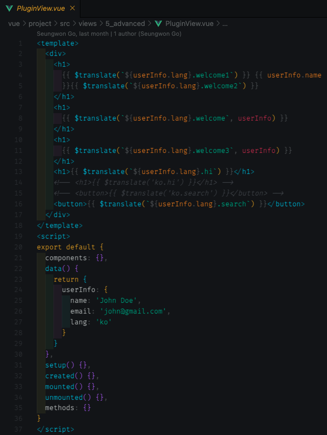

- [1. Vuejs Advanced](#1-vuejs-advanced)
- [2. Custom Directive](#2-custom-directive)
- [3. Mixins](#3-mixins)
- [4. Plugin](#4-plugin)
- [5. Vuex](#5-vuex)
- [6. Composition API](#6-composition-api)
- [7. Kakao Login API](#7-kakao-login-api)
- [8. Naver Login API](#8-naver-login-api)
- [9. Daum Post Number API](#9-daum-post-number-api)
- [10. Kakao Map API](#10-kakao-map-api)
- [11. Vue Favorite Component](#11-vue-favorite-component)
- [12. 참고](#12-참고)

# 1. Vuejs Advanced


- [Vuejs 공식 사이트](https://vuejs.org/)

# 2. Custom Directive

- v-on, v-bind와 같은 키워드를 directive라고 부르며, 이러한 directive를 custom하게 구현할 수 있음
- custom하게 만든 directive를 life cycle hook을 이용하여 사용 가능

> **IMPORTANT**
>> Directive를 Custom하게 구현 가능 `v-` prefix 사용
>>
>> - `v-xxx` 같이 단순 directive, `v-xxx="값"` 같이 직접 값 할당 directive, `v-xxx="{id:1, name:'john'}"` 같이 바인딩 방법
>> - `directives: {}` 내부에 `모든 Life Cycle Hook` 요소를 사용하여 구현
>> - Life Cycle Hook 요소의 구현 함수에 `인자 값으로 el, binding` 사용 가능
>> - Global하게 사용 가능(main.js에 구현하며 내부/외부 코드로 가능)
  
```html
<template>
  <div>
    <div>
      <label for="email" class="form-label">이메일주소</label>
      <input type="email" name="" id="email" class="form-control" v-focus />
    </div>
  </div>

  <div v-color="color" style="height: 50px"></div>
  <div v-demo="{ color: 'red', text: 'hello!' }"></div>
  <div>
    <input type="text" name="" id="" v-lowercase class="form-control" />
  </div>
  <div>
    <input type="text" name="" id="" v-uppercase class="form-control" />
  </div>
  <div>
    <input type="text" name="" id="" v-number class="form-control" />
    <input type="number" name="" id="" class="form-control" />
  </div>
  <div>
    <input type="text" name="" id="" v-korean class="form-control" />
  </div>
</template>
<script>
export default {
  components: {},
  directives: {
    focus: {
      mounted(el, binding) {
        console.log(el)
        el.focus()
      }
    },
    lowercase: {
      mounted(el) {
        el.addEventListener('input', (event) => {
          console.log(event.target.value)
          event.target.value = event.target.value.toLowerCase()
        })
      }
    },
    uppercase: {
      mounted(el) {
        el.addEventListener('input', (event) => {
          console.log(event.target.value)
          event.target.value = event.target.value.toUpperCase()
        })
      }
    },
    number: {
      mounted(el) {
        el.addEventListener('input', (event) => {
          console.log(event.target.value)
          event.target.value = event.target.value.replace(/\D/g, '')
        })
      }
    },
    korean: {
      mounted(el) {
        el.addEventListener('input', (event) => {
          console.log(event.target.value)
          event.target.value = event.target.value.replace(/[^ㄱ-ㅎ|ㅏ-ㅣ|가-힣]/g, '')
        })
      }
    },
    color: {
      mounted(el, binding) {
        console.log(binding.value)
        el.style.backgroundColor = binding.value
      }
    },
    demo: {
      mounted(el, binding) {
        el.innerText = binding.value.text
        el.style.color = binding.value.color
      }
    }
  }
}
</script>
```

> **IMPORTANT**
>> 전역 사용을 위한 설정은 main.js에 다음과 같이 선언
>>
>> - `app.mount() 전`에 정의
>> - `app.directive(....)` 형식으로 구현
>> - `외부 파일`로 작성하여 사용 가능
>> - 각 파일에서는 전역으로 선언한 Directive 키워드 `v-focus`, `v-lowercase` 사용

```javascript
<!-- main.js에 mount() 전 directive()로 정의 -->
app.directive('focus', {
  mounted(el, binding) {
    el.focus()
  }
})

app.directive('lowercase', {
  mounted(el) {
    el.addEventListener('input', (event) => {
      event.target.value = event.target.value.toLowerCase()
    })
  }
})
```

# 3. Mixins

- Vue Component의 코드와 Javascript 코드를 섞어 하개의 파일과 같이 사용할 수 있다.

> **IMPORTANT**
>> Mixin
>>
>> - 여러개의 콤포넌트 간의 공통으로 사용되는 코드(로직)를 재사용할 수 있는 방법
>> - 통상적으로 mixin 함수는 `"$" prefix`를 사용한다.
>> - `mixin 의 함수부터 먼저 수행` 된다.(라이프 사이클 훅 메서드를 기준으로)
>> - custom derective와 동일하게 `Global(main.js)에 등록하여 전역으로 사용`할 수 있다.
>> - import 할때 from 키워드에서 `index.js` 파일은 기본 파일로 제외해도 된다.
>> - `$route.path` 함수를 사용하여 component 접속 로그 기록 가능

```html
<!-- mixin을 사용할 vue component -->
<template>
  <div></div>
</template>
<script>
import Formater from '@/mixins/formatter.js'

export default {
  mixins: [Formater],
  created() {
    console.log('MixinView의 created')
  },
  mounted() {
    console.log('MixinView의 mounted')
    console.log(this.$convertDateFormat('20220601', 'YYYY-MM-DD'))
    console.log(this.$convertDateFormat('20220601', 'MM.DD.YYYY'))
  }
}
</script>

<script>
// formatter.js : mixin 시킬 코드
export default {
  created() {
    console.log('formatter의 created')
  },
  mounted() {
    console.log('formatter의 mounted')
  },
  unmounted() {},
  methods: {
    $convertDateFormat(d, f) {
      let year = ''
      let month = ''
      let day = ''

      // '20221201'
      // Date
      if (typeof d === 'string' && d.length === 8) {
        year = d.substr(0, 4)
        month = d.substr(4, 2)
        day = d.substr(6, 2)
      } else if (typeof d === 'object') {
        year = d.getFullYear()
        month = (d.getMonth() + 1).toString().padStart(2, 0)
        day = (d.getDate() + 1).toString().padStart(2, 0)
      }

      // f - 'YYYY-MM-DD', 'MM-DD-YYYY'
      return f.replace('YYYY', year).replace('MM', month).replace('DD', day)
    }
  }
}
</script>
```

> **IMPORTANT**
>> [Axios 공식 사이트](https://axios-http.com/kr/docs/intro)
>>
>> - 브라우저와 node.js에서 사용할 수 있는 Promise 기반 HTTP 클라이언트 라이브러리
>> - main.js에 Global 사용을 위하여 등록하여 사용할 수 있다.

```javascript
import axios from 'axios'

axios.defaults.baseURL = 'http://localhost:3000'
axios.defaults.headers['Content-Type'] = 'application/json;charset=utf-8'
axios.defaults.headers['Access-Control-Allow-Origin'] = '*'

export default {
  methods: {
    async $get(url) {
      return (
        await axios.get(url).catch((e) => {
          console.log(e)
        })
      ).data
    },
    async $post(url, data) {
      return await axios.post(url, data).catch((e) => {
        console.log(e)
      })
    },
    async $put(url, data) {
      return await axios.put(url, data).catch((e) => {
        console.log(e)
      })
    },
    async $delete(url) {
      return await axios.delete(url).catch((e) => {
        console.log(e)
      })
    }
  }
}
```

# 4. Plugin

- 코드나 기능의 컴폰넌트화의 방식중에 하나이며, 플러그인으로 사용할 함수나 모듈은 `install(app, options)`를 정의하고 사용한다.

> **IMPORTANT**
>> [Vuejs Plugin 공식 싸이트](https://v3-docs.vuejs-korea.org/guide/reusability/plugins.html#introduction)
>>
>> - 여러 Component에서 공통으로 사용할 수 있는 공통의 함수를 미리 정의해두고 플로그인처럼 바로 사용할 수 있다
>> - Global Plugin으로 사용하기 위해서는 다음의 샘플코드처럼 필수 사항을 준수해야 한다.

```javascript
// main.js
import { createApp } from 'vue'
const app = createApp({})
app.use(myPlugin, {
  // 선택적인 옵션
})

// myPlugin.js
const myPlugin = {
  install(app, options) {
    // 앱 환경설정
  }
}
```

- 다음은 i18n(Internationalization)에 대한 plugin sample 코드 이다
  
```javascript
// main.js
import i18nPlugin from './plugins/i18n'
import en from './i18n/en'
import ko from './i18n/ko'

const i18nStrings = { en, ko }
app.use(i18nPlugin, i18nStrings)

// en.js
const i18nEN = {
  hi: 'Hello',
  search: 'Search',
  save: 'Save',
  welcome: 'Welcome, {name}',
  welcome1: 'Welcome, ',
  welcome2: '',
  welcome3: 'Welcome. {name}({email}).'
}

export default i18nEN

// ko.js
const i18nEN = {
  hi: '안녕하세요',
  search: '조회',
  save: '저장',
  welcome: '환영합니다. {name}님.',
  welcome1: '환영합니다.',
  welcome2: '님',
  welcome3: '환영합니다. {name}님({email}).'
}

export default i18nEN

// i18n.js
/* eslint-disable */
export default {
  install: (app, options) => {
    app.config.globalProperties.$translate = (key, params = {}) =>
      // en.hi => ['en','hi']
      key
        .split('.')
        .reduce((o, i) => {
          if (o) return o[i]
        }, options)
        .replace(/{\w+}/g, (match) => params[match.slice(1, -1)])
  }
}
```



# 5. Vuex

- Vuex는 모든 컴포넌트의 중앙 집중식 저장소 기능을 제공하며, Vuex에 저장된 데이터는 쉽게 바꿀 수 없으며 특정 함수(mutations, actions)를 통해서만 변경이 가능하고 변경 상태를 관리할 수 있다.
- `vuex-persistedstate`와 `vue-cookies` plugin 설치시 문제 발생시 다음의 명령어로 설치 

```command
npm i vuex-persistedstate --legacy-peer-deps
npm i vue-cookies --legacy-peer-deps

npm config set legacy-peer-deps=true --location=project
```

> **IMPORTANT**
>> [Vue.js Vuex 국문 참고 사이트](https://v3-docs.vuejs-korea.org/guide/scaling-up/state-management.html)<br/>
>> [Vue.js Vuex 영문 참고 사이트](https://vuex.vuejs.org/)
>>
>> - state : 데이터 저장소 (`this.$store.state.xxx`)
>> - getters : Store를 위한 computed(값의 변경을 즉시 알 수 있음) / 변수와 같이 사용될 수 있다. (`this.$store.getters.xxx`)
>> - mutations : 상태(state)를 변경시킬 수 있는 유일한 방법(함수) (`this.$store.commit('mutation name', parameter)`)
>> - actions : 정의된 함수에서는 mutations에 정의한 함수를 커밋(commit)시켜 state를 변경, 비동기 처리가 가능(DB 작업에 가능 많이 사용) (`this.$store.dispatch('action name', parameter)`)
>> - modules : store로 관리할 파일이나 저장소가 많아질 경우 모듈화하여 참조 사용 (`참조당하는 모듈에서는 반드시 namespaced:true 옵션 설정하고, 참조하는 모듈에서는 반드시 modules: { 참조키값: 참조모듈}) 정의 필요 / 실제 참조하여 사용하는 모듈에서는 '참조모듈/함수,변수명'('todo/dodosCount')형식으로 사용 필요`)
>> - 상태값 영구 관리를 위한 `persistedstate` 방법 : `'vue-persistedstate'` 참조 및 설치, `plugin` 정의
>> - 상태값 설정 시간만큼 관리를 위한 `cookie` 방법 : `'vue-cookies'` 참조 및 설치, `VueCookies` 접근


```javascript
// store > index.js
import { createStore } from 'vuex'
import { todo } from './todo' // 모듈화를 위한 todo 참조
import { user } from './user' // 모듈화를 위한 user 참조
import persistedstate from 'vuex-persistedstate' // 상태값 영구 보존을 위한 플로그인 참조

export default createStore({
  modules: {
    todo: todo,
    user: user
  },
  plugins: [persistedstate({ paths: ['todo.todos'] })] // 영구 사용을 위해서는 반드시 지정되어야 함
})
```

```javascript
// todo.js for persistedstate(영구 상태값 저장을 위함)
export const todo = {
  // 중앙 데이터 저장소
  namespaced: true,
  state() {
    return {
      todos: [
        { id: 1, title: 'todo 1', done: true },
        { id: 2, title: 'todo 2', done: false },
        { id: 3, title: 'todo 3', done: false }
      ]
    }
  },
  // Store를 위한 computed라고 생각하면 됨.
  getters: {
    todosCount(state) {
      return state.todos.length
    },
    doneTodosCount(state) {
      return state.todos.filter((todo) => todo.done).length
    },
    notDoneTodosCount(state) {
      return state.todos.filter((todo) => !todo.done).length
    }
  },
  // 상태(state)를 변경시킬 수 있는 유일한 방법(함수)
  mutations: {
    add(state, item) {
      state.todos.push(item)
    },
    remove(state, id) {
      state.todos = state.todos.filter((todo) => todo.id !== id)
    },
    doneYN(state, doneStatus) {
      state.todos.filter((todo) => todo.id === doneStatus.id)[0].done =
        doneStatus.done
    }
  },
  // mutations 하고 비슷한데,
  // actions에 정의된 함수에서는 결국은 mutations에 정의한 함수를 커밋(commit)시켜서 state를 변경
  // 비동기 처리가 가능
  actions: {
    add({ commit }, item) {
      // const {commit, state} = context
      // context.commit, context.state

      // 서버랑 통신. fetch, axios
      commit('add', item)
    }
    // add2: async ({ commit }, item) => {
    //   await fetch('', {})
    // }
  }
}
```

```javascript
// user.js for cookie 사용을 위함
import VueCookies from 'vue-cookies'

export const user = {
  // 중앙 데이터 저장소
  namespaced: true,
  state() {
    return {
      userInfo: {
        name: '',
        email: '',
        phone: '',
        lang: ''
      }
    }
  },
  // Store를 위한 computed라고 생각하면 됨.
  getters: {
    isLogin(state) {
      if (VueCookies.get('userInfo')) {
        return true
      } else {
        return false
      }
    },
    isKakaoLogin() {
      if (window.Kakao.Auth.getAccessToken()) {
        return true
      } else {
        return false
      }
    }
  },
  // 상태(state)를 변경시킬 수 있는 유일한 방법(함수)
  mutations: {
    setUserInfo(state, userInfo) {
      console.log(userInfo)
      state.userInfo = userInfo
      VueCookies.set('userInfo', userInfo, '30s')
    },
    clearUserInfo(state) {
      state.userInfo = {}
      VueCookies.remove('userInfo')
    },
    getUserInfo(state) {
      if (VueCookies.get('userInfo')) {
        return state.userInfo
      } else {
        return {}
      }
    }
  },
  actions: {}
}
```

```html
// TodoView.vue
<template>
  <div>
    <div>{{ todos }}</div>
    <div>할일 목록 전체수 : {{ todosCount }}</div>
    <div>완료 목록 수 : {{ doneTodosCount }}</div>
    <div>미완료 목록 수 : {{ notDoneTodosCount }}</div>

    <div>
      <label for="todo" class="form-label">할일</label>
      <input type="text" name="" id="todo" class="form-control" v-model="todo" />
      <button class="btn btn-primary" v-on:click="addItem">추가(mutation)</button>
      <button class="btn btn-primary" @click="addItem2">추가(action)</button>
    </div>

    <div>
      <table class="table table-bordered table-striped">
        <thead>
          <tr>
            <th>Todo ID</th>
            <th>할일</th>
            <th>완료여부</th>
            <th></th>
          </tr>
        </thead>
        <tbody>
          <tr v-bind:key="todo.id" v-for="todo in todos">
            <td>{{ todo.id }}</td>
            <td>{{ todo.title }}</td>
            <td>
              <div class="form-check form-switch">
                <input
                  class="form-check-input"
                  type="checkbox"
                  role="switch"
                  id="flexSwitchCheckChecked"
                  v-bind:checked="todo.done"
                  v-on:change="doneYN(todo.id, $event)"
                />
              </div>
            </td>
            <td><button class="btn btn-danger btn-sm" v-on:click="removeItem(todo.id)">삭제</button></td>
          </tr>
        </tbody>
      </table>
    </div>
  </div>
</template>
<script>
export default {
  components: {},
  data() {
    return {
      todo: ''
    }
  },
  computed: {
    // namespace 사용으로 지정된 modules에 정의된 store 오브젝트 접근법
    todos() {
      return this.$store.state.todo.todos
    },
    todosCount() {
      return this.$store.getters['todo/todosCount']
    },
    doneTodosCount() {
      return this.$store.getters['todo/doneTodosCount']
    },
    notDoneTodosCount() {
      return this.$store.getters['todo/notDoneTodosCount']
    }
    // state나 module 없이 바로 사용하는 경우 다음과 같은 코드로 작성
    // ,
    // todos() {
    //   return this.$store.state.todos
    // },
    // todosCount() {
    //   return this.$store.getters.todosCount
    // },
    // doneTodosCount() {
    //   return this.$store.getters.doneTodosCount
    // },
    // notDoneTodosCount() {
    //   return this.$store.getters.notDoneTodosCount
    // }
  },
  methods: {
    // module 사용하는 코드 샘플
    addItem() {
      this.$store.commit('todo/add', { id: 4, title: this.todo, done: false })
    },
    removeItem(id) {
      this.$store.commit('todo/remove', id)
    },
    doneYN(id, event) {
      this.$store.commit('todo/doneYN', { id: id, done: !event.target.checked })
    },
    addItem2() {
      this.$store.dispatch('todo/add', { id: 4, title: this.todo, done: false })
    }

    //state나 module 없이 바로 사용하는 경우
    // addItem() {
    //   this.$store.commit('add', { id: 4, title: this.todo, done: false })
    // },
    // removeItem(id) {
    //   this.$store.commit('remove', id)
    // },
    // doneYN(id, event) {
    //   this.$store.commit('doneYN', { id: id, done: event.target.checked })
    // }
  }
}
</script>
```

```html
<!-- LoginView.vue -->
<template>
  <main class="form-signin w-100 m-auto">
    <div>
      <h1 class="h3 mb-3 fw-normal">Please sign in</h1>

      <div class="form-floating">
        <input
          type="email"
          class="form-control"
          id="floatingInput"
          placeholder="name@example.com"
        />
        <label for="floatingInput">Email address</label>
      </div>
      <div class="form-floating">
        <input
          type="password"
          class="form-control"
          id="floatingPassword"
          placeholder="Password"
        />
        <label for="floatingPassword">Password</label>
      </div>

      <div class="checkbox mb-3">
        <label>
          <input type="checkbox" value="remember-me" /> Remember me
        </label>
      </div>
      <button class="w-100 btn btn-lg btn-primary" @click="login">
        Sign in
      </button>
      <p class="mt-5 mb-3 text-muted">&copy; 2017–2022</p>
    </div>
  </main>
</template>
<script>
export default {
  components: {},
  data() {
    return {
      sampleData: ''
    }
  },
  methods: {
    login() {
      this.$store.commit('user/setUserInfo', {
        name: 'John Doe',
        email: 'john@gmail.com',
        phone: '010-0000-0000',
        lang: 'ko'
      })
    }
  }
}
</script>
```

# 6. Composition API

- 코드의 그룹화를 위한 option api 에 대응하는 개념으로 어플리케이션이 거대해짐에 유지보수 및 코드 가독성을 높이기 위한 vue 3.0 주요 특장점이다.

<br/>

> **IMPORTANT**
>> [Composition API 공식 참고 사이트](https://vuejs.org/guide/extras/composition-api-faq.html)
>>
>> - `setup`에 정의하면서 `reactive`, `ref` 키워드로 반응형(two-way, 데이터 변경과 유사)으로 사용가능.(기본 data() {}에는 반응형이다)
>> - setup 함수내에 정의하며(import, return 필수), reactive와 ref 키워드 사용법이 있다.
>> - `reactive` : reactive는 `state.xxx` 로 접근, object, array만 가능
>> - `ref` : ref는 `state.value.xxx` 로 접근, object, array, string, number 모두 가능
>> - 외부 함수로 정의하고자 할때는 반드시 return 하면서 `torefs`(복수, `toref` 단수) 함수를 사용해야 한다. refs 또은 ref 사용시 `xxx.value` 사용필요
>> - mixin과 같이 공통 composition 파일을 만들어 사용(mixin과 구분 필요)
>> - <u>composition은 내가 필요한 함수만</u> / <u>mixin는 전체 무조건</u>

```html
<!-- 기본 data, computed 사용 샘플 -->
<template>
  <div>
    <h2>calculator</h2>
    <div>
      <input type="text" v-model.number="num1" v-on:click="plusNumber" />
      <span>+</span>
      <input type="text" v-model.number="num2" v-on:click="plusNumber" />
      <span>=</span>
      <span>{{ result }}</span>
    </div>
  </div>
</template>
<script>
export default {
  data() {
    return {
      num1: 0,
      num2: 0
    }
  },
  computed: {
    result() {
      return this.num1 + this.num2
    }
  }
}
</script>
```

```html
<!-- Composition > Reactive 사용 샘플  -->
<template>
  <div>
    <h2>calculator</h2>
    <div>
      <input type="text" v-model.number="state.num1" v-on:keyup="plusNumber2" />
      <span>+</span>
      <input type="text" v-model.number="state.num2" v-on:keyup="plusNumber2" />
      <span>=</span>
      <span>{{ state.result }}</span>
    </div>
  </div>
</template>
<script>
import { reactive } from 'vue'

export default {
  // Composition API
  setup() {
    const state = reactive({
      num1: 0,
      num2: 0,
      result: 0
    })

    function plusNumber2() {
      state.result = state.num1 + state.num2
    }

    return { state, plusNumber2 }
  }
}
</script>
```

```html
<!-- Composition > Ref 사용 샘플  -->
<template>
  <div>
    <h2>calculator</h2>
    <div>
      <input type="text" v-model.number="state.num1" v-on:keyup="plusNumber2" />
      <span>+</span>
      <input type="text" v-model.number="state.num2" v-on:keyup="plusNumber2" />
      <span>=</span>
      <span>{{ state.result }}</span>
    </div>
  </div>
</template>
<script>
import { ref } from 'vue'

export default {
  // Composition API > ref
  setup() {
    const state = ref({
      num1: 0,
      num2: 0,
      result: 0
    })

    function plusNumber2() {
      state.value.result = state.value.num1 + state.value.num2
    }

    return { state, plusNumber2 }
  }
}
</script>
```

```javascript
// Composition > External Component(js, 공통화) 사용 샘플
// api/common.js
import { ref, computed, toRefs } from 'vue'

function plusNumber2() {
  const state = ref({
    num1: 0,
    num2: 0,
    result: computed(() => state.value.num1 + state.value.num2)
  })

  return toRefs(state.value)
}

export { plusNumber2 }
```

```html
// Composition > External Component(js, 공통화) 사용 샘플
<template>
  <div>
    <h2>calculator</h2>
    <div>
      <input type="text" v-model.number="num1" />
      <span>+</span>
      <input type="text" v-model.number="num2" />
      <span>=</span>
      <span>{{ result }}</span>
    </div>
  </div>
</template>
<script>
import { plusNumber2 } from '@/api/common'

export default {
  // Composition API > ref
  setup() {
    const { num1, num2, result } = plusNumber2()
    return { num1, num2, result }
  }
}
</script>
```

# 7. Kakao Login API

- 카카오에서 제공하는 인증 API로 다음과 같은 몇가지 주요 사항 존재
  - 카카오개발자센터 / 내 어플리케이션 / 애플리케이션 추가
  - JavaScript 키를 Vue에서 사용
  - 플랫폼
    - 웹 플랫폼 등록 / http://localhost:8080 입력(테스트를 위함이며, 런칭을 위해서는 신청 및 검수 필요)
    - `Redirect URI` 등록 / 활성화 설정 `On`, Redirect URI 설정
  - 동의 항목
    - 인증을 위하여 사용할 인증 항목에 대한 동의(필수, 선택) 선택 및 설정
    - ID 컬럼 참고

> **IMPORTANT**
>> [카카오 로그인 공식 싸이트](https://developers.kakao.com/docs/latest/ko/kakaologin/common)
>>
>> - 카카오 로그인 API 사용시 필수 사항
>> - 카카오 개발자 센터에서 API 설정, index.html(public) CDN 추가, main.js에 키값 추가, user store 정의, 로그인 인증 및 상태 확인 코드 작성

```html
<!-- public > index.html > CDN -->
<script src="https://developers.kakao.com/sdk/js/kakao.js"></script>
```

```javascript
<!-- main.js seceret key -->
window.Kakao.init('05fd4f355c7ac022161c6196df1acbe1')

<!-- user.js store -->
// Store를 위한 computed라고 생각하면 됨.
  getters: {
    isKakaoLogin() {
      if (window.Kakao.Auth.getAccessToken()) {
        return true
      } else {
        return false
      }
    }
  }
```

```html
<!-- kakaoLoginView.vue auth -->
<template>
  <div>
    <a id="custom-login-btn" @click="kakaoLogin">
      
    </a>
    <button class="btn btn-danger" @click="kakaoLogout">카카오 로그아웃</button>
  </div>
</template>
<script>
export default {
  methods: {
    kakaoLogin() {
      window.Kakao.Auth.login({
        scope: 'profile_nickname, account_email, gender',
        success: this.getKakaoAccount,
        fail: function (err) {
          alert(JSON.stringify(err))
        }
      })
    },
    getKakaoAccount(authObj) {
      console.log(authObj)
      window.Kakao.API.request({
        url: '/v2/user/me',
        success: (res) => {
          const kakaoAccount = res.kakao_account
          console.log('kakaoAccount', kakaoAccount)
          const nickname = kakaoAccount.profile.nickname
          const email = kakaoAccount.email
          const gender = kakaoAccount.gender

          this.$router.push({ path: '/login/main' })
        }
      })
    },
    kakaoLogout() {
      if (!window.Kakao.Auth.getAccessToken()) {
        console.log('로그인 하지 않았습니다.')
        return
      }

      window.Kakao.Auth.logout((res) => {
        // 로그아웃
        console.log('access token', window.Kakao.Auth.getAccessToken())
        console.log('logout', res)
      })
    }
  }
}
</script>
```

```html
<!-- 일반페이지 로그인 확인 -->
<template>
  <div>{{ isLogin }}</div>
</template>
<script>
export default {
  computed: {
    isLogin() {
      return this.$store.getters['user/isKakaoLogin']
    }
  }
  mounted() {
    console.log('access token', window.Kakao.Auth.getAccessToken())
  }
}
</script>
```

# 8. Naver Login API

- 네이버에서 제공하는 인증 API로 다음과 같은 몇가지 주요 사항 존재
  - 네이버개발자센터 / 어플리케이션 / 애플리케이션 등록
  - 어플리케이션 정보 / Client ID가 인증 키 값, 관리자 ID 등록
  - 사용 API 선택, 환경은 PC `웹`선택
  - `서비스 URL` 및 `Callback URL` 등록

> **IMPORTANT**
>> [네이버 로그인 공식 싸이트](https://developers.naver.com/products/login/api/api.md)
>>
>> - 카카오 로그인 API 사용시 필수 사항
>> - 네이버 개발자 센터에서 API 등록 및 설정, index.html(public) CDN 추가, 로그인 인증 및 상태 확인 코드 작성

```html
<!-- CDN -->
<script src="https://static.nid.naver.com/js/naveridlogin_js_sdk_2.0.2.js"></script>
```

```html
<template>
  <div>
    <div id="naverIdLogin">
      <a id="naverIdLogin_loginButton" href="#" role="button"
        ></a>
    </div>
    <button class="btn btn-danger" @click="naverLogout($event)">
      로그아웃
    </button>
  </div>
</template>
<script>
export default {
  data() {
    return {
      email: '',
      naverLogin: null
    }
  }
  mounted() {
    this.naverLogin = new window.naver.LoginWithNaverId({
      clientId: 'aaiqLtDt9WeEHl5ZSpgi',
      callbackUrl: 'http://localhost:8080/login/naver',
      isPopup: true,
      loginButton: { color: 'green', type: 3, height: 60 }
    })
    /* (4) 네아로 로그인 정보를 초기화하기 위하여 init을 호출 */
    this.naverLogin.init()

    /* (4-1) 임의의 링크를 설정해줄 필요가 있는 경우 */
    // $("#gnbLogin").attr("href", naverLogin.generateAuthorizeUrl());

    /* (5) 현재 로그인 상태를 확인 */
    this.naverLogin.getLoginStatus((status) => {
      if (status) {
        /* (6) 로그인 상태가 "true" 인 경우 로그인 버튼을 없애고 사용자 정보를 출력합니다. */
        // setLoginStatus();
        console.log(this.naverLogin.user.getEmail())
        console.log(this.naverLogin.user.getNickName())
        console.log(this.naverLogin.user.getGender())
        this.email = this.naverLogin.user.getEmail()
      }
    })
  },
  unmounted() {},
  methods: {
    naverLogout(event) {
      event.preventDefault()
      this.naverLogin.logout()
    }
  }
}
</script>
```

# 9. Daum Post Number API

- Daum에서 제공하는 우편번호 검색 API

> **IMPORTANT**
>> [Daum Post API 공식 싸이트](https://postcode.map.daum.net/guide)
>>
>> - CDN 추가
>> - `window.daum.Postcode` callback 함수로 구현

```html
<template>
  <div class="row">
    <div class="col-lg-3 col-md-5">
      <div class="input-group mb-3">
        <input type="text" class="form-control" placeholder="우편번호" aria-label="우편번호" aria-describedby="postcode" v-model="zonecode" readonly/>
        <button class="btn btn-outline-secondary" id="postcode" v-on:click="openPostcode">검색</button>
      </div>
    </div>
    <div class="col-12">
      <input type="text" class="form-control" v-model="roadAddress" placeholder="주소" readonly />
      <input type="text" class="form-control" v-model="detailAddress" placeholder="상세주소" />
    </div>
  </div>
</template>
<script>
export default {
  data() {
    return {
      zonecode: '',
      roadAddress: '',
      detailAddress: ''
    }
  },
  created() {
    // daum 객체가 없다면 스크립트에 추가 합니다.
    if (!window.daum) {
      this.loadScript()
    }
  },
  methods: {
    loadScript() {
      // document에 script CDN 추가 됩니다.
      const script = document.createElement('script')
      script.src = '//t1.daumcdn.net/mapjsapi/bundle/postcode/prod/postcode.v2.js'
      document.head.appendChild(script)
    },
    openPostcode() {
      new window.daum.Postcode({
        oncomplete: (data) => {
          // 팝업에서 검색결과 항목을 클릭했을때 실행할 코드를 작성하는 부분입니다.
          // 예제를 참고하여 다양한 활용법을 확인해 보세요.
          console.log(data)
          this.zonecode = data.zonecode
          this.roadAddress = data.roadAddress
        }
      }).open()
    }
    // 카카오페이
    // https://developers.kakao.com/docs/latest/ko/kakaopay/common
    // https://developers.kakao.com/docs/latest/ko/kakaopay/ready
    // https://developers.kakao.com/docs/latest/ko/kakaopay/approve
    // https://developers.kakao.com/docs/latest/ko/kakaopay/cancel
    // https://developers.kakao.com/docs/latest/ko/kakaopay/ready-vbank
    // https://developers.kakao.com/docs/latest/ko/kakaopay/approve-vbank
    // https://developers.kakao.com/docs/latest/ko/kakaopay/ready-escrow
    // https://developers.kakao.com/docs/latest/ko/kakaopay/approve-escrow
  }
}
</script>
```

# 10. Kakao Map API

- Kakao에서 제공하는 지도 API

> **IMPORTANT**
>> [kakao map API 공식 싸이트](https://apis.map.kakao.com/)
>>
>> - `kakao 개발자 센터`에서 지도를 위한 `애플리케이션 생성`
>> - 애플리케이션 신규 생성, URI나 Callback은 필요없으며 JavaScript 키 값만 있으면 가능
>> - `JavaScript 키` 값 확인
>> - CDN 추가시 `@autoload=false` 추가 필요
>> - [지도 API 샘플 코드](https://apis.map.kakao.com/)

```html
<template>
  <div class="mt-2">
    <div id="map" style="width: 500px; height: 400px"></div>
  </div>
</template>
<script>
export default {
  components: {},
  data() {
    return {
      map: null
    }
  },
  setup() {},
  created() {},
  mounted() {
    if (window.kakao && window.kakao.maps) {
      this.loadMap()
    } else {
      this.loadScript()
    }
  },
  unmounted() {},
  methods: {
    loadScript() {
      const script = document.createElement('script')
      script.src =
        '//dapi.kakao.com/v2/maps/sdk.js?appkey=32e3b91d5934929c13ad33973ce62178&autoload=false'
      script.onload = () => window.kakao.maps.load(this.loadMap)
      document.head.appendChild(script)
    },
    loadMap() {
      const container = document.getElementById('map') // 지도를 담을 영역의 DOM 레퍼런스
      const options = {
        // 지도를 생성할 때 필요한 기본 옵션
        center: new window.kakao.maps.LatLng(33.450701, 126.570667), // 지도의 중심좌표.
        level: 3 // 지도의 레벨(확대, 축소 정도)
      }
      
      this.map = new window.kakao.maps.Map(container, options) // 지도 생성 및 객체 리턴
      this.loadMaker()
    },
    loadMaker() {
      // 마커가 표시될 위치입니다
      const markerPosition = new window.kakao.maps.LatLng(33.450701, 126.570667)

      // 마커를 생성합니다
      const marker = new window.kakao.maps.Marker({
        position: markerPosition
      })

      // 마커가 지도 위에 표시되도록 설정합니다
      marker.setMap(this.map)
    }
  }
}
</script>
```

# 11. Vue Favorite Component

- `Vue-Fontawesome`은 무료(유료) 아이콘 콤포넌트

> **IMPORTANT**
>> [Fontawesome 공식 싸이트](https://fontawesome.com/)
>>
>> - [npm fontawesome](https://www.npmjs.com/package/font-awesome)
>> - [Fontawesome npm installation](https://fontawesome.com/docs/web/use-with/vue/)
>> - [Globaly Guide in main.js](https://fontawesome.com/docs/web/use-with/vue/add-icons)
>> - 전체 아이콘을 할꺼번에 추가해서 사용하는 부분은 지양해야 한다. 이유는 로드 부하로 인하여 비용이 증가할 수 있다. 그러므로 프로젝트별 사용할 아이콘을 명시적으로 선언해서 사용하길 권장 한다.
>> - [Fontawesome CDN](https://cdnjs.com/libraries/font-awesome)

```javascript
// main.js > globaly
import { library } from '@fortawesome/fontawesome-svg-core'
import { faUserSecret, faUserClock } from '@fortawesome/free-solid-svg-icons'
import { FontAwesomeIcon } from '@fortawesome/vue-fontawesome'

library.add(faUserSecret)
library.add(faUserClock)

app.component('font-awesome-icon', FontAwesomeIcon)
```

```html
<template>
  <div>
    <font-awesome-icon icon="user-secret" />
    <font-awesome-icon icon="user-clock" />
    <i class="fa-solid fa-envelope"></i>
  </div>
</template>
<script>
export default {
}
</script>
```

- `FullCalendar는` 일정관리를 위한 칼렌다 콤포넌트

> **IMPORTANT**
>> [FullCalendar 공식 싸이트](https://fullcalendar.io/)
>>
>> - npm을 이용하여 vue3용 콤포넌트 설치 ([vue fullcalendar doc](https://fullcalendar.io/docs/vue))
>> - `Then install any additional FullCalendar plugins like "@fullcalendar/daygrid"`
>> - 보통 특정 화면에서만 사용함으로 Globaly로 사용하지 않으며, 특정 페이지 콤포넌트에서만 사용 한다.

```html
<template>
  <FullCalendar :options="calendarOptions" />
</template>

<script>
import '@fullcalendar/core/vdom' // solves problem with Vite
import FullCalendar from '@fullcalendar/vue3'
import dayGridPlugin from '@fullcalendar/daygrid'
import timeGridPlugin from '@fullcalendar/timegrid'
import interactionPlugin from '@fullcalendar/interaction'

export default {
  components: { FullCalendar },
  data() {
    return {
      calendarOptions: {
        plugins: [dayGridPlugin, timeGridPlugin, interactionPlugin],
        initialView: 'dayGridMonth',
        dateClick: this.handleDateClick,
        events: [
          { title: 'event 1', date: '2022-05-28' },
          {
            title: 'event 2',
            start: '2022-06-02T10:30:00',
            end: '2022-06-04T11:30:00'
          }
        ],
        headerToolbar: {
          left: 'dayGridMonth,timeGridWeek,timeGridDay',
          center: 'title',
          right: 'prevYear,prev,next,nextYear'
        }
      }
    }
  },
  methods: {
    handleDateClick(arg) {
      console.log(arg)
    }
  }
}
</script>
```

- `Sweetalert2`은 자바스크립트 기반의 `Sweetalert를` Vue 버전으로 출시한 대표적인 다이얼로그 창을 위한 콤포넌트

> **IMPORTANT**
>> [vue-sweetalert2 공식 싸이트](https://avil13.github.io/vue-sweetalert2/)
>>
>> - [vue-sweetalert2 npm 공식 싸이트](https://www.npmjs.com/package/vue-sweetalert2)
>> - [vue-sweetalert2 doc](https://sweetalert2.github.io/)
>> - Globaly로 사용하기 추천
>> - `Swal.fire({...})`의 코드는 기존의 Sweetalert과 동일

```javascript
// main.js
import VueSweetalert2 from 'vue-sweetalert2'
import 'sweetalert2/dist/sweetalert2.min.css'

app.use(VueSweetalert2)
```

```html
<template>
  <button @click="showAlert">Hello world</button>
</template>

<script>
export default {
  methods: {
    showAlert() {
      // Use sweetalert2
      //   this.$swal('Any fool can use a computer')
      //   this.$swal('The Internet?', 'That thing is still around?', 'info')

      this.$swal({
        title: '정말 삭제하시겠습니까?',
        text: '삭제된 데이터는 복구할 수 없습니다!',
        icon: 'warning',
        showCancelButton: true,
        confirmButtonColor: '#3085d6',
        cancelButtonColor: '#d33',
        confirmButtonText: '네, 삭제하겠습니다!',
        cancelButtonText: '취소'
      }).then((result) => {
        if (result.isConfirmed) {
          // 삭제 로직 구현
          this.$swal(
            '삭제되었습니다!',
            '선택한 데이터가 정상적으로 삭제되었습니다.',
            'success'
          )
        }
      })
    }
  }
}
</script>
```

- `Vue Loading Overlay`는 화면 로딩에 대한 처리를 위한 컴포넌트

> **IMPORTANT**
>> [Loading Overlay NPM 공식 싸이트](https://www.npmjs.com/package/vue-loading-overlay)
>>
>> - Globaly 설치하여 전역으로 사용

```javascript
// main.js for globaly use
import VueLoading from 'vue-loading-overlay'
import 'vue-loading-overlay/dist/vue-loading.css'

app.use(VueLoading)
```

```html
<template>
  <div>
    <button @click="doSearch">조회</button>
  </div>
</template>
<script>
export default {
  components: {},
  data() {
    return {
      sampleData: ''
    }
  },
  methods: {
    doSearch() {
      const loader = this.$loading.show()
      // simulate AJAX
      setTimeout(() => {
        loader.hide()
      }, 5000)
    }
  }
}
</script>
```

- `Vue Good Table Next`는 `Vue Good Table의 Vue 3 버전`으로 테이블 요소에 대한 컴포넌트

> **IMPORTANT**
>> [Vue Good Table Next 공식 싸이트](https://borisflesch.github.io/vue-good-table-next/)
>>
>> - [NPM 공식 싸이트](https://www.npmjs.com/package/vue-good-table-next)
>> - Globaly 사용을 위하여 main.js에 참조 및 사용 속성 설정

```javascript
import VueGoodTablePlugin from 'vue-good-table-next'
import 'vue-good-table-next/dist/vue-good-table-next.css'

app.use(VueGoodTablePlugin)
```

```html
<template>
  <div>
    <vue-good-table
      :columns="columns"
      :rows="rows"
      :line-numbers="true"
      :row-style-class="rowStyleClassFn"
      v-on:row-click="onRowClick"
      :search-options="{
        enabled: true,
        trigger: 'enter',
        placeholder: 'Search this table'
      }"
      :sort-options="{
        enabled: true,
        multipleColumns: true,
        initialSortBy: [
          { field: 'name', type: 'asc' },
          { field: 'age', type: 'desc' }
        ]
      }"
      :pagination-options="{
        enabled: true,
        mode: 'pages',
        perPage: 2,
        perPageDropdownEnabled: true
      }"
    >
      <template #table-actions>
        <button class="btn btn-info btn-sm">엑셀저장</button>
      </template>
    </vue-good-table>
  </div>
</template>

<script>
export default {
  name: 'my-component',
  data() {
    return {
      columns: [
        {
          label: 'Name',
          field: 'name'
        },
        {
          label: 'Age',
          field: 'age',
          type: 'number'
        },
        {
          label: 'Created On',
          field: 'createdAt',
          type: 'date',
          dateInputFormat: 'yyyy-MM-dd',
          dateOutputFormat: 'MMM do yy'
        },
        {
          label: 'Percent',
          field: 'score',
          type: 'percentage'
        }
      ],
      rows: [
        { id: 1, name: 'John', age: 20, createdAt: '', score: 0.03343 },
        { id: 2, name: 'Jane', age: 24, createdAt: '2011-10-31', score: 0.03343 },
        { id: 3, name: 'Susan', age: 16, createdAt: '2011-10-30', score: 0.03343 },
        { id: 4, name: 'Chris', age: 55, createdAt: '2011-10-11', score: 0.03343 },
        { id: 5, name: 'Dan', age: 40, createdAt: '2011-10-21', score: 0.03343 },
        { id: 6, name: 'John', age: 20, createdAt: '2011-10-31', score: 0.03343 }
      ]
    }
  },
  methods: {
    rowStyleClassFn(row) {
      return row.age > 18 ? 'green' : 'red'
    },
    onRowClick(params) {
      console.log(params)
    }
  }
}
</script>

<style>
.green {
  background-color: green;
}
.red {
  background-color: red;
}
</style>
```

- `Vue ApexCharts`는 Vue 3를 지원하는 챠트 컴포넌트

> **IMPORTANT**
>> [Vue ApexChart 공식 싸이트](https://apexcharts.com/)
>>
>> - [NPM 공식 싸이트](https://www.npmjs.com/package/vue3-apexcharts)
>> - globaly 사용을 위하여 main.js에 참조 및 사용 설정
>> - chart의 경우 component화하여 많이 사용

```javascript
// main.js for globaly use
import VueApexCharts from 'vue3-apexcharts'

app.use(VueApexCharts)
```

```html
<!-- BarChar.vue Component -->
<template>
  <apexchart type="bar" :width="width" :height="height" :options="chartOptions" :series="series"/>
</template>
<script>
export default {
  components: {},
  props: {
    width: {
      type: String,
      default: '100%'
    },
    height: {
      type: String,
      default: '100%'
    },
    title: {
      type: String,
      default: ''
    },
    legendPosition: {
      type: String,
      default: 'bottom'
    },
    series: {
      type: Array,
      default: function () {
        return []
      }
    },
    categories: {
      type: Array,
      default: function () {
        return []
      }
    }
  },
  data() {
    return {
      chartOptions: {
        plotOptions: {
          bar: {
            // borderRadius: 4,
            horizontal: true, //false의 경우 Column Chart로 표시 됨
            dataLabels: {
              position: 'top'
            }
          }
        },
        // stroke: {
        //   width: 1,
        //   colors: ['#000000']
        // },
        xaxis: {
          categories: []
        },
        legend: {
          show: true,
          position: this.legendPosition
        },
        title: {
          text: this.title
        }
      }
    }
  },
  setup() {},
  created() {},
  mounted() {
    this.chartOptions.xaxis.categories = this.categories
  },
  unmounted() {},
  methods: {}
}
</script>
```

```html
<!-- BarChartView.vue for use component -->
<template>
  <div>
    <bar-chart
      height="400px"
      :series="bar.series"
      :categories="bar.categories"
      title="Bar차트 타이틀"
      legendPosition="right"
    />
  </div>
</template>
<script>
import BarChart from '@/components/charts/BarChart.vue'
export default {
  components: {
    'bar-chart': BarChart
  },
  data() {
    return {
      bar: {
        series: [
          {
            name: '매출',
            data: [30, 40, 45, 50, 49, 60, 70, 91]
          },
          {
            name: '매입',
            data: [20, 30, 35, 40, 39, 50, 70, 91]
          }
        ],
        categories: [1991, 1992, 1993, 1994, 1995, 1996, 1997, 1998]
      }
    }
  },
  setup() {},
  created() {},
  mounted() {},
  unmounted() {},
  methods: {}
}
</script>
```

- `Excel` Export 관련 컴포넌트

> **IMPORTANT**
>> [NPM exceljs](https://www.npmjs.com/package/exceljs)
>> [NPM file-saver](https://www.npmjs.com/package/file-saver)
>>
>> - ...
>> - ...
>> - ...

```javascript
// package.json
"exceljs": "^4.3.0",
"file-saver": "^2.0.5",

// mixin > index.js
import ExcelJS from 'exceljs'
import { saveAs } from 'file-saver'

async $excelFromTable(header = [], rows = [], fileName = 'excel', option = {}) {
  /* eslint-disable */
  header = header.filter((h) => h.title && h.key)

  const wb = new ExcelJS.Workbook()
  const ws = wb.addWorksheet()
  ws.addTable({
    name: 'myTable',
    ref: 'A1',
    headerRow: true,
    columns: header.map((h) => ({
      name: h.title
    })),
    rows: rows.map((r) => header.map((h) => r[h.key])),
    ...option
  })

  saveAs(new Blob([await wb.xlsx.writeBuffer()]), `${fileName}.xlsx`)
}
```

```html
<!-- 사용하는 코드 샘플 -->
<template>
  <div class="mt-3">
    <button class="btn btn-secondary me-1" @click="downloadExcel">Excel</button>
  </div>
</template>
<script>
export default {
  components: {},
  data() {
    return {
      headers: [
        { title: 'Name', key: 'name' },
        { title: 'Company', key: 'company' },
        { title: 'Email', key: 'email' },
        { title: 'Phone', key: 'phone' },
        { title: 'Address', key: 'addres' },
        { title: 'Gender', key: 'gender' } //화면에는 안보이지만 Excel 출력시 추가로 들어가는 데이터
      ],
      customers: [],
      searchName: ''
    }
  },
  methods: {
    downloadExcel() {
      this.$excelFromTable(this.headers, this.customers, 'customers', {})
    }
  }
}
</script>
```

# 12. 참고

- [개발자의 품격 youtube](https://www.youtube.com/c/%EA%B0%9C%EB%B0%9C%EC%9E%90%EC%9D%98%ED%92%88%EA%B2%A9)
- [MDN Site](https://developer.mozilla.org/ko/)
- [W3C Site](https://www.w3.org/)
- [Can I use ? Site](https://caniuse.com/)