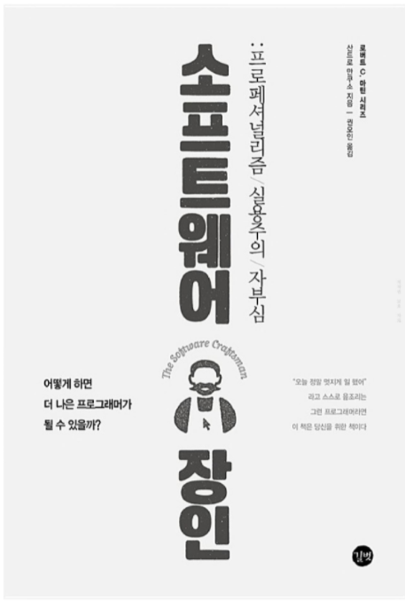

|책||
|:---:||
|{:class="img-responsive"}{: width="300px"}|제목 : 소프트웨어 장인<br/>지은이 : 산드로 만쿠소(권오인 옮김)<br/>출판사 : 길벗<br/>초판발행 : 2015년09월25일<br/>점수 : ⭐️⭐️⭐️⭐️☆|

### 1. 총평
스스로 마스터라고 생각한 적은 없지만, 마스터를 꿈꾸며 하루하루 최선을 다 한다. 뒤를 돌아보고 앞을 고민하게하는 좋은 책이다.
애자일 방식의 개발패턴을 좀더 깊이있게 연구/학습해야 겠다는 의지가 타오른다.
본인이 개발자이고 마스터를 꿈꾼다면 필독서가 아닌가 생각한다.
{: .notice}

### 2. 인용문
>소프트웨어 장인정신에 대한 짧은 정의<br/>
><u>소프트웨어 장인정신은 소프트웨어 개발의 프로페셔널리즘에 대한 것이다.</u>

이 부분이 소프트웨어 장인정신에서 가장 중요한 내용이다. 이책에서 단 한가지만 알아야 한다면 이 문장을 기억했으면 한다.

>매니페스토
>소프트웨어 장인을 열망하는 우리는, 스스로의 기술을 연마하고, 다른 사람들이 기술을 배울 수 있도록 도움으로써 프로페셔널 소프트웨어 개발의 수준을 높인다. 이러한 일을 하는 과정에서 우리는 다음과 같은 가치들을 추구한다.
>
>>동작하는 소프트웨어뿐만 아니라, <u>정교하고 솜씨 있게 만들어진 작품을</u>,<br/>
>>변화에 대응하는 것뿐만 아니라, <u>계속해서 가치를 더하는 것을</u>,<br/>
>>개별적으로 협력하는 것뿐만 아니라, <u>프로페셔널 커뮤니티를 조성하는 것을</u>,<br/>
>>고객과 협업하는 것뿐만 아니라, <u>생산적인 동반자 관계를</u>,<br/>
> 
>이 왼쪽의 항목들을 추구하는 과정에서, 오른쪽 항목들이 꼭 필요함을 의미한다.

```
같은 일을 반복하면서 다른 결과를 기대하는 것은 미친 짓이다.
-앨버트 아인슈타인
```

```
조직의 규모가 크건 작건 매번 이러한 상황들을 목격했다. 
작은 규모의 조직에서는 대체로 드물지만 비슷한 문제로 괴로워하는 경우들도 있었다.
이러한 상황에 처한 개발자들은 자신들이 그저 코딩 기계일 뿐, 아이디어를 내고 
회사에 기여할 수 있는 프로페셔널로서 대우받고 있지 못하다고 느낀다.

애자일을 도입한다는 것은 실무자들에 대한 권한 위임, 변화에 대한 내재화, 협업 증대, 
정말로 중요한 것들에 대한 집중, 각 업무들의 가치 이해, 맹목적인 업무의 배체를 
시행한다는 것과 같은 의미다. 

애자일스럽게 일한다는 것은 일을 올바르게 하고, 소통을 원활히 하고, 피드백 주기를 
짧게하고, 팀워크를 최대화한다는 것과 같아야 한다.
```

### 3. 마치며
특정분야에서 장인(마스터) 된다는게 어떤걸까? 정략적인 자격증이나 수료증이 있다고 될까? 물론 표면적으로는 필요하다고 생각한다.
하지만, 내면적인 부분이 얼마나 중요한지 이책에서 말하고 있다. 공감가는 부분이 너무도 많고 혼자 읽기 아까운 문구들도 많았다.
전자책이아닌 종이책으로 항상 곁에두고 싶은 책이다.