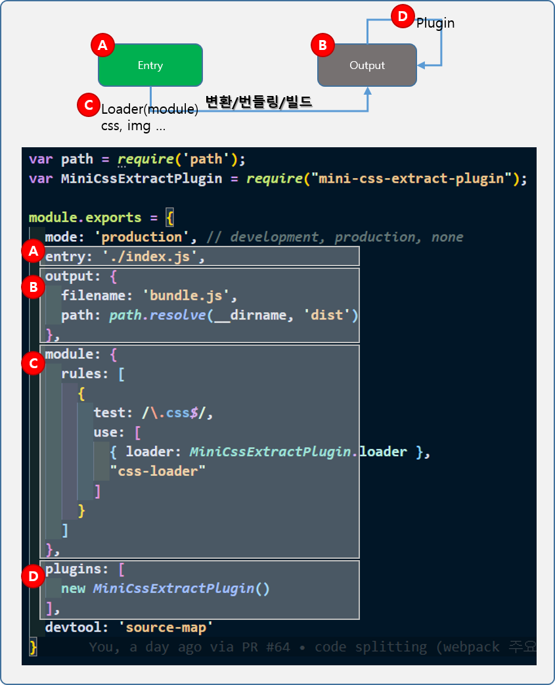
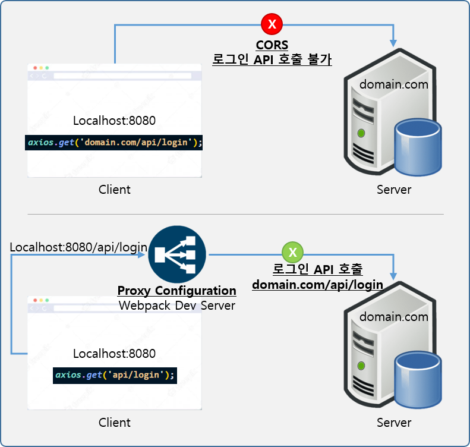

## 1. *Study Agenda*
  - 프런트앤드 빌드 시스템
  - https://joshua1988.github.io/webpack-guide/guide.html)
    - NPM, Webpack
  - 자바스크립트 모듈화(AMD, Common.js, ES6 Modules)
  - 웹팩 개요(등장 배경, 철학 등)
  - 웹팩 주요 속성 4가지
  - 배포 환경에서 알고 있어야 할 웹팩 특징과 설정 등<br/><br/>

## 2. *개발 환경 설정*
  > Chrome<br/>
  > Git<br/>
  > Visual Studio Code<br/>
  > Node.js LTS 버전(v12.x 이상)
  
<br/>

### 2.1 *VSCode 유용한 플러그인 목록*
  - 색 테마 : Night Owl
  - 파일 아이콘 테마 : Material Icon Theme
  - 문법 검사 : ESLint, TSLint
  - 실습 환경 보조 : Live Server
  - 기타 : Prettier, Project Manager, Auto Close Tag, GitLens, Atom Keymap, Jetbrains IDE Keymap 등<br/><br/>

## 3. *초기 설치 명령어*
```
node -v // node 버전 확인
npm -v // node package manager 버전 확인
vue --version // vue 버전 확인
npm init -y // 해당 폴더에 'package.json' 파일 생성
npm install jquery // 해당 폴더에 'jquery' npm 설치

//test
npm install gulp
npm uninstall gulp
npm install gulp --global // 전역 설치 (경로 : %USERPROFILE%\AppData\Roaming\npm\node_modules)
npm uninstall gulp --global

// '-D' 옵션은 'package.json'에서 'dependencies'와 'devDependencies'로 나눠 구성되며
// 배포시 devDependencies는 포함되지 않는다.(용도에 따라 구분하여 npm i로 설치할 필요가 있음)
npm i vue -D // 'npm install vue --save-dev'와 동일하다
```

### 3.1 *참고 사항*
  - git branch 변경 main -> master 이후 git 명령어
```
git branch -m main master
git fetch origin
git branch -u origin/master master
git remote set-head origin -a
```
<br/>

## 4. *Webpack*
  - 최신 FrontEnd 프레임워크에서 가장 많이 사용되는 모듈 번들러(Module Bundler)이다. 
  - Module Bundler : HTML, CSS, Javascript, Images와 같이 애플리케이션을 구성하는 자원을 하나의 결과물로 만들어내는 도구
  - Getting Start
    - 기본 설치 npm
  - **아주 중요 !!(초기화 및 빌드 옵션)**
```
npm init -y //package.json 파일을 생성 시킨다.
npm i webpack webpack-cli -D // webpack과 webpack-cli를 devDependencies로 설치 한다.
npm i lodash // lodash를 설치한다.
```
  - package.json > 하기의 build 스크립트 추가하여 npm 빌드 명령으로 빌드
```json
"scripts": {
  "build": "webpack --mode=none" // "webpack"
}
// --mode=none을 없애는 방법은 'webpack.config.js' 파일을 정의 한다.
// 'mode' 값 'none, production, development'에 따라서 webpack으로 빌드된 파일이
// 가독성 좋게 볼지 말지 선택할 수 있다.
// 'webpack.config.js'에 'devtool: 'source-map'' 옵션을 추가 한다.
```

```
npm run build
```
<br/>

### 4.1 *참고 사이트*
  - [node apth](https://nodejs.org/api/path.html)
  - [gulp](https://gulpjs.com/)
  - [lodash join() API 문서](https://lodash.com/docs/4.17.15#join)
  - [즉시 실행 함수 표현(IIFE, Immediately Invoked Function Expression)]https://developer.mozilla.org/ko/docs/Glossary/IIFE)
  - [Webpack First Principle, Youtube](https://www.youtube.com/watch?v=WQue1AN93YU)

<br/>
  
### 4.2 *Webpack의 사용하는 이유 3가지*
  > 파일 단위의 자바 스크립트 모듈 관리의 필요성<br/>
  > 웹 개발 작업 자동화 도구(Web Task Manager, VSCode.Live Server)<br/>
  > 웹 애플리케이션의 빠른 로딩 속도와 높은 성능

<br/>

### 4.3 *ES6 모듈 문법*
  - [ES6 Modules 문법 소개 글](https://joshua1988.github.io/es6-online-book/modules.html#%EB%AA%A8%EB%93%88%ED%99%94%EC%9D%98-%ED%95%84%EC%9A%94%EC%84%B1)
  
<br/>

### 4.4 *웹팩의 주요 속성 4가지*
  - entry
    - 변환할 자원의 최초 진입점 또는 자바스크립트 파일 경로
  - output
    - 웹팩을 실행하고 난 결과물의 파일 경로 및 확장자
  - loader(module)
    - 자비스크립트가 아닌 자원(html, css, images, font)등 변환
    - 자주 사용하는 loader
      > [Babel Loader](https://webpack.js.org/loaders/babel-loader/#root), [Sass Loader](https://webpack.js.org/loaders/sass-loader/#root), [File Loader](https://v4.webpack.js.org/loaders/file-loader/),
       [Vue Loader](https://github.com/vuejs/vue-loader),
       [TS Loader](https://webpack.js.org/guides/typescript/#loader)
  - plugin
    - 추가적인 기능 제공(로더와 차이점은 결과물의 `형태`를 바꿈)
    - 자주 사용하는 plugin
      - [HtmlWebpackPlugin](https://webpack.js.org/plugins/html-webpack-plugin/)
        - 웹팩으로 빌드한 결과물로 HTML 파일을 생성해주는 플러그인
      - [ProgressPlugin](https://webpack.js.org/plugins/progress-plugin/#root)
        - 웹팩의 빌드 진행율을 표시해주는 플러그인
      - [split-chunks-plugin](https://webpack.js.org/plugins/split-chunks-plugin/)
      - [clean-webpack-plugin](https://www.npmjs.com/package/clean-webpack-plugin)
      - [image-webpack-loader](https://github.com/tcoopman/image-webpack-loader)
      - [webpack-bundle-analyzer-plugin](https://github.com/webpack-contrib/webpack-bundle-analyzer)
      - [mini-css-extract-plugin](https://webpack.js.org/plugins/mini-css-extract-plugin/)
        - 사용의 경우 `<link rel="stylesheet" href="./dist/main.css">`와 같이 스타일시트 참조 필요
  - 실습
    - 'code-splitting' 참고
  
  <br/>

## 5. *정리*
  - Entry
    - 웹팩을 실행할 대상 파일 즉 진입점
  - Output
    - 웹팩의 결과물에 대한 정보를 입력, 일반적으로 `filename`과 `path`를 정의
  - Loader
    - css, image등과 같은 파일을 웹팩이 인식할 수 있게 추가, `오른쪽에서 왼쪽으로 적용`
  - Plugin
    - 웹팩으로 변환한 파일에 추가적인 기능을 더할때, 변환 과정 전반에 제어권을 가짐
  - [resolve](https://webpack.js.org/configuration/resolve/#root), [devServer](https://webpack.js.org/configuration/dev-server/#root), [devtool](https://webpack.js.org/configuration/devtool/#devtool) 속성도 있다.
  - 

<br/>

## 6. *Webpack Dev Server*
  - [Webpack Dev Server](https://joshua1988.github.io/webpack-guide/devtools/webpack-dev-server.html)
  - 웹팩을 사용하여 개발할때 빌드작업 시간을 줄여 줌(즉, 코드만 변경하고 저장하면 웹팩빌드 후 브라우저 새로고침)
  
```
"script": {
  "dev": "webpack serve",
  "build": "webpack"
}
```

  - `Webpack Dev Server`로 빌드한 경우 빌드 파일이 메모리에 쌓임으로 직접 확인 할 수 는 없다.(즉, 개발이 완료되면 Terminal에서 직접 빌드 필요)
  - Proxy 설정
    > 프록시 설정을 통하여 API 요청에 대해서 설정 할 수 있다.<br/>
    >> ```
    >> // webpack.config.js
    >> module.exports = {
    >> devServer : {
    >>     proxy: {
    >>       '/api': 'http://localhost:3000', // domain.com
    >>       target: 'domain.com', // 도메인으로 접근 할 경우
    >>       changeOrigin: true // 도메인으로 접근 할 경우
    >>     }
    >>   } 
    >> }
    >> ```
    > [CORS](https://developer.mozilla.org/en-US/docs/Web/HTTP/CORS)(Cross-Origin Resource Sharing)<br/>
    >> [교차 출처 리소스 공유](https://ko.wikipedia.org/wiki/%EA%B5%90%EC%B0%A8_%EC%B6%9C%EC%B2%98_%EB%A6%AC%EC%86%8C%EC%8A%A4_%EA%B3%B5%EC%9C%A0)
  - 

<br/>

## 7. *실전 webpack.config.js 분석*

## 8. 출처

  * [인프런](https://www.inflearn.com/course/%ED%94%84%EB%9F%B0%ED%8A%B8%EC%97%94%EB%93%9C-%EC%9B%B9%ED%8C%A9/dashboard)